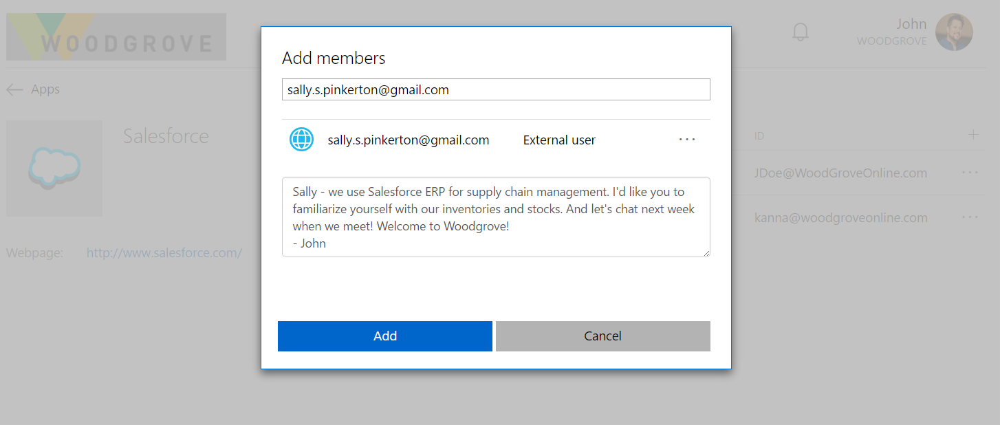
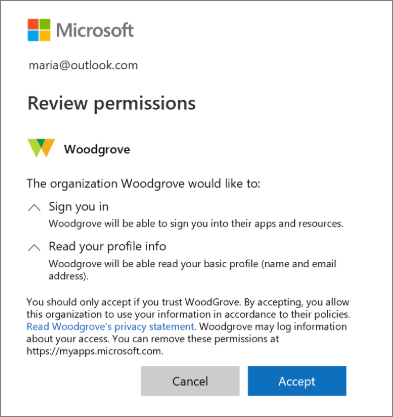
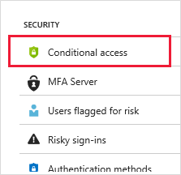
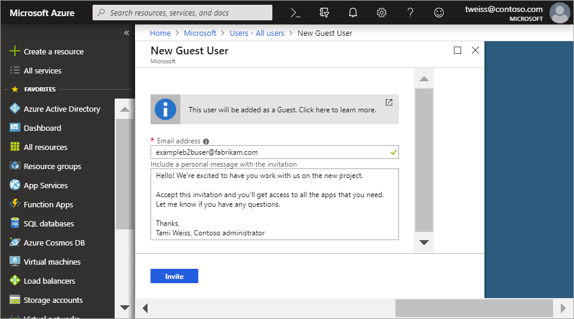
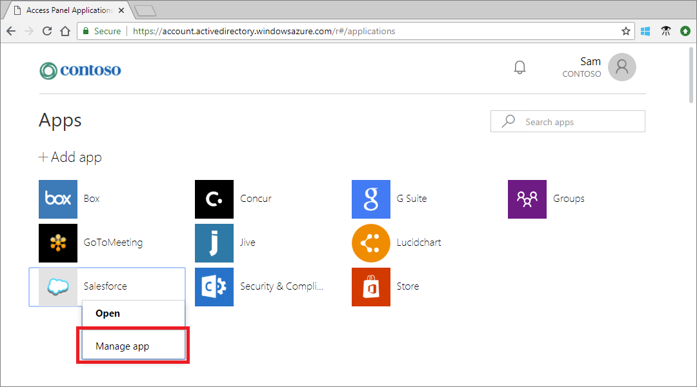
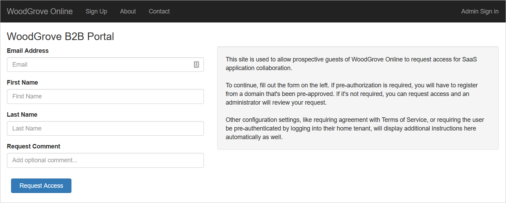

# What is guest user access in Azure Active Directory B2B?

Azure Active Directory (Azure AD) business-to-business (B2B) collaboration lets you securely share your company's applications and services with guest users from any other organization, while maintaining control over your own corporate data. Work safely and securely with external partners, large or small, even if they don't have Azure AD or an IT department. A simple invitation and redemption process lets partners use their own credentials to access your company's resources. Developers can use Azure AD business-to-business APIs to customize the invitation process or write applications like self-service sign-up portals.

Watch the video learn how you can securely collaborate with guest users by inviting them to sign in to your company's apps and services using their own identities.

The following video provides a useful overview.

>[!VIDEO https://www.youtube.com/embed/AhwrweCBdsc]

## Collaborate with any partner using their identities
With Azure AD B2B, the partner uses their own identity management solution, so there is no external administrative overhead for your organization. 
- The partner uses their own identities and credentials; Azure AD is not required. 
- You don't need to manage external accounts or passwords. 
- You don't need to sync accounts or manage account lifecycles.  

## Invite guest users with a simple invitation and redemption process
Guest users sign in to your apps and services with their own work, school, or social identities. If the guest user doesn’t have a Microsoft account or an Azure AD account, one is created for them when they redeem their invitation. 
- Invite guest users using the email identity of their choice.
- Send a direct link to an app, or send an invitation to the guest user's own Access Panel. 
- Guest users follow a few simple redemption steps to sign in.

## Use policies to securely share your apps and services
You can use authorization policies protect your corporate content. Conditional access policies, such as multi-factor authentication, can be enforced:
- At the tenant level.
- At the application level.
- For specific guest users to protect corporate apps and data.

## Easily add guest users in the Azure AD portal

As an administrator, you can easily add guest users to your organization in the Azure portal.
- Create a new guest user in Azure AD, similar to how you'd add a new user.
- The guest user immediately receives a customizable invitation that lets them sign in to their Access Panel.
- Guest users in the directory can be assigned to apps or groups.  

## Let application and group owners manage their own guest users

You can delegate guest user management to application owners so that they can add guest users directly to any application they want to share, whether it's a Microsoft application or not. 
 - Administrators set up self-service app and group management.
 - Non-administrators use their [Access Panel](https://myapps.microsoft.com) to add guest users to applications or groups.

## Use APIs and sample code to easily build applications to onboard

Bring your external partners on board in ways customized to your organization’s needs.
- Use the [B2B collaboration invitation APIs](https://developer.microsoft.com/graph/docs/api-reference/v1.0/resources/invitation) to customize your onboarding experiences, including creating self-service sign-up portals. 
- Use the sample code we provide for a self-service portal [on GitHub](https://github.com/Azure/active-directory-dotnet-graphapi-b2bportal-web).

## Next steps

- [Licensing guidance for Azure AD B2B collaboration](licensing-guidance.md)
- [Add B2B collaboration guest users in the portal](add-users-administrator.md)
- [Understand the invitation redemption process](redemption-experience.md)
- And, as always, connect with the product team for any feedback, discussions, and suggestions through our [Microsoft Tech Community](https://techcommunity.microsoft.com/t5/Azure-Active-Directory-B2B/bd-p/AzureAD_B2b).
