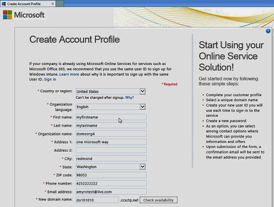
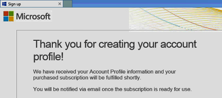

# Sign up for Azure Active Directory Premium editions
You can purchase and associate Azure Active Directory (Azure AD) Premium editions with your Azure subscription. If you need to create a new Azure subscription, you'll also need to activate your licensing plan and Azure AD service access.

> [!NOTE]
>Azure AD Premium and Basic editions are available for customers in China using the worldwide instance of Azure Active Directory. Azure AD Premium and Basic editions aren't currently supported in the Azure service operated by 21Vianet in China. For more information, talk to us using the [Azure Active Directory Forum](https://feedback.azure.com/forums/169401-azure-active-directory/).

Before you sign up for Active Directory Premium 1 or Premium 2, you must first determine which of your existing subscription or plan to use:

- Through your existing Azure or Office 365 subscription

- Through your Enterprise Mobility + Security licensing plan

- Through a Microsoft Volume Licensing plan

Signing up using your Azure subscription with previously purchased and activated Azure AD licenses, automatically activates the licenses in the same directory. If that's not the case, you must still activate your license plan and your Azure AD access. For more information about activating your license plan, see [Activate your new license plan](#activate-your-new-license-plan). For more information about activating your Azure AD access, see [Activate your Azure AD access](#activate-your-azure-ad-access). 

## Sign up using your existing Azure or Office 365 subscription
As an Azure or Office 365 subscriber, you can purchase the Azure Active Directory Premium editions online. For detailed steps, see [How to Purchase Azure Active Directory Premium - Existing Customers](https://channel9.msdn.com/Series/Azure-Active-Directory-Videos-Demos/How-to-Purchase-Azure-Active-Directory-Premium-Existing-Customer) or [How to Purchase Azure Active Directory Premium - New Customers](https://channel9.msdn.com/Series/Azure-Active-Directory-Videos-Demos/How-to-Purchase-Azure-Active-Directory-Premium-New-Customers).

## Sign up using your Enterprise Mobility + Security licensing plan
Enterprise Mobility + Security is a suite, comprised of Azure AD Premium, Azure Information Protection, and Microsoft Intune. If you already have an EMS license, you can get started with Azure AD, using one of these licensing options:

For more information about EMS, see [Enterprise Mobility + Security web site](https://www.microsoft.com/cloud-platform/enterprise-mobility-security).

- Try out EMS with a free [Enterprise Mobility + Security E5 trial subscription](https://signup.microsoft.com/Signup?OfferId=87dd2714-d452-48a0-a809-d2f58c4f68b7&ali=1)

- Purchase [Enterprise Mobility + Security E5 licenses](https://signup.microsoft.com/Signup?OfferId=e6de2192-536a-4dc3-afdc-9e2602b6c790&ali=1)

- Purchase [Enterprise Mobility + Security E3 licenses](https://signup.microsoft.com/Signup?OfferId=4BBA281F-95E8-4136-8B0F-037D6062F54C&ali=1)

## Sign up using your Microsoft Volume Licensing plan
Through your Microsoft Volume Licensing plan, you can sign up for Azure AD Premium using one of these two programs, based on the number of licenses you want to get:

- **For 250 or more licenses.** [Microsoft Enterprise Agreement](https://www.microsoft.com/en-us/licensing/licensing-programs/enterprise.aspx)

- **For 5 to 250 licenses.** [Open Volume License](https://www.microsoft.com/en-us/licensing/licensing-programs/open-license.aspx)

For more information about volume licensing purchase options, see [How to purchase through Volume Licensing](https://www.microsoft.com/en-us/licensing/how-to-buy/how-to-buy.aspx).

## Activate your new license plan
If you signed up using a new Azure AD license plan, you must activate it for your organization, using the confirmation email sent after purchase.

### To activate your license plan
- Open the confirmation email you received from Microsoft after you signed up, and then click either **Sign In** or **Sign Up**.
   
    

    - **Sign in.** Choose this link if you have an existing tenant, and then sign in using your existing administrator account. You must be a global administrator on the tenant where the licenses are being activated.

    - **Sign up.** Choose this link if you want to open the **Create Account Profile** page and create a new Azure AD tenant for your licensing plan.

        

When you're done, you will see a confirmation box thanking you for activating the license plan for your tenant.

## Activate your Azure AD access
If you're adding new Azure AD Premium licenses to an existing subscription, your Azure AD access should already be activated. Otherwise, you need to activate Azure AD access after you receive the **Welcome email**.  

After your purchased licenses are provisioned in your directory, you'll receive a **Welcome email**. This email confirms that you can start managing your Azure AD Premium or Enterprise Mobility + Security licenses and features. 

> [!TIP]
> You won't be able to access Azure AD for your new tenant until you activate Azure AD directory access from the welcome email.

### To activate your Azure AD access

1. Open the **Welcome email**, and then click **Sign In**.
   
    

2. After successfully signing in, you'll go through two-step verification using a mobile device.
   
    

The activation process typically takes only a few minutes and then you can use your Azure AD tenant. 

## Next steps
Now that you have Azure AD Premium, you can [customize your domain](add-custom-domain.md), add your [corporate branding](customize-branding.md), [create a tenant](active-directory-access-create-new-tenant.md), and [add groups](active-directory-groups-create-azure-portal.md) and [users](add-users-azure-active-directory.md).
