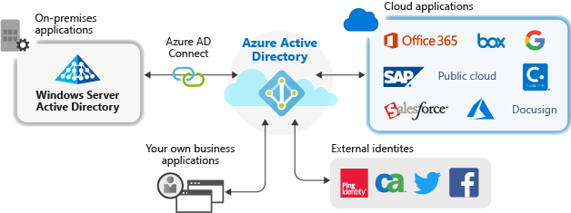

# Application management with Azure Active Directory

Azure Active Directory (Azure AD) provides secure and seamless access to cloud and on-premises applications. Users can sign in once to access Office 365 and other business applications from Microsoft, software as a service (SaaS) applications, on-premises applications, and line of business (LOB) apps. Reduce administrative costs by automating user provisioning. Use multi-factor authentication and conditional access policies to provide secure application access.

## Why manage applications with a cloud solution?

Organizations often have hundreds of applications that users depend on to get their work done. Users access these applications from many devices and locations. New applications are added, developed, and sunset every day. With so many applications and access points, it is more critical than ever to use a cloud-based solution to manage user access to all applications.

## Manage risk with conditional access policies
Coupling Azure AD single sign-on (SSO) with conditional access policies provides high levels of security for accessing applications. Security capabilities include cloud-scale identity protection, risk-based access control, native multi-factor authentication, and conditional access policies. These capabilities allow for granular control policies based on applications, or on groups that need higher levels of security.

## Improve productivity with single sign-on
Enabling single sign-on (SSO) across applications and Office 365 provides a superior sign-in experience for existing users by reducing or eliminating sign-in prompts. The user’s environment feels more cohesive and is less distracting without multiple prompts, or the need to manage multiple passwords. The business group can manage and approve access through self-service and dynamic membership. Allowing the right people in the business to manage access to an application improves the security of the identity system.

SSO improves security. *Without single sign-on*, administrators need to create and update user accounts for each individual application, which takes time. Also, users have to track multiple credentials to access their applications. As a result, users tend to write down their passwords or use other password management solutions, which introduce data security risks. 

## Address governance and compliance
With Azure AD, you can monitor application sign-ins through reports that leverage Security Incident and Event Monitoring (SIEM) tools. You can access the reports from the portal, or from APIs. Programmatically audit who has access to your applications, and remove access to inactive users via access reviews.

## Manage costs
By migrating to Azure AD, you can save costs and remove the hassle of managing your on-premises infrastructure. Azure AD also provides self-service access to applications, which saves time for both administrators and users. Single sign-on eliminates application-specific passwords. This ability to sign on once saves costs related to password reset for applications, and lost productivity while retrieving passwords.

