# Prerequisites to access the Azure Active Directory reporting API

The [Azure Active Directory (Azure AD) reporting APIs](https://msdn.microsoft.com/library/azure/ad/graph/howto/azure-ad-reports-and-events-preview) provide you with programmatic access to the data through a set of REST-based APIs. You can call these APIs from a variety of programming languages and tools.

The reporting API uses [OAuth](https://msdn.microsoft.com/library/azure/dn645545.aspx) to authorize access to the web APIs.

To prepare your access to the reporting API, you need to:

1. [Assign roles](#assign-roles)
2. [Register an application](#register-an-application)
3. [Grant permissions](#grant-permissions)
4. [Gather configuration settings](#gather-configuration-settings)

## Assign roles

To get access to the reporting data through the API, you need to have one of the following roles assigned:

- Security Reader

- Security Administrator

- Global Administrator

## Register an application

You need to register an application even if you're accessing the reporting API using a script. This gives you an **Application ID**, which is required for the authorization calls and enables your code to receive tokens.

To configure your directory to access the Azure AD reporting API, you must sign in to the [Azure portal](https://portal.azure.com) with an Azure administrator account that is also a member of the **Global Administrator** directory role in your Azure AD tenant.

> [!IMPORTANT]
> Applications running under credentials with administrator privileges can be very powerful, so please be sure to keep the application's ID and secret credentials in a secure location.
> 

**To register an Azure AD application:**

1. In the [Azure portal](https://portal.azure.com), select **Azure Active Directory** from the left navigation pane.
   
     

2. In the **Azure Active Directory** page, select **App registrations**.

    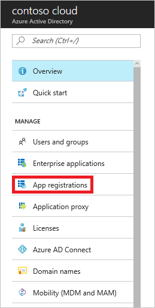 

3. From the **App registrations** page, select **New application registration**.

    

4. In the **Create** page, perform the following steps:

    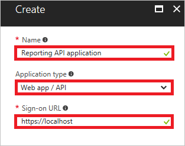

    a. In the **Name** textbox, type `Reporting API application`.

    b. As **Application type**, select **Web app / API**.

    c. In the **Sign-on URL** textbox, type `https://localhost`.

    d. Select **Create**. 

## Grant permissions 

Depending on API you want to access, you need to grant your app the following permissions:  

| API | Permission |
| --- | --- |
| Windows Azure Active Directory | Read directory data |
| Microsoft Graph | Read all audit log data |

The following section lists the steps for both APIs. If you don't want to access one of the APIs, you can skip the related steps.

**To grant your application permissions to use the APIs:**

1. Select your application from the **App Registrations** page and select **Settings**. 

    

2. On the **Settings** page, select **Required permissions**. 

    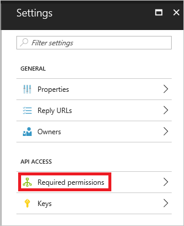

3. On the **Required permissions** page, in the **API** list, click **Windows Azure Active Directory**. 

    

4. On the **Enable Access** page, select **Read directory data** and, deselect **Sign in and read user profile**. 

    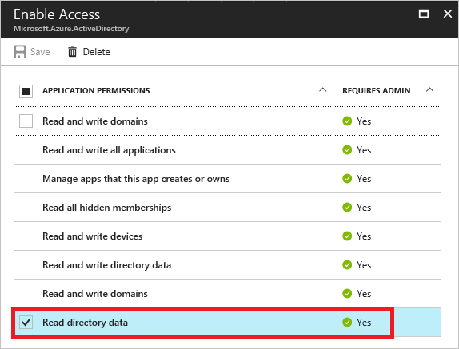

5. In the toolbar on the top, click **Save**.

    

6. On the **Required permissions** page, in the toolbar on the top, click **Add**.

    

7. On the **Add API access** page, click **Select an API**.

    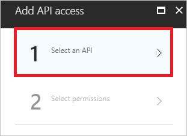

8. On the **Select an API** page, click **Microsoft Graph**, and then click **Select**.

    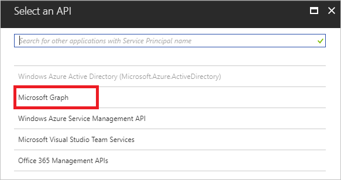

9. On the **Enable Access** page, select **Read all audit log data**, and then click **Select**.  

    

10. On the **Add API access** page, click **Done**.  

11. On the **Required permissions** page, in the toolbar on the top. click **Grant Permissions**, and then click **Yes**.

    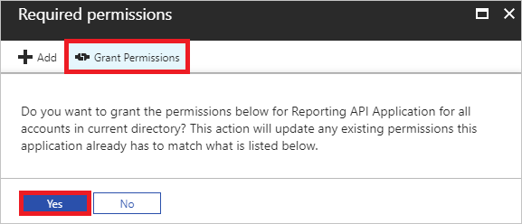

## Gather configuration settings 

This section shows you how to get the following settings from your directory:

- Domain name
- Client ID
- Client secret

You need these values when configuring calls to the reporting API. 

### Get your domain name

**To get your domain name:**

1. In the [Azure portal](https://portal.azure.com), on the left navigation pane, select **Azure Active Directory**.
   
     

2. On the **Azure Active Directory** page, select **Custom domain names**.

    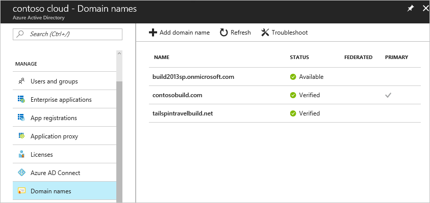 

3. Copy your domain name from the list of domains.

### Get your application's client ID

**To get your application's client ID:**

1. In the [Azure portal](https://portal.azure.com), on the left navigation pane, click **Azure Active Directory**.
   
     

2. Select your application from the **App Registrations** page.

3. From the application page, navigate to **Application ID** and select **Click to copy**.

    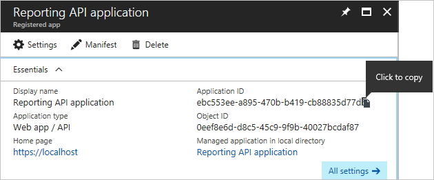 

### Get your application's client secret
To get your application's client secret, you need to create a new key and save its value upon saving the new key because it is not possible to retrieve this value later anymore.

**To get your application's client secret:**

1. In the [Azure portal](https://portal.azure.com), on the left navigation pane, click **Azure Active Directory**.
   
     

2.  Select your application from the **App Registrations** page.

3. On the application page, in the toolbar on the top, select **Settings**. 

    

4. On the **Settings** page, in the **API Access** section, click **Keys**. 

    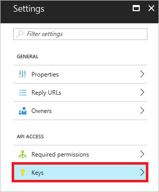

5. On the **Keys** page, perform the following steps:

    

    a. In the **Description** textbox, type `Reporting API`.

    b. As **Expires**, select **In 2 years**.

    c. Click **Save**.

    d. Copy the key value.

## Troubleshoot errors in the reporting API

This section lists the common error messages you may run into while accessing activity reports using the MS Graph API and steps for their resolution.

### 500 HTTP internal server error while accessing Microsoft Graph V2 endpoint

We do not currently support the Microsoft Graph v2 endpoint - make sure to access the activity logs using the Microsoft Graph v1 endpoint.

### Error: Failed to get user roles from AD Graph

You may get this error message when trying to access sign-ins using Graph Explorer. Make sure you are signed in to your account using both of the sign-in buttons in the Graph Explorer UI, as shown in the following image. 

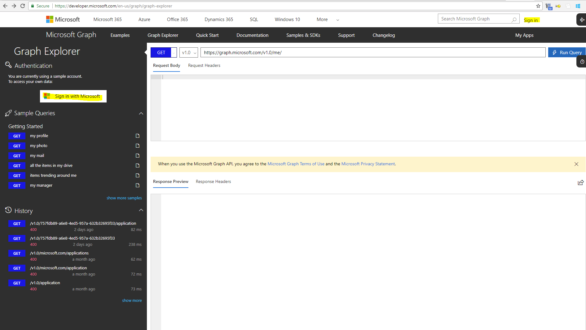

### Error: Failed to do premium license check from AD Graph 

If you run into this error message while trying to access sign-ins using Graph Explorer, choose **Modify Permissions** underneath your account on the left nav, and select **Tasks.ReadWrite** and **Directory.Read.All**. 

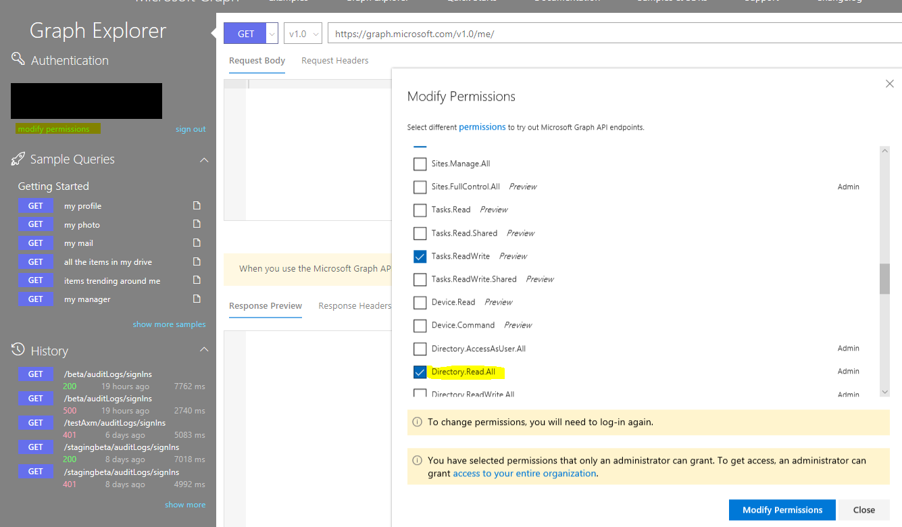

### Error: Neither tenant is B2C or tenant doesn't have premium license

Accessing sign-in reports requires an Azure Active Directory premium 1 (P1) license. If you see this error message while accessing sign-ins, make sure that your tenant is licensed with an Azure AD P1 license.

### Error: User is not in the allowed roles 

If you see this error message while trying to access audit logs or sign-ins using the API, make sure that your account is part of the **Security Reader** or **Report Reader** role in your Azure Active Directory tenant. 

### Error: Application missing AAD 'Read directory data' permission 

Please follow the steps in the [Prerequisites to access the Azure Active Directory reporting API](howto-configure-prerequisites-for-reporting-api.md) to ensure your application is running with the right set of permissions. 

### Error: Application missing MSGraph API 'Read all audit log data' permission

Please follow the steps in the [Prerequisites to access the Azure Active Directory reporting API](howto-configure-prerequisites-for-reporting-api.md) to ensure your application is running with the right set of permissions. 

## Next steps

* [Get data using the Azure Active Directory reporting API with certificates](tutorial-access-api-with-certificates.md)
* [Audit API reference](https://developer.microsoft.com/graph/docs/api-reference/beta/resources/directoryaudit) 
* [Sign-in activity report API reference](https://developer.microsoft.com/graph/docs/api-reference/beta/resources/signin)
