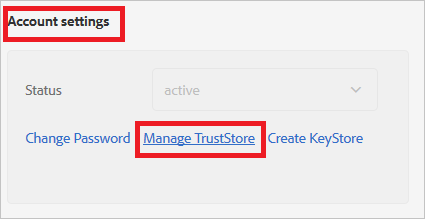
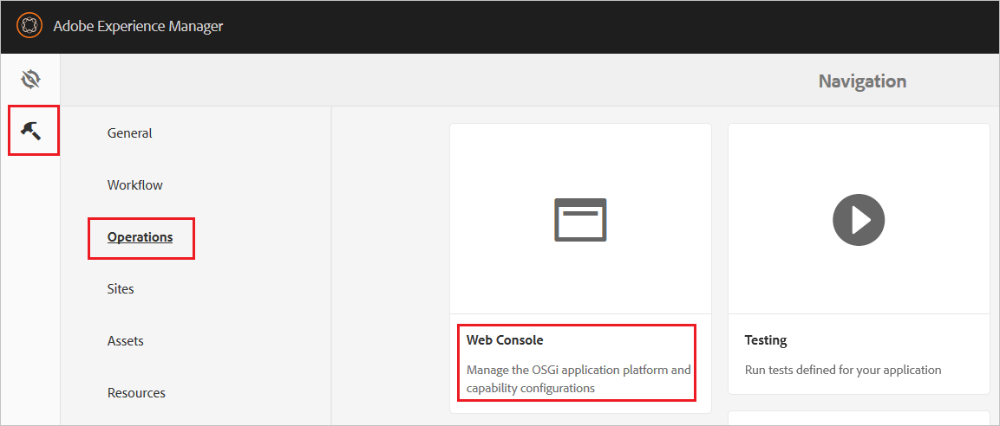

# Tutorial: Azure Active Directory integration with Adobe Experience Manager

In this tutorial, you learn how to integrate Adobe Experience Manager with Azure Active Directory (Azure AD).
Integrating Adobe Experience Manager with Azure AD provides you with the following benefits:

* You can control in Azure AD who has access to Adobe Experience Manager.
* You can enable your users to be automatically signed-in to Adobe Experience Manager (Single Sign-On) with their Azure AD accounts.
* You can manage your accounts in one central location - the Azure portal.

If you want to know more details about SaaS app integration with Azure AD, see [What is application access and single sign-on with Azure Active Directory](https://docs.microsoft.com/azure/active-directory/active-directory-appssoaccess-whatis).
If you don't have an Azure subscription, [create a free account](https://azure.microsoft.com/free/) before you begin.

## Prerequisites

To configure Azure AD integration with Adobe Experience Manager, you need the following items:

* An Azure AD subscription. If you don't have an Azure AD environment, you can get one-month trial [here](https://azure.microsoft.com/pricing/free-trial/)
* Adobe Experience Manager single sign-on enabled subscription

## Scenario description

In this tutorial, you configure and test Azure AD single sign-on in a test environment.

* Adobe Experience Manager supports **SP and IDP** initiated SSO

* Adobe Experience Manager supports **Just In Time** user provisioning

## Adding Adobe Experience Manager from the gallery

To configure the integration of Adobe Experience Manager into Azure AD, you need to add Adobe Experience Manager from the gallery to your list of managed SaaS apps.

**To add Adobe Experience Manager from the gallery, perform the following steps:**

1. In the **[Azure portal](https://portal.azure.com)**, on the left navigation panel, click **Azure Active Directory** icon.

	

2. Navigate to **Enterprise Applications** and then select the **All Applications** option.

	

3. To add new application, click **New application** button on the top of dialog.

	

4. In the search box, type **Adobe Experience Manager**, select **Adobe Experience Manager** from result panel then click **Add** button to add the application.

	 

## Configure and test Azure AD single sign-on

In this section, you configure and test Azure AD single sign-on with [Application name] based on a test user called **Britta Simon**.
For single sign-on to work, a link relationship between an Azure AD user and the related user in [Application name] needs to be established.

To configure and test Azure AD single sign-on with [Application name], you need to complete the following building blocks:

1. **[Configure Azure AD Single Sign-On](#configure-azure-ad-single-sign-on)** - to enable your users to use this feature.
2. **[Configure Adobe Experience Manager Single Sign-On](#configure-adobe-experience-manager-single-sign-on)** - to configure the Single Sign-On settings on application side.
3. **[Create an Azure AD test user](#create-an-azure-ad-test-user)** - to test Azure AD single sign-on with Britta Simon.
4. **[Assign the Azure AD test user](#assign-the-azure-ad-test-user)** - to enable Britta Simon to use Azure AD single sign-on.
5. **[Create Adobe Experience Manager test user](#create-adobe-experience-manager-test-user)** - to have a counterpart of Britta Simon in Adobe Experience Manager that is linked to the Azure AD representation of user.
6. **[Test single sign-on](#test-single-sign-on)** - to verify whether the configuration works.

### Configure Azure AD single sign-on

In this section, you enable Azure AD single sign-on in the Azure portal.

To configure Azure AD single sign-on with [Application name], perform the following steps:

1. In the [Azure portal](https://portal.azure.com/), on the **Adobe Experience Manager** application integration page, select **Single sign-on**.

    

2. On the **Select a Single sign-on method** dialog, select **SAML/WS-Fed** mode to enable single sign-on.

    

3. On the **Set up Single Sign-On with SAML** page, click **Edit** icon to open **Basic SAML Configuration** dialog.

	

4. On the **Basic SAML Configuration** section, If you wish to configure the application in **IDP** initiated mode, perform the following steps:

    

    a. In the **Identifier** text box, type a unique value that you define on your AEM server as well.

    b. In the **Reply URL** text box, type a URL using the following pattern:
    `https://<AEM Server Url>/saml_login`

    > [!NOTE]
	> The Reply URL value is not real. Update Reply URL value with the actual reply URL. To get this value, contact the [Adobe Experience Manager Client support team](https://helpx.adobe.com/support/experience-manager.html) to get this value. You can also refer to the patterns shown in the **Basic SAML Configuration** section in the Azure portal.

5. Click **Set additional URLs** and perform the following step if you wish to configure the application in **SP** initiated mode:

    

    In the **Sign-on URL** text box, type your Adobe Experience Manager server URL.

6. On the **Set up Single Sign-On with SAML** page, in the **SAML Signing Certificate** section, click **Download** to download the **Certificate (Base64)** from the given options as per your requirement and save it on your computer.

	

7. On the **Set up Adobe Experience Manager** section, copy the appropriate URL(s) as per your requirement.

	

	a. Login URL

	b. Azure Ad Identifier

	c. Logout URL

### Configure Adobe Experience Manager Single Sign-On

1. In another browser window, open the **Adobe Experience Manager** admin portal.

2. Select **Settings** > **Security** > **Users**.

	

3. Select **Administrator** or any other relevant user.

	

4. Select **Account settings** > **Manage TrustStore**.

	

5. Under **Add Certificate from CER file**, click **Select Certificate File**. Browse to and select the certificate file, which you already downloaded from the Azure portal.

	

6. The certificate is added to the TrustStore. Note the alias of the certificate.

	

7. On the **Users** page, select **authentication-service**.

	

8. Select **Account settings** > **Create/Manage KeyStore**. Create KeyStore by supplying a password.

	

9. Go back to the admin screen. Then select **Settings** > **Operations** > **Web Console**.

	

	This opens the configuration page.

	

10. Find **Adobe Granite SAML 2.0 Authentication Handler**. Then select the **Add** icon.

	

11. Take the following actions on this page.

	

	a. In the **Path** box, enter **/**.

	b. In the **IDP URL** box, enter the **Login URL** value that you copied from the Azure portal.

	c. In the **IDP Certificate Alias** box, enter the **Certificate Alias** value that you added in TrustStore.

	d. In the **Security Provided Entity ID** box, enter the unique **Azure Ad Identifier** value that you configured in the Azure portal.

	e. In the **Assertion Consumer Service URL** box, enter the **Reply URL** value that you configured in the Azure portal.

	f. In the **Password of Key Store** box, enter the **Password** that you set in KeyStore.

	g. In the **User Attribute ID** box, enter the **Name ID** or another user ID that's relevant in your case.

	h. Select **Autocreate CRX Users**.

	i. In the **Logout URL** box, enter the unique **Logout URL** value that you got from the Azure portal.

	j. Select **Save**.

### Create an Azure AD test user

The objective of this section is to create a test user in the Azure portal called Britta Simon.

1. In the Azure portal, in the left pane, select **Azure Active Directory**, select **Users**, and then select **All users**.

    

2. Select **New user** at the top of the screen.

    

3. In the User properties, perform the following steps.

    

    a. In the **Name** field enter **BrittaSimon**.
  
    b. In the **User name** field type **brittasimon@yourcompanydomain.extension**  
    For example, BrittaSimon@contoso.com

    c. Select **Show password** check box, and then write down the value that's displayed in the Password box.

    d. Click **Create**.

### Assign the Azure AD test user

In this section, you enable Britta Simon to use Azure single sign-on by granting access to Adobe Experience Manager.

1. In the Azure portal, select **Enterprise Applications**, select **All applications**, then select **Adobe Experience Manager**.

	

2. In the applications list, select **Adobe Experience Manager**.

	

3. In the menu on the left, select **Users and groups**.

    

4. Click the **Add user** button, then select **Users and groups** in the **Add Assignment** dialog.

    

5. In the **Users and groups** dialog select **Britta Simon** in the Users list, then click the **Select** button at the bottom of the screen.

6. If you are expecting any role value in the SAML assertion then in the **Select Role** dialog select the appropriate role for the user from the list, then click the **Select** button at the bottom of the screen.

7. In the **Add Assignment** dialog click the **Assign** button.

### Create Adobe Experience Manager test user

In this section, you create a user called Britta Simon in Adobe Experience Manager. If you selected the **Autocreate CRX Users** option, users are created automatically after successful authentication.

If you want to create users manually, work with the [Adobe Experience Manager support team](https://helpx.adobe.com/support/experience-manager.html) to add the users in the Adobe Experience Manager platform.

### Test single sign-on 

In this section, you test your Azure AD single sign-on configuration using the Access Panel.

When you click the Adobe Experience Manager tile in the Access Panel, you should be automatically signed in to the Adobe Experience Manager for which you set up SSO. For more information about the Access Panel, see [Introduction to the Access Panel](https://docs.microsoft.com/azure/active-directory/active-directory-saas-access-panel-introduction).

## Additional Resources

- [ List of Tutorials on How to Integrate SaaS Apps with Azure Active Directory ](https://docs.microsoft.com/azure/active-directory/active-directory-saas-tutorial-list)

- [What is application access and single sign-on with Azure Active Directory? ](https://docs.microsoft.com/azure/active-directory/active-directory-appssoaccess-whatis)

- [What is conditional access in Azure Active Directory?](https://docs.microsoft.com/azure/active-directory/conditional-access/overview)