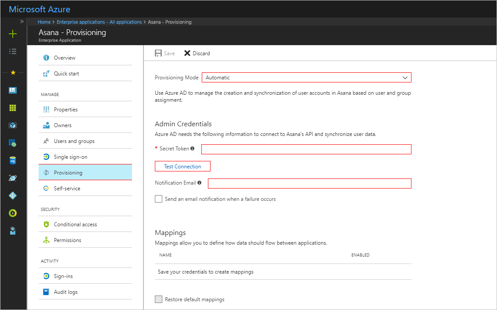

---

title: 'Tutorial: Configure Asana for automatic user provisioning with Azure Active Directory | Microsoft Docs'
description: Learn how to configure Azure Active Directory to automatically provision and de-provision user accounts to Asana.
services: active-directory
documentationcenter: ''
author: asmalser-msft
writer: asmalser-msft
manager: sakula

ms.assetid: 0b38ee73-168b-42cb-bd8b-9c5e5126d648
ms.service: active-directory
ms.subservice: saas-app-tutorial
ms.workload: identity
ms.tgt_pltfrm: na
ms.devlang: na
ms.topic: article
ms.date: 01/26/2018
ms.author: asmalser
ms.reviewer: asmalser

---

# Tutorial: Configure Asana for automatic user provisioning

The objective of this tutorial is to show you the steps you need to perform in Asana and Azure Active Directory (Azure AD) to automatically provision and de-provision user accounts from Azure AD to Asana.

## Prerequisites

The scenario outlined in this tutorial assumes that you already have the following items:

*   An Azure AD tenant
*   An Asana tenant with an [Enterprise](https://www.asana.com/pricing) plan or better enabled 
*   A user account in Asana with admin permissions 

> [!NOTE] 
> Azure AD provisioning integration relies on the [Asana API](https://asana.com/developers/api-reference/users), which is available to Asana.

## Assign users to Asana

Azure AD uses a concept called "assignments" to determine which users should receive access to selected apps. In the context of automatic user account provisioning, only the users assigned to an application in Azure AD are synchronized. 

Before you configure and enable the provisioning service, you must decide which users in Azure AD need access to your Asana app. Then you can assign these users to your Asana app by following the instructions here:

[Assign a user to an enterprise app](../manage-apps/assign-user-or-group-access-portal.md)

### Important tips for assigning users to Asana

We recommend that you assign a single Azure AD user to Asana to test the provisioning configuration. Additional users can be assigned later.

## Configure user provisioning to Asana 

This section guides you through connecting your Azure AD to Asana user account provisioning API. You also configure the provisioning service to create, update, and disable assigned user accounts in Asana based on user assignments in Azure AD.

> [!TIP]
> To enable SAML-based single sign-on for Asana, follow the instructions provided in the [Azure portal](https://portal.azure.com). Single sign-on can be configured independently of automatic provisioning, although these two features complement each other.

### To configure automatic user account provisioning to Asana in Azure AD

1. In the [Azure portal](https://portal.azure.com), browse to the **Azure Active Directory** > **Enterprise Apps** > **All applications** section.

1. If you already configured Asana for single sign-on, search for your instance of Asana by using the search field. Otherwise, select **Add** and search for **Asana** in the application gallery. Select **Asana** from the search results, and add it to your list of applications.

1. Select your instance of Asana, and then select the **Provisioning** tab.

1. Set **Provisioning Mode** to **Automatic**.

    

1. Under the **Admin Credentials** section, follow these instructions to generate the token and enter it in  **Secret Token**:

    a. Sign in to [Asana](https://app.asana.com) by using your admin account.

    b. Select the profile photo from the top bar, and select your current organization-name settings.

    c. Go to the **Service Accounts** tab.

    d. Select **Add Service Account**.

    e. Update **Name** and **About** and the profile photo as needed. Copy the token in **Token**, and select it in **Save Changes**.

1. In the Azure portal, select **Test Connection** to ensure that Azure AD can connect to your Asana app. If the connection fails, ensure that your Asana account has admin permissions, and try the **Test Connection** step again.

1. Enter the email address of a person or group that you want to receive provisioning error notifications in  **Notification Email**. Select the check box underneath.

1. Select **Save**. 

1. Under the **Mappings** section, select **Synchronize Azure Active Directory Users to Asana**.

1. In the **Attribute Mappings** section, review the user attributes to be synchronized from Azure AD to Asana. The attributes selected as **Matching** properties are used to match the user accounts in Asana for update operations. Select **Save** to commit any changes. For more information, see [Customize user provision attribute mappings](../manage-apps/customize-application-attributes.md).

1. To enable the Azure AD provisioning service for Asana, in the **Settings** section, change **Provisioning Status** to **On**.

1. Select **Save**. 

Now the initial synchronization starts for any users assigned to Asana in the **Users** section. The initial sync takes longer to perform than subsequent syncs, which occur approximately every 40 minutes as long as the service is running. Use the **Synchronization Details** section to monitor progress and follow links to provisioning activity logs. The audit logs describe all actions performed by the provisioning service on your Asana app.

For more information on how to read the Azure AD provisioning logs, see [Report on automatic user account provisioning](../manage-apps/check-status-user-account-provisioning.md).

## Additional resources

* [Manage user account provisioning for Enterprise Apps](../manage-apps/configure-automatic-user-provisioning-portal.md)
* [What is application access and single sign-on with Azure Active Directory?](../manage-apps/what-is-single-sign-on.md)
* [Configure single sign-on](asana-tutorial.md)
