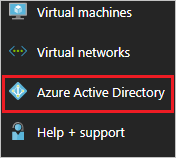
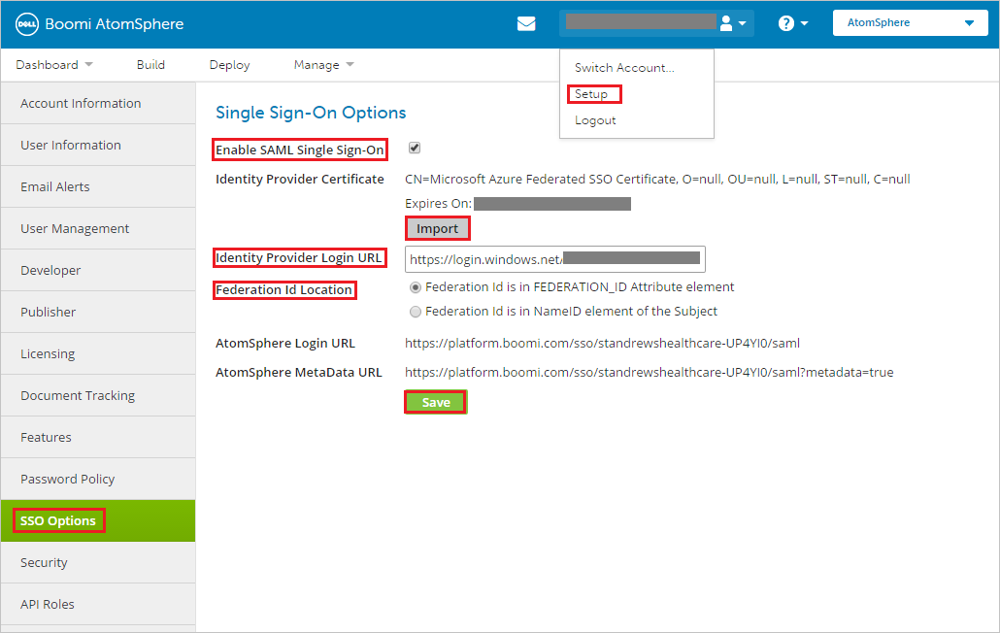
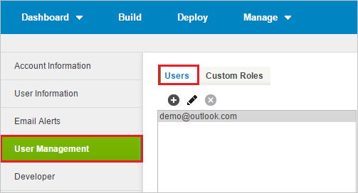

# Tutorial: Azure Active Directory integration with Boomi

In this tutorial, you learn how to integrate Boomi with Azure Active Directory (Azure AD).
Integrating Boomi with Azure AD provides you with the following benefits:

* You can control in Azure AD who has access to Boomi.
* You can enable your users to be automatically signed-in to Boomi (Single Sign-On) with their Azure AD accounts.
* You can manage your accounts in one central location - the Azure portal.

If you want to know more details about SaaS app integration with Azure AD, see [What is application access and single sign-on with Azure Active Directory](https://docs.microsoft.com/azure/active-directory/active-directory-appssoaccess-whatis).
If you don't have an Azure subscription, [create a free account](https://azure.microsoft.com/free/) before you begin.

## Prerequisites

To configure Azure AD integration with Boomi, you need the following items:

* An Azure AD subscription. If you don't have an Azure AD environment, you can get one-month trial [here](https://azure.microsoft.com/pricing/free-trial/)
* Boomi single sign-on enabled subscription

## Scenario description

In this tutorial, you configure and test Azure AD single sign-on in a test environment.

* Boomi supports **IDP** initiated SSO

## Adding Boomi from the gallery

To configure the integration of Boomi into Azure AD, you need to add Boomi from the gallery to your list of managed SaaS apps.

**To add Boomi from the gallery, perform the following steps:**

1. In the **[Azure portal](https://portal.azure.com)**, on the left navigation panel, click **Azure Active Directory** icon.

	

2. Navigate to **Enterprise Applications** and then select the **All Applications** option.

	

3. To add new application, click **New application** button on the top of dialog.

	

4. In the search box, type **Boomi**, select **Boomi** from result panel then click **Add** button to add the application.

	 

## Configure and test Azure AD single sign-on

In this section, you configure and test Azure AD single sign-on with Boomi based on a test user called **Britta Simon**.
For single sign-on to work, a link relationship between an Azure AD user and the related user in Boomi needs to be established.

To configure and test Azure AD single sign-on with Boomi, you need to complete the following building blocks:

1. **[Configure Azure AD Single Sign-On](#configure-azure-ad-single-sign-on)** - to enable your users to use this feature.
2. **[Configure Boomi Single Sign-On](#configure-boomi-single-sign-on)** - to configure the Single Sign-On settings on application side.
3. **[Create an Azure AD test user](#create-an-azure-ad-test-user)** - to test Azure AD single sign-on with Britta Simon.
4. **[Assign the Azure AD test user](#assign-the-azure-ad-test-user)** - to enable Britta Simon to use Azure AD single sign-on.
5. **[Create Boomi test user](#create-boomi-test-user)** - to have a counterpart of Britta Simon in Boomi that is linked to the Azure AD representation of user.
6. **[Test single sign-on](#test-single-sign-on)** - to verify whether the configuration works.

### Configure Azure AD single sign-on

In this section, you enable Azure AD single sign-on in the Azure portal.

To configure Azure AD single sign-on with Boomi, perform the following steps:

1. In the [Azure portal](https://portal.azure.com/), on the **Boomi** application integration page, select **Single sign-on**.

    

2. On the **Select a Single sign-on method** dialog, select **SAML/WS-Fed** mode to enable single sign-on.

    

3. On the **Set up Single Sign-On with SAML** page, click **Edit** icon to open **Basic SAML Configuration** dialog.

	

4. On the **Set up Single Sign-On with SAML** page, click **Edit** button to open **Basic SAML Configuration** dialog.

    

    a. In the **Identifier** text box, type a URL:
    `https://platform.boomi.com/`

    b. In the **Reply URL** text box, type a URL using the following pattern:
    `https://platform.boomi.com/sso/<boomi-tenant>/saml`

	> [!NOTE]
	> The Reply URL value is not real. Update the value with the actual Reply URL. Contact [Boomi Client support team](https://boomi.com/company/contact/) to get this value. You can also refer to the patterns shown in the **Basic SAML Configuration** section in the Azure portal.

5. Boomi application expects the SAML assertions in a specific format. Configure the following claims for this application. You can manage the values of these attributes from the **User Attributes** section on application integration page. On the **Set up Single Sign-On with SAML** page, click **Edit** button to open **User Attributes** dialog.

	

6. In the **User Claims** section on the **User Attributes** dialog, configure SAML token attribute as shown in the image above and perform the following steps:

	| Name |  Source Attribute|
	| ---------------|  --------- |
	| FEDERATION_ID | user.mail |

	a. Click **Add new claim** to open the **Manage user claims** dialog.

	

	

	b. In the **Name** textbox, type the attribute name shown for that row.

	c. Leave the **Namespace** blank.

	d. Select Source as **Attribute**.

	e. From the **Source attribute** list, type the attribute value shown for that row.

	f. Click **Ok**

	g. Click **Save**.

7. On the **Set up Single Sign-On with SAML** page, in the **SAML Signing Certificate** section, click **Download** to download the **Certificate (Base64)** from the given options as per your requirement and save it on your computer.

	

8. On the **Set up Boomi** section, copy the appropriate URL(s) as per your requirement.

	

	a. Login URL

	b. Azure Ad Identifier

	c. Logout URL

### Configure Boomi Single Sign-On

1. In a different web browser window, log into your Boomi company site as an administrator. 

2. Navigate to **Company Name** and go to **Set up**.

3. Click the **SSO Options** tab and perform below steps.

	

	a. Check **Enable SAML Single Sign-On** checkbox.

	b. Click **Import** to upload the downloaded certificate from Azure AD to **Identity Provider Certificate**.

	c. In the **Identity Provider Login URL** textbox, put the value of **Login URL** from Azure AD application configuration window.

	d. As **Federation Id Location**, select **Federation Id is in FEDERATION_ID Attribute element** radio button.

	e. Click **Save** button.

### Create an Azure AD test user

The objective of this section is to create a test user in the Azure portal called Britta Simon.

1. In the Azure portal, in the left pane, select **Azure Active Directory**, select **Users**, and then select **All users**.

    

2. Select **New user** at the top of the screen.

    

3. In the User properties, perform the following steps.

    

    a. In the **Name** field enter **BrittaSimon**.
  
    b. In the **User name** field type **brittasimon@yourcompanydomain.extension**  
    For example, BrittaSimon@contoso.com

    c. Select **Show password** check box, and then write down the value that's displayed in the Password box.

    d. Click **Create**.

### Assign the Azure AD test user

In this section, you enable Britta Simon to use Azure single sign-on by granting access to Boomi.

1. In the Azure portal, select **Enterprise Applications**, select **All applications**, then select **Boomi**.

	

2. In the applications list, select **Boomi**.

	

3. In the menu on the left, select **Users and groups**.

    

4. Click the **Add user** button, then select **Users and groups** in the **Add Assignment** dialog.

    

5. In the **Users and groups** dialog select **Britta Simon** in the Users list, then click the **Select** button at the bottom of the screen.

6. If you are expecting any role value in the SAML assertion then in the **Select Role** dialog select the appropriate role for the user from the list, then click the **Select** button at the bottom of the screen.

7. In the **Add Assignment** dialog click the **Assign** button.

### Create Boomi test user

In order to enable Azure AD users to log in to Boomi, they must be provisioned into Boomi. In the case of Boomi, provisioning is a manual task.

### To provision a user account, perform the following steps:

1. Log in to your Boomi company site as an administrator.

2. After logging in, navigate to **User Management** and go to **Users**.

	

3. Click **+**  icon and the **Add/Maintain User Roles** dialog opens.

	

	

	a. In the **User e-mail address** textbox, type the email of user like BrittaSimon@contoso.com.

	b. In the **First name** textbox, type the First name of user like Britta.

	c. In the **Last name** textbox, type the Last name of user like Simon.

	d. Enter the user's **Federation ID**. Each user must have a Federation ID that uniquely identifies the user within the account.

	e. Assign the **Standard User** role to the user. Do not assign the Administrator role because that would give him normal Atmosphere access as well as single sign-on access.

	f. Click **OK**.

	> [!NOTE]
	> The user will not receive a welcome notification email containing a password that can be used to log in to the AtomSphere account because his password is managed through the identity provider. You may use any other Boomi user account creation tools or APIs provided by Boomi to provision AAD user accounts.

### Test single sign-on

In this section, you test your Azure AD single sign-on configuration using the Access Panel.

When you click the Boomi tile in the Access Panel, you should be automatically signed in to the Boomi for which you set up SSO. For more information about the Access Panel, see [Introduction to the Access Panel](https://docs.microsoft.com/azure/active-directory/active-directory-saas-access-panel-introduction).

## Additional Resources

- [ List of Tutorials on How to Integrate SaaS Apps with Azure Active Directory ](https://docs.microsoft.com/azure/active-directory/active-directory-saas-tutorial-list)

- [What is application access and single sign-on with Azure Active Directory? ](https://docs.microsoft.com/azure/active-directory/active-directory-appssoaccess-whatis)

- [What is conditional access in Azure Active Directory?](https://docs.microsoft.com/azure/active-directory/conditional-access/overview)

