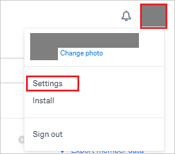
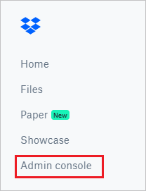
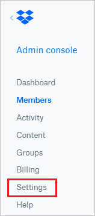
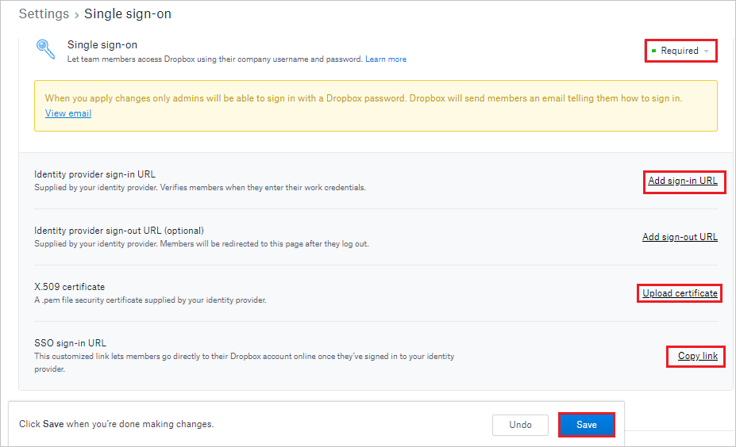
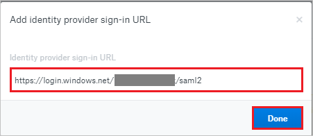

# Tutorial: Azure Active Directory integration with Dropbox for Business

In this tutorial, you learn how to integrate Dropbox for Business with Azure Active Directory (Azure AD).
Integrating Dropbox for Business with Azure AD provides you with the following benefits:

* You can control in Azure AD who has access to Dropbox for Business.
* You can enable your users to be automatically signed-in to Dropbox for Business (Single Sign-On) with their Azure AD accounts.
* You can manage your accounts in one central location - the Azure portal.

If you want to know more details about SaaS app integration with Azure AD, see [What is application access and single sign-on with Azure Active Directory](https://docs.microsoft.com/azure/active-directory/active-directory-appssoaccess-whatis).
If you don't have an Azure subscription, [create a free account](https://azure.microsoft.com/free/) before you begin.

## Prerequisites

To configure Azure AD integration with Dropbox for Business, you need the following items:

* An Azure AD subscription. If you don't have an Azure AD environment, you can get one-month trial [here](https://azure.microsoft.com/pricing/free-trial/)
* Dropbox for Business single sign-on enabled subscription

## Scenario description

In this tutorial, you configure and test Azure AD single sign-on in a test environment.

* Dropbox for Business supports **SP** initiated SSO

* Dropbox for Business supports **Just In Time** user provisioning

## Adding Dropbox for Business from the gallery

To configure the integration of Dropbox for Business into Azure AD, you need to add Dropbox for Business from the gallery to your list of managed SaaS apps.

**To add Dropbox for Business from the gallery, perform the following steps:**

1. In the **[Azure portal](https://portal.azure.com)**, on the left navigation panel, click **Azure Active Directory** icon.

	

2. Navigate to **Enterprise Applications** and then select the **All Applications** option.

	

3. To add new application, click **New application** button on the top of dialog.

	

4. In the search box, type **Dropbox for Business**, select **Dropbox for Business** from result panel then click **Add** button to add the application.

	 

## Configure and test Azure AD single sign-on

In this section, you configure and test Azure AD single sign-on with Dropbox for Business based on a test user called **Britta Simon**.
For single sign-on to work, a link relationship between an Azure AD user and the related user in Dropbox for Business needs to be established.

To configure and test Azure AD single sign-on with Dropbox for Business, you need to complete the following building blocks:

1. **[Configure Azure AD Single Sign-On](#configure-azure-ad-single-sign-on)** - to enable your users to use this feature.
2. **[Configure Dropbox for Business Single Sign-On](#configure-dropbox-for-business-single-sign-on)** - to configure the Single Sign-On settings on application side.
3. **[Create an Azure AD test user](#create-an-azure-ad-test-user)** - to test Azure AD single sign-on with Britta Simon.
4. **[Assign the Azure AD test user](#assign-the-azure-ad-test-user)** - to enable Britta Simon to use Azure AD single sign-on.
5. **[Create Dropbox for Business test user](#create-dropbox-for-business-test-user)** - to have a counterpart of Britta Simon in Dropbox for Business that is linked to the Azure AD representation of user.
6. **[Test single sign-on](#test-single-sign-on)** - to verify whether the configuration works.

### Configure Azure AD single sign-on

In this section, you enable Azure AD single sign-on in the Azure portal.

To configure Azure AD single sign-on with Dropbox for Business, perform the following steps:

1. In the [Azure portal](https://portal.azure.com/), on the **Dropbox for Business** application integration page, select **Single sign-on**.

    

2. On the **Select a Single sign-on method** dialog, select **SAML/WS-Fed** mode to enable single sign-on.

    

3. On the **Set up Single Sign-On with SAML** page, click **Edit** icon to open **Basic SAML Configuration** dialog.

	

4. On the **Basic SAML Configuration** section, perform the following steps:

    

	a. In the **Sign on URL** text box, type a URL using the following pattern:
    `https://www.dropbox.com/sso/<id>`

    b. In the **Identifier (Entity ID)** text box, type a value:
    `Dropbox`

	> [!NOTE]
	> The preceding Sign-on URL value is not real value. You will update the value with the actual Sign-on URL, which is explained later in the tutorial.

4. On the **Set up Single Sign-On with SAML** page, in the **SAML Signing Certificate** section, click **Download** to download the **Certificate (Base64)** from the given options as per your requirement and save it on your computer.

	

6. On the **Set up Dropbox for Business** section, copy the appropriate URL(s) as per your requirement.

	

	a. Login URL

	b. Azure Ad Identifier

	c. Logout URL

### Configure Dropbox for Business Single Sign-On

1. To configure single sign-on on **Dropbox for Business** side, Go on your Dropbox for Business tenant and sign on to your Dropbox for business tenant.

	

2. Click on the **User Icon** and select **Settings** tab.

	

3. In the navigation pane on the left side, click **Admin console**.

	

4. On the **Admin console**, click **Settings** in the left navigation pane.

	

5. Select **Single sign-on** option under the **Authentication** section.

	

6. In the **Single sign-on** section, perform the following steps:  

	

	a. Select **Required** as a option from the dropdown for the **Single sign-on**.

	b. Click on **Add sign-in URL** and in the **Identity provider sign-in URL** textbox, paste the **Login URL** value which you have copied from the Azure portal and then select **Done**.

	

	c. Click **Upload certificate**, and then browse to your **Base64 encoded certificate file** which you have downloaded from the Azure portal.

	d. Click on **Copy link** and paste the copied value into the **Sign-on URL** textbox of **Dropbox for Business Domain and URLs** section on Azure portal.

	e. Click **Save**.

### Create an Azure AD test user 

The objective of this section is to create a test user in the Azure portal called Britta Simon.

1. In the Azure portal, in the left pane, select **Azure Active Directory**, select **Users**, and then select **All users**.

    

2. Select **New user** at the top of the screen.

    

3. In the User properties, perform the following steps.

    

    a. In the **Name** field enter **BrittaSimon**.
  
    b. In the **User name** field type **brittasimon@yourcompanydomain.extension**  
    For example, BrittaSimon@contoso.com

    c. Select **Show password** check box, and then write down the value that's displayed in the Password box.

    d. Click **Create**.

### Assign the Azure AD test user

In this section, you enable Britta Simon to use Azure single sign-on by granting access to Dropbox for Business.

1. In the Azure portal, select **Enterprise Applications**, select **All applications**, then select **Dropbox for Business**.

	

2. In the applications list, type and select **Dropbox for Business**.

	

3. In the menu on the left, select **Users and groups**.

    

4. Click the **Add user** button, then select **Users and groups** in the **Add Assignment** dialog.

    

5. In the **Users and groups** dialog select **Britta Simon** in the Users list, then click the **Select** button at the bottom of the screen.

6. If you are expecting any role value in the SAML assertion then in the **Select Role** dialog select the appropriate role for the user from the list, then click the **Select** button at the bottom of the screen.

7. In the **Add Assignment** dialog click the **Assign** button.

### Create Dropbox for Business test user

In this section, a user called Britta Simon is created in Dropbox for Business. Dropbox for Business supports just-in-time user provisioning, which is enabled by default. There is no action item for you in this section. If a user doesn't already exist in Dropbox for Business, a new one is created after authentication.

>[!Note]
>If you need to create a user manually, Contact [Dropbox for Business Client support team](https://www.dropbox.com/business/contact)

### Test single sign-on 

In this section, you test your Azure AD single sign-on configuration using the Access Panel.

When you click the Dropbox for Business tile in the Access Panel, you should be automatically signed in to the Dropbox for Business for which you set up SSO. For more information about the Access Panel, see [Introduction to the Access Panel](https://docs.microsoft.com/azure/active-directory/active-directory-saas-access-panel-introduction).

## Additional Resources

- [ List of Tutorials on How to Integrate SaaS Apps with Azure Active Directory ](https://docs.microsoft.com/azure/active-directory/active-directory-saas-tutorial-list)

- [What is application access and single sign-on with Azure Active Directory? ](https://docs.microsoft.com/azure/active-directory/active-directory-appssoaccess-whatis)

- [What is conditional access in Azure Active Directory?](https://docs.microsoft.com/azure/active-directory/conditional-access/overview)

