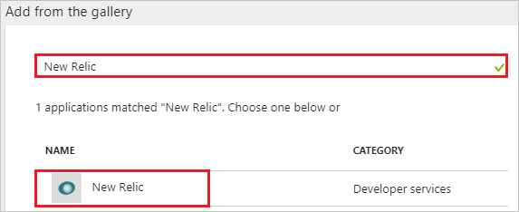
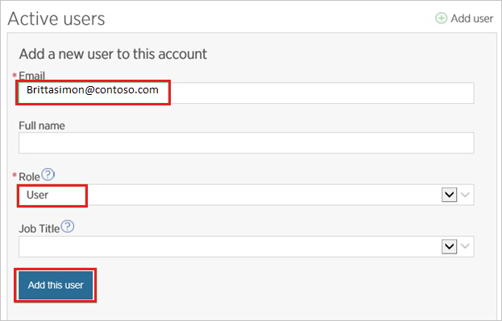
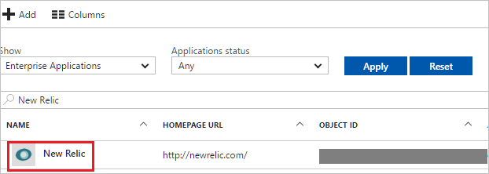

# Tutorial: Azure Active Directory integration with New Relic

In this tutorial, you learn how to integrate New Relic with Azure Active Directory (Azure AD).

Integrating New Relic with Azure AD provides you with the following benefits:

- You can control in Azure AD who has access to New Relic.
- You can enable your users to automatically get signed-on to New Relic (Single Sign-On) with their Azure AD accounts.
- You can manage your accounts in one central location - the Azure portal.

If you want to know more details about SaaS app integration with Azure AD, see [what is application access and single sign-on with Azure Active Directory](../manage-apps/what-is-single-sign-on.md).

## Prerequisites

To configure Azure AD integration with New Relic, you need the following items:

- An Azure AD subscription
- A New Relic single sign-on enabled subscription

> [!NOTE]
> To test the steps in this tutorial, we do not recommend using a production environment.

To test the steps in this tutorial, you should follow these recommendations:

- Do not use your production environment, unless it is necessary.
- If you don't have an Azure AD trial environment, you can [get a one-month trial](https://azure.microsoft.com/pricing/free-trial/).

## Scenario description
In this tutorial, you test Azure AD single sign-on in a test environment. 
The scenario outlined in this tutorial consists of two main building blocks:

1. Adding New Relic from the gallery
1. Configuring and testing Azure AD single sign-on

## Adding New Relic from the gallery
To configure the integration of New Relic into Azure AD, you need to add New Relic from the gallery to your list of managed SaaS apps.

**To add New Relic from the gallery, perform the following steps:**

1. In the **[Azure portal](https://portal.azure.com)**, on the left navigation panel, click **Azure Active Directory** icon. 

	![The Azure Active Directory button][1]

1. Navigate to **Enterprise applications**. Then go to **All applications**.

	![The Enterprise applications blade][2]
	
1. To add new application, click **New application** button on the top of dialog.

	![The New application button][3]

1. In the search box, type **New Relic**, select **New Relic** from result panel then click **Add** button to add the application.

	

## Configure and test Azure AD single sign-on

In this section, you configure and test Azure AD single sign-on with New Relic based on a test user called "Britta Simon".

For single sign-on to work, Azure AD needs to know what the counterpart user in New Relic is to a user in Azure AD. In other words, a link relationship between an Azure AD user and the related user in New Relic needs to be established.

In New Relic, assign the value of the **user name** in Azure AD as the value of the **Username** to establish the link relationship.

To configure and test Azure AD single sign-on with New Relic, you need to complete the following building blocks:

1. **[Configure Azure AD Single Sign-On](#configure-azure-ad-single-sign-on)** - to enable your users to use this feature.
1. **[Create an Azure AD test user](#create-an-azure-ad-test-user)** - to test Azure AD single sign-on with Britta Simon.
1. **[Create a New Relic test user](#create-a-new-relic-test-user)** - to have a counterpart of Britta Simon in New Relic that is linked to the Azure AD representation of user.
1. **[Assign the Azure AD test user](#assign-the-azure-ad-test-user)** - to enable Britta Simon to use Azure AD single sign-on.
1. **[Test single sign-on](#test-single-sign-on)** - to verify whether the configuration works.

### Configure Azure AD single sign-on

In this section, you enable Azure AD single sign-on in the Azure portal and configure single sign-on in your New Relic application.

**To configure Azure AD single sign-on with New Relic, perform the following steps:**

1. In the Azure portal, on the **New Relic** application integration page, click **Single sign-on**.

	![Configure single sign-on link][4]

1. On the **Single sign-on** dialog, select **Mode** as	**SAML-based Sign-on** to enable single sign-on.
 
	

1. On the **New Relic Domain and URLs** section, perform the following steps:

	

    a. In the **Sign-on URL** textbox, type a URL using the following pattern: `https://rpm.newrelic.com/accounts/{acc_id}/sso/saml/login` - Be sure to substitute your own New Relic Account ID.

	b. In the **Identifier** textbox, type the value: `rpm.newrelic.com`

1. On the **SAML Signing Certificate** section, click **Certificate (Base64)** and then save the certificate file on your computer.

	 

1. Click **Save** button.

	

1. On the **New Relic Configuration** section, click **Configure New Relic** to open **Configure sign-on** window. Copy the **Sign-Out URL, and SAML Single Sign-On Service URL** from the **Quick Reference section.**

	 

1. In a different web browser window, sign on to your **New Relic** company site as administrator.

1. In the menu on the top, click **Account Settings**.
   
    

1. Click the **Security and authentication** tab, and then click the **Single sign on** tab.
   
    

1. On the SAML dialog page, perform the following steps:
   
    
   
   a. Click **Choose File** to upload your downloaded Azure Active Directory certificate.

   b. In the **Remote login URL** textbox,  paste the value of **SAML Single Sign-On Service URL**, which you have copied from Azure portal.
   
   c. In the **Logout landing URL** textbox, paste the value of **Sign-Out URL**, which you have copied from Azure portal.

   d. Click **Save my changes**.

> [!TIP]
> You can now read a concise version of these instructions inside the [Azure portal](https://portal.azure.com), while you are setting up the app!  After adding this app from the **Active Directory > Enterprise Applications** section, simply click the **Single Sign-On** tab and access the embedded documentation through the **Configuration** section at the bottom. You can read more about the embedded documentation feature here: [Azure AD embedded documentation]( https://go.microsoft.com/fwlink/?linkid=845985)
> 

### Create an Azure AD test user

The objective of this section is to create a test user in the Azure portal called Britta Simon.

   ![Create an Azure AD test user][100]

**To create a test user in Azure AD, perform the following steps:**

1. In the Azure portal, in the left pane, click the **Azure Active Directory** button.

    

1. To display the list of users, go to **Users and groups**, and then click **All users**.

    

1. To open the **User** dialog box, click **Add** at the top of the **All Users** dialog box.

    

1. In the **User** dialog box, perform the following steps:

    

    a. In the **Name** box, type **BrittaSimon**.

    b. In the **User name** box, type the email address of user Britta Simon.

    c. Select the **Show Password** check box, and then write down the value that's displayed in the **Password** box.

    d. Click **Create**.
 
### Create a New Relic test user

In order to enable Azure Active Directory users to log in to New Relic, they must be provisioned into New Relic. In the case of New Relic, provisioning is a manual task.

**To provision a user account to New Relic, perform the following steps:**

1. Log in to your **New Relic** company site as administrator.

1. In the menu on the top, click **Account Settings**.
   
    

1. In the **Account** pane on the left side, click **Summary**, and then click **Add user**.
   
    

1. On the **Active users** dialog, perform the following steps:
   
    
   
    a. In the **Email** textbox, type the email address of a valid Azure Active Directory user you want to provision.

    b. As **Role** select **User**.

    c. Click **Add this user**.

>[!NOTE]
>You can use any other New Relic user account creation tools or APIs provided by New Relic to provision AAD user accounts.
> 

### Assign the Azure AD test user

In this section, you enable Britta Simon to use Azure single sign-on by granting access to New Relic.

![Assign the user role][200] 

**To assign Britta Simon to New Relic, perform the following steps:**

1. In the Azure portal, open the applications view, and then navigate to the directory view and go to **Enterprise applications** then click **All applications**.

	![Assign User][201] 

1. In the applications list, select **New Relic**.

	  

1. In the menu on the left, click **Users and groups**.

	![The "Users and groups" link][202]

1. Click **Add** button. Then select **Users and groups** on **Add Assignment** dialog.

	![The Add Assignment pane][203]

1. On **Users and groups** dialog, select **Britta Simon** in the Users list.

1. Click **Select** button on **Users and groups** dialog.

1. Click **Assign** button on **Add Assignment** dialog.
	
### Test single sign-on

In this section, you test your Azure AD single sign-on configuration using the Access Panel.

When you click the New Relic tile in the Access Panel, you should get automatically signed-on to your New Relic application.
For more information about the Access Panel, see [Introduction to the Access Panel](../user-help/active-directory-saas-access-panel-introduction.md). 

## Additional resources

* [List of Tutorials on How to Integrate SaaS Apps with Azure Active Directory](tutorial-list.md)
* [What is application access and single sign-on with Azure Active Directory?](../manage-apps/what-is-single-sign-on.md)

<!--Image references-->

[1]: ./media/new-relic-tutorial/tutorial_general_01.png
[2]: ./media/new-relic-tutorial/tutorial_general_02.png
[3]: ./media/new-relic-tutorial/tutorial_general_03.png
[4]: ./media/new-relic-tutorial/tutorial_general_04.png

[100]: ./media/new-relic-tutorial/tutorial_general_100.png

[200]: ./media/new-relic-tutorial/tutorial_general_200.png
[201]: ./media/new-relic-tutorial/tutorial_general_201.png
[202]: ./media/new-relic-tutorial/tutorial_general_202.png
[203]: ./media/new-relic-tutorial/tutorial_general_203.png

