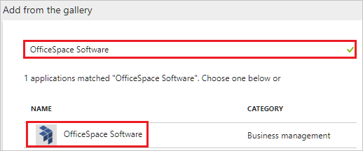
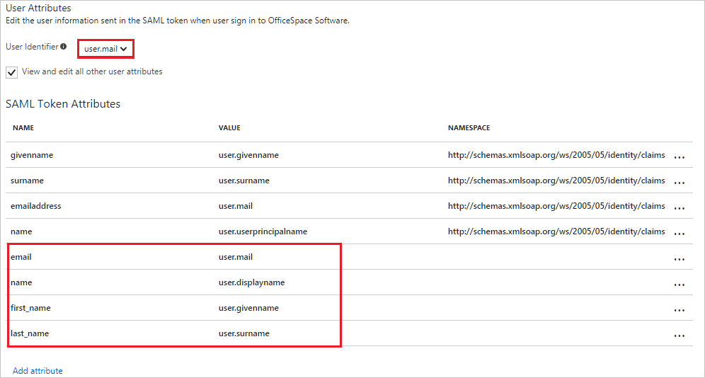
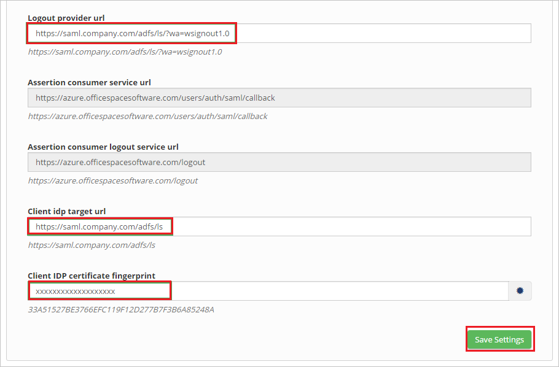
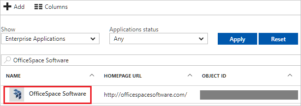

# Tutorial: Azure Active Directory integration with OfficeSpace Software

In this tutorial, you learn how to integrate OfficeSpace Software with Azure Active Directory (Azure AD).

Integrating OfficeSpace Software with Azure AD provides you with the following benefits:

- You can control in Azure AD who has access to OfficeSpace Software.
- You can enable your users to automatically get signed-on to OfficeSpace Software (Single Sign-On) with their Azure AD accounts.
- You can manage your accounts in one central location - the Azure portal.

If you want to know more details about SaaS app integration with Azure AD, see [what is application access and single sign-on with Azure Active Directory](../manage-apps/what-is-single-sign-on.md).

## Prerequisites

To configure Azure AD integration with OfficeSpace Software, you need the following items:

- An Azure AD subscription
- A OfficeSpace Software single sign-on enabled subscription

> [!NOTE]
> To test the steps in this tutorial, we do not recommend using a production environment.

To test the steps in this tutorial, you should follow these recommendations:

- Do not use your production environment, unless it is necessary.
- If you don't have an Azure AD trial environment, you can [get a one-month trial](https://azure.microsoft.com/pricing/free-trial/).

## Scenario description
In this tutorial, you test Azure AD single sign-on in a test environment. 
The scenario outlined in this tutorial consists of two main building blocks:

1. Adding OfficeSpace Software from the gallery
1. Configuring and testing Azure AD single sign-on

## Adding OfficeSpace Software from the gallery
To configure the integration of OfficeSpace Software into Azure AD, you need to add OfficeSpace Software from the gallery to your list of managed SaaS apps.

**To add OfficeSpace Software from the gallery, perform the following steps:**

1. In the **[Azure portal](https://portal.azure.com)**, on the left navigation panel, click **Azure Active Directory** icon. 

	![The Azure Active Directory button][1]

1. Navigate to **Enterprise applications**. Then go to **All applications**.

	![The Enterprise applications blade][2]
	
1. To add new application, click **New application** button on the top of dialog.

	![The New application button][3]

1. In the search box, type **OfficeSpace Software**, select **OfficeSpace Software** from result panel then click **Add** button to add the application.

	

## Configure and test Azure AD single sign-on

In this section, you configure and test Azure AD single sign-on with OfficeSpace Software based on a test user called "Britta Simon".

For single sign-on to work, Azure AD needs to know what the counterpart user in OfficeSpace Software is to a user in Azure AD. In other words, a link relationship between an Azure AD user and the related user in OfficeSpace Software needs to be established.

In OfficeSpace Software, assign the value of the **user name** in Azure AD as the value of the **Username** to establish the link relationship.

To configure and test Azure AD single sign-on with OfficeSpace Software, you need to complete the following building blocks:

1. **[Configure Azure AD Single Sign-On](#configure-azure-ad-single-sign-on)** - to enable your users to use this feature.
1. **[Create an Azure AD test user](#create-an-azure-ad-test-user)** - to test Azure AD single sign-on with Britta Simon.
1. **[Create a OfficeSpace Software test user](#create-a-officespace-software-test-user)** - to have a counterpart of Britta Simon in OfficeSpace Software that is linked to the Azure AD representation of user.
1. **[Assign the Azure AD test user](#assign-the-azure-ad-test-user)** - to enable Britta Simon to use Azure AD single sign-on.
1. **[Test single sign-on](#test-single-sign-on)** - to verify whether the configuration works.

### Configure Azure AD single sign-on

In this section, you enable Azure AD single sign-on in the Azure portal and configure single sign-on in your OfficeSpace Software application.

**To configure Azure AD single sign-on with OfficeSpace Software, perform the following steps:**

1. In the Azure portal, on the **OfficeSpace Software** application integration page, click **Single sign-on**.

	![Configure single sign-on link][4]

1. On the **Single sign-on** dialog, select **Mode** as	**SAML-based Sign-on** to enable single sign-on.
 
	

1. On the **OfficeSpace Software Domain and URLs** section, perform the following steps:

	

    a. In the **Sign-on URL** textbox, type a URL using the following pattern: `https://<company name>.officespacesoftware.com/users/sign_in/saml`

	b. In the **Identifier** textbox, type a URL using the following pattern: `<company name>.officespacesoftware.com`

	> [!NOTE] 
	> These values are not real. Update these values with the actual Sign-On URL and Identifier. Contact [OfficeSpace Software Client support team](mailto:support@officespacesoftware.com) to get these values. 

1. OfficeSpace Software application expects the SAML assertions in a specific format. Please configure the following claims for this application. You can manage the values of these attributes from the "**User Attributes**" section on application integration page. The following screenshot shows an example for this.
	
	

1. In the **User Attributes** section on the **Single sign-on** dialog, select **user.mail**  as **User Identifier** and for each row shown in the table below, perform the following steps:
    
	| Attribute Name | Attribute Value |
	| --- | --- |    
	| email | user.mail |
	| name | user.displayname |
	| first_name | user.givenname |
	| last_name | user.surname |

	a. Click **Add attribute** to open the **Add Attribute** dialog.

	

	
	
	b. In the **Name** textbox, type the attribute name shown for that row.
	
	c. From the **Value** list, type the attribute value shown for that row.
	
	d. Click **Ok**
 
1. On the **SAML Signing Certificate** section, copy the **THUMBPRINT** value of the certificate.

	 

1. Click **Save** button.

	

1. On the **OfficeSpace Software Configuration** section, click **Configure OfficeSpace Software** to open **Configure sign-on** window. Copy the **Sign-Out URL, and SAML Single Sign-On Service URL** from the **Quick Reference section.**

	 

1. In a different web browser window, log into your OfficeSpace Software tenant as an administrator.

1. Go to **Settings** and click **Connectors**.

	

1. Click **SAML Authentication**.

	

1. In the **SAML Authentication** section, perform the following steps:

	

	a. In the **Logout provider url** textbox, paste the value of **Sign-Out URL** which you have copied from Azure portal.

	b. In the **Client idp target url** textbox, paste the value of **SAML Single Sign-On Service URL** which you have copied from Azure portal.

	c. Paste the **Thumbprint** value which you have copied from Azure portal, into the **Client IDP certificate fingerprint** textbox. 

	d. Click **Save Settings**.

> [!TIP]
> You can now read a concise version of these instructions inside the [Azure portal](https://portal.azure.com), while you are setting up the app!  After adding this app from the **Active Directory > Enterprise Applications** section, simply click the **Single Sign-On** tab and access the embedded documentation through the **Configuration** section at the bottom. You can read more about the embedded documentation feature here: [Azure AD embedded documentation]( https://go.microsoft.com/fwlink/?linkid=845985)
> 

### Create an Azure AD test user

The objective of this section is to create a test user in the Azure portal called Britta Simon.

   ![Create an Azure AD test user][100]

**To create a test user in Azure AD, perform the following steps:**

1. In the Azure portal, in the left pane, click the **Azure Active Directory** button.

    

1. To display the list of users, go to **Users and groups**, and then click **All users**.

    

1. To open the **User** dialog box, click **Add** at the top of the **All Users** dialog box.

    

1. In the **User** dialog box, perform the following steps:

    

    a. In the **Name** box, type **BrittaSimon**.

    b. In the **User name** box, type the email address of user Britta Simon.

    c. Select the **Show Password** check box, and then write down the value that's displayed in the **Password** box.

    d. Click **Create**.
 
### Create a OfficeSpace Software test user

The objective of this section is to create a user called Britta Simon in OfficeSpace Software. OfficeSpace Software supports just-in-time provisioning, which is by default enabled.

There is no action item for you in this section. A new user will be created during an attempt to access OfficeSpace Software if it doesn't exist yet.

> [!NOTE]
> If you need to create an user manually, you need to Contact [OfficeSpace Software support team](mailto:support@officespacesoftware.com).

### Assign the Azure AD test user

In this section, you enable Britta Simon to use Azure single sign-on by granting access to OfficeSpace Software.

![Assign the user role][200] 

**To assign Britta Simon to OfficeSpace Software, perform the following steps:**

1. In the Azure portal, open the applications view, and then navigate to the directory view and go to **Enterprise applications** then click **All applications**.

	![Assign User][201] 

1. In the applications list, select **OfficeSpace Software**.

	  

1. In the menu on the left, click **Users and groups**.

	![The "Users and groups" link][202]

1. Click **Add** button. Then select **Users and groups** on **Add Assignment** dialog.

	![The Add Assignment pane][203]

1. On **Users and groups** dialog, select **Britta Simon** in the Users list.

1. Click **Select** button on **Users and groups** dialog.

1. Click **Assign** button on **Add Assignment** dialog.
	
### Test single sign-on

In this section, you test your Azure AD single sign-on configuration using the Access Panel.

When you click the OfficeSpace Software tile in the Access Panel, you should get automatically signed-on to your OfficeSpace Software application.

## Additional resources

* [List of Tutorials on How to Integrate SaaS Apps with Azure Active Directory](tutorial-list.md)
* [What is application access and single sign-on with Azure Active Directory?](../manage-apps/what-is-single-sign-on.md)

<!--Image references-->

[1]: ./media/officespace-tutorial/tutorial_general_01.png
[2]: ./media/officespace-tutorial/tutorial_general_02.png
[3]: ./media/officespace-tutorial/tutorial_general_03.png
[4]: ./media/officespace-tutorial/tutorial_general_04.png

[100]: ./media/officespace-tutorial/tutorial_general_100.png

[200]: ./media/officespace-tutorial/tutorial_general_200.png
[201]: ./media/officespace-tutorial/tutorial_general_201.png
[202]: ./media/officespace-tutorial/tutorial_general_202.png
[203]: ./media/officespace-tutorial/tutorial_general_203.png

