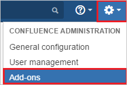
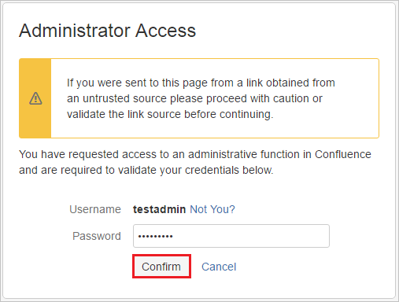
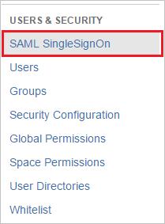
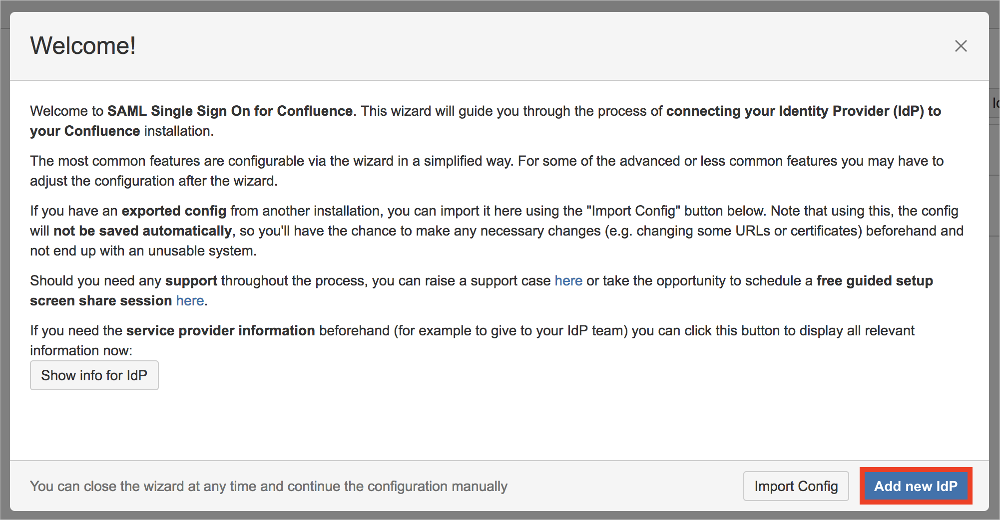
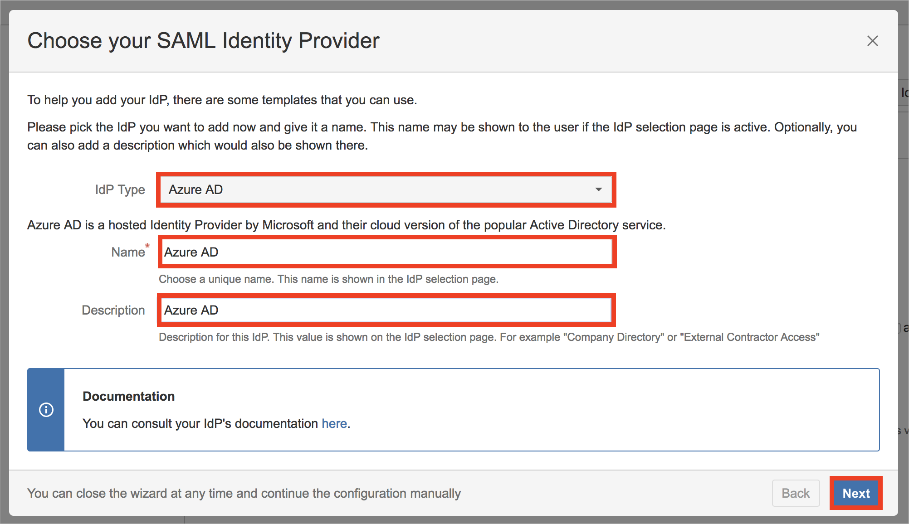
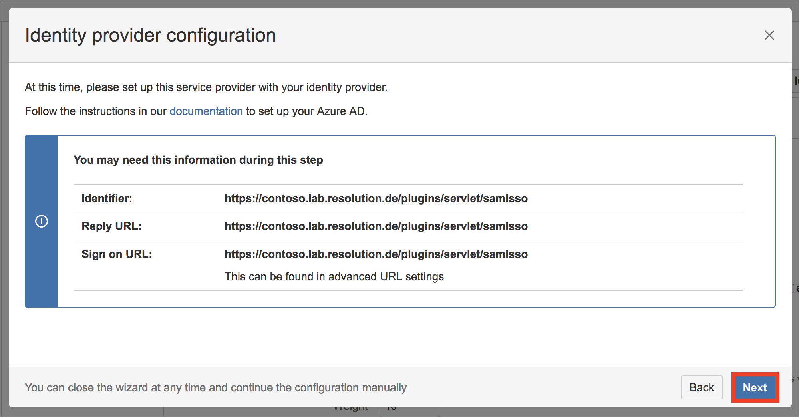
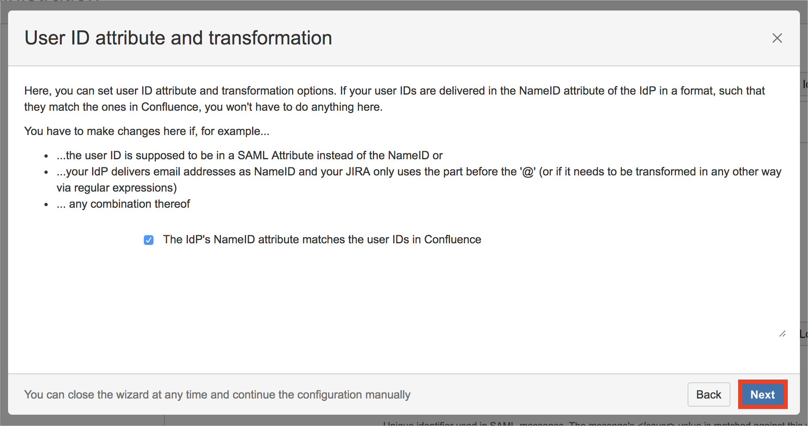
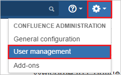

# Tutorial: Azure Active Directory integration with SAML SSO for Confluence by resolution GmbH

In this tutorial, you learn how to integrate SAML SSO for Confluence by resolution GmbH with Azure Active Directory (Azure AD).
Integrating SAML SSO for Confluence by resolution GmbH with Azure AD provides you with the following benefits:

* You can control in Azure AD who has access to SAML SSO for Confluence by resolution GmbH.
* You can enable your users to be automatically signed-in to SAML SSO for Confluence by resolution GmbH (Single Sign-On) with their Azure AD accounts.
* You can manage your accounts in one central location - the Azure portal.

If you want to know more details about SaaS app integration with Azure AD, see [What is application access and single sign-on with Azure Active Directory](https://docs.microsoft.com/azure/active-directory/active-directory-appssoaccess-whatis).
If you don't have an Azure subscription, [create a free account](https://azure.microsoft.com/free/) before you begin.

## Prerequisites

To configure Azure AD integration with SAML SSO for Confluence by resolution GmbH, you need the following items:

* An Azure AD subscription. If you don't have an Azure AD environment, you can get one-month trial [here](https://azure.microsoft.com/pricing/free-trial/)
* SAML SSO for Confluence by resolution GmbH single sign-on enabled subscription

## Scenario description

In this tutorial, you configure and test Azure AD single sign-on in a test environment.

* SAML SSO for Confluence by resolution GmbH supports **SP** and **IDP** initiated SSO

## Adding SAML SSO for Confluence by resolution GmbH from the gallery

To configure the integration of SAML SSO for Confluence by resolution GmbH into Azure AD, you need to add SAML SSO for Confluence by resolution GmbH from the gallery to your list of managed SaaS apps.

**To add SAML SSO for Confluence by resolution GmbH from the gallery, perform the following steps:**

1. In the **[Azure portal](https://portal.azure.com)**, on the left navigation panel, click **Azure Active Directory** icon.

	

2. Navigate to **Enterprise Applications** and then select the **All Applications** option.

	

3. To add new application, click **New application** button on the top of dialog.

	

4. In the search box, type **SAML SSO for Confluence by resolution GmbH**, select **SAML SSO for Confluence by resolution GmbH** from result panel then click **Add** button to add the application.

	 

## Configure and test Azure AD single sign-on

In this section, you configure and test Azure AD single sign-on with SAML SSO for Confluence by resolution GmbH based on a test user called **Britta Simon**.
For single sign-on to work, a link relationship between an Azure AD user and the related user in SAML SSO for Confluence by resolution GmbH needs to be established.

To configure and test Azure AD single sign-on with SAML SSO for Confluence by resolution GmbH, you need to complete the following building blocks:

1. **[Configure Azure AD Single Sign-On](#configure-azure-ad-single-sign-on)** - to enable your users to use this feature.
2. **[Configure SAML SSO for Confluence by resolution GmbH Single Sign-On](#configure-saml-sso-for-confluence-by-resolution-gmbh-single-sign-on)** - to configure the Single Sign-On settings on application side.
3. **[Create an Azure AD test user](#create-an-azure-ad-test-user)** - to test Azure AD single sign-on with Britta Simon.
4. **[Assign the Azure AD test user](#assign-the-azure-ad-test-user)** - to enable Britta Simon to use Azure AD single sign-on.
5. **[Create SAML SSO for Confluence by resolution GmbH test user](#create-saml-sso-for-confluence-by-resolution-gmbh-test-user)** - to have a counterpart of Britta Simon in SAML SSO for Confluence by resolution GmbH that is linked to the Azure AD representation of user.
6. **[Test single sign-on](#test-single-sign-on)** - to verify whether the configuration works.

### Configure Azure AD single sign-on

In this section, you enable Azure AD single sign-on in the Azure portal.

To configure Azure AD single sign-on with SAML SSO for Confluence by resolution GmbH, perform the following steps:

1. In the [Azure portal](https://portal.azure.com/), on the **SAML SSO for Confluence by resolution GmbH** application integration page, select **Single sign-on**.

    

2. On the **Select a Single sign-on method** dialog, select **SAML/WS-Fed** mode to enable single sign-on.

    

3. On the **Set up Single Sign-On with SAML** page, click **Edit** icon to open **Basic SAML Configuration** dialog.

	

4. On the **Basic SAML Configuration** section perform the following steps, if you wish to configure the application in **IDP** Initiated mode:

    

    a. In the **Identifier** text box, type a URL using the following pattern:
    `https://<server-base-url>/plugins/servlet/samlsso`

    b. In the **Reply URL** text box, type a URL using the following pattern:
    `https://<server-base-url>/plugins/servlet/samlsso`

    c. Click **Set additional URLs** and perform the following step if you wish to configure the application in SP initiated mode:

	

    In the **Sign-on URL** text box, type a URL using the following pattern:
    `https://<server-base-url>/plugins/servlet/samlsso`

	> [!NOTE]
	> These values are not real. Update these values with the actual Identifier, Reply URL and Sign-on URL. Contact [SAML SSO for Confluence by resolution GmbH Client support team](https://www.resolution.de/go/support) to get these values. You can also refer to the patterns shown in the **Basic SAML Configuration** section in the Azure portal.

4. On the **Set up Single Sign-On with SAML** page, in the **SAML Signing Certificate** section, click **Download** to download the **Federation Metadata XML** from the given options as per your requirement and save it on your computer.

	

### Configure SAML SSO for Confluence by resolution GmbH Single Sign-On

1. In a different web browser window, log in to your **SAML SSO for Confluence by resolution GmbH admin portal** as an administrator.

2. Hover on cog and click the **Add-ons**.
    
	

3. You are redirected to Administrator Access page. Enter the password and click **Confirm** button.

	

4. Under **ATLASSIAN MARKETPLACE** tab, click **Find new add-ons**. 

	

5. Search **SAML Single Sign On (SSO) for Confluence** and click **Install** button to install the new SAML plugin.

	

6. The plugin installation will start. Click **Close**.

	

	

7.	Click **Manage**.

	
    
8. Click **Configure** to configure the new plugin.

	

9. This new plugin can also be found under **USERS & SECURITY** tab.

	
    
10. On **SAML SingleSignOn Plugin Configuration** page, click **Add new IdP** button to configure the settings of Identity Provider.

	

11. On **Choose your SAML Identity Provider** page, perform the following steps:

	
 
	a. Set **Azure AD** as the IdP type.
	
	b. Add **Name** of the Identity Provider (e.g Azure AD).
	
	c. Add **Description** of the Identity Provider (e.g Azure AD).
	
	d. Click **Next**.
	
12. On **Identity provider configuration** page, click **Next** button.

	

13. On **Import SAML IdP Metadata** page, perform the following steps:

	

    a. Click **Load File** button and pick Metadata XML file you downloaded in Step 5.

    b. Click **Import** button.
    
    c. Wait briefly until import succeeds.
    
    d. Click **Next** button.
    
14. On **User ID attribute and transformation** page, click **Next** button.

	
	
15. On **User creation and update** page, click **Save & Next** to save settings.	
	
	
	
16. On **Test your settings** page, click **Skip test & configure manually** to skip the user test for now. This will be performed in the next section and requires some settings in Azure portal. 
	
	
	
17. In the apprearing dialog reading **Skipping the test means...**, click **OK**.
	
	

### Create an Azure AD test user 

The objective of this section is to create a test user in the Azure portal called Britta Simon.

1. In the Azure portal, in the left pane, select **Azure Active Directory**, select **Users**, and then select **All users**.

    

2. Select **New user** at the top of the screen.

    

3. In the User properties, perform the following steps.

    

    a. In the **Name** field enter **BrittaSimon**.
  
    b. In the **User name** field type **brittasimon@yourcompanydomain.extension**  
    For example, BrittaSimon@contoso.com

    c. Select **Show password** check box, and then write down the value that's displayed in the Password box.

    d. Click **Create**.

### Assign the Azure AD test user

In this section, you enable Britta Simon to use Azure single sign-on by granting access to SAML SSO for Confluence by resolution GmbH.

1. In the Azure portal, select **Enterprise Applications**, select **All applications**, then select **SAML SSO for Confluence by resolution GmbH**.

	

2. In the applications list, type and select **SAML SSO for Confluence by resolution GmbH**.

	

3. In the menu on the left, select **Users and groups**.

    

4. Click the **Add user** button, then select **Users and groups** in the **Add Assignment** dialog.

    

5. In the **Users and groups** dialog select **Britta Simon** in the Users list, then click the **Select** button at the bottom of the screen.

6. If you are expecting any role value in the SAML assertion then in the **Select Role** dialog select the appropriate role for the user from the list, then click the **Select** button at the bottom of the screen.

7. In the **Add Assignment** dialog click the **Assign** button.

### Create SAML SSO for Confluence by resolution GmbH test user

To enable Azure AD users to log in to SAML SSO for Confluence by resolution GmbH, they must be provisioned into SAML SSO for Confluence by resolution GmbH.  
In SAML SSO for Confluence by resolution GmbH, provisioning is a manual task.

**To provision a user account, perform the following steps:**

1. Log in to your SAML SSO for Confluence by resolution GmbH company site as an administrator.

2. Hover on cog and click the **User management**.

     

3. Under Users section, click **Add users** tab. On the **“Add a User”** dialog page, perform the following steps:

	 

	a. In the **Username** textbox, type the email of user like Britta Simon.

	b. In the **Full Name** textbox, type the full name of user like Britta Simon.

	c. In the **Email** textbox, type the email address of user like Brittasimon@contoso.com.

	d. In the **Password** textbox, type the password for Britta Simon.

	e. Click **Confirm Password** reenter the password.
	
	f. Click **Add** button.

### Test single sign-on 

In this section, you test your Azure AD single sign-on configuration using the Access Panel.

When you click the SAML SSO for Confluence by resolution GmbH tile in the Access Panel, you should be automatically signed in to the SAML SSO for Confluence by resolution GmbH for which you set up SSO. For more information about the Access Panel, see [Introduction to the Access Panel](https://docs.microsoft.com/azure/active-directory/active-directory-saas-access-panel-introduction).

## Additional resources

- [ List of Tutorials on How to Integrate SaaS Apps with Azure Active Directory ](https://docs.microsoft.com/azure/active-directory/active-directory-saas-tutorial-list)

- [What is application access and single sign-on with Azure Active Directory? ](https://docs.microsoft.com/azure/active-directory/active-directory-appssoaccess-whatis)

- [What is conditional access in Azure Active Directory?](https://docs.microsoft.com/azure/active-directory/conditional-access/overview)

