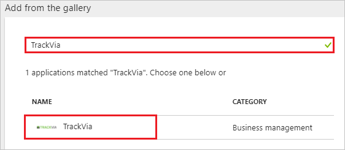
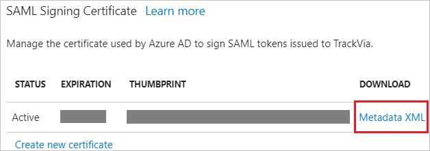
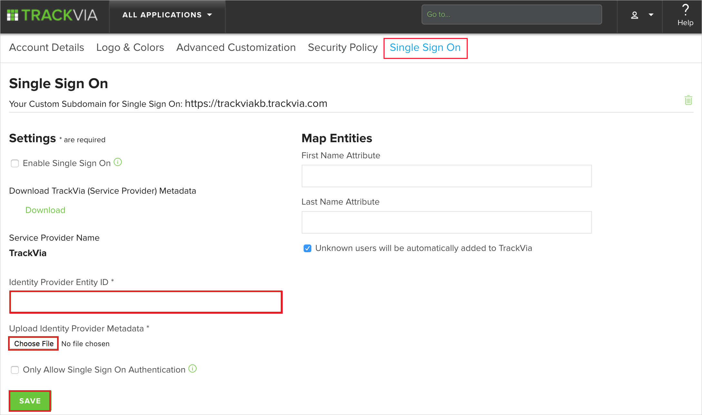

# Tutorial: Azure Active Directory integration with TrackVia

In this tutorial, you learn how to integrate TrackVia with Azure Active Directory (Azure AD).

Integrating TrackVia with Azure AD provides you with the following benefits:

- You can control in Azure AD who has access to TrackVia.
- You can enable your users to automatically get signed-on to TrackVia (Single Sign-On) with their Azure AD accounts.
- You can manage your accounts in one central location - the Azure portal.

If you want to know more details about SaaS app integration with Azure AD, see [what is application access and single sign-on with Azure Active Directory](../manage-apps/what-is-single-sign-on.md).

## Prerequisites

To configure Azure AD integration with TrackVia, you need the following items:

- An Azure AD subscription
- A TrackVia single sign-on enabled subscription

> [!NOTE]
> To test the steps in this tutorial, we do not recommend using a production environment.

To test the steps in this tutorial, you should follow these recommendations:

- Do not use your production environment, unless it is necessary.
- If you don't have an Azure AD trial environment, you can [get a one-month trial](https://azure.microsoft.com/pricing/free-trial/).

## Scenario description
In this tutorial, you test Azure AD single sign-on in a test environment. 
The scenario outlined in this tutorial consists of two main building blocks:

1. Adding TrackVia from the gallery
1. Configuring and testing Azure AD single sign-on

## Adding TrackVia from the gallery
To configure the integration of TrackVia into Azure AD, you need to add TrackVia from the gallery to your list of managed SaaS apps.

**To add TrackVia from the gallery, perform the following steps:**

1. In the **[Azure portal](https://portal.azure.com)**, on the left navigation panel, click **Azure Active Directory** icon. 

	![The Azure Active Directory button][1]

1. Navigate to **Enterprise applications**. Then go to **All applications**.

	![The Enterprise applications blade][2]
	
1. To add new application, click **New application** button on the top of dialog.

	![The New application button][3]

1. In the search box, type **TrackVia**, select **TrackVia** from result panel then click **Add** button to add the application.

	

## Configure and test Azure AD single sign-on

In this section, you configure and test Azure AD single sign-on with TrackVia based on a test user called "Britta Simon".

For single sign-on to work, Azure AD needs to know what the counterpart user in TrackVia is to a user in Azure AD. In other words, a link relationship between an Azure AD user and the related user in TrackVia needs to be established.

In TrackVia, assign the value of the **user name** in Azure AD as the value of the **Username** to establish the link relationship.

To configure and test Azure AD single sign-on with TrackVia, you need to complete the following building blocks:

1. **[Configure Azure AD Single Sign-On](#configure-azure-ad-single-sign-on)** - to enable your users to use this feature.
1. **[Create an Azure AD test user](#create-an-azure-ad-test-user)** - to test Azure AD single sign-on with Britta Simon.
1. **[Create a TrackVia test user](#create-a-trackvia-test-user)** - to have a counterpart of Britta Simon in TrackVia that is linked to the Azure AD representation of user.
1. **[Assign the Azure AD test user](#assign-the-azure-ad-test-user)** - to enable Britta Simon to use Azure AD single sign-on.
1. **[Test single sign-on](#test-single-sign-on)** - to verify whether the configuration works.

### Configure Azure AD single sign-on

In this section, you enable Azure AD single sign-on in the Azure portal and configure single sign-on in your TrackVia application.

**To configure Azure AD single sign-on with TrackVia, perform the following steps:**

1. In the Azure portal, on the **TrackVia** application integration page, click **Single sign-on**.

	![Configure single sign-on link][4]

1. On the **Single sign-on** dialog, select **Mode** as	**SAML-based Sign-on** to enable single sign-on.
 
	

1. On the **TrackVia Domain and URLs** section, perform the following steps if you wish to configure the application in **IDP** initiated mode:

	

	In the **Identifier** textbox, type the value: `TrackVia`

1. Check **Show advanced URL settings** and perform the following step if you wish to configure the application in **SP** initiated mode:

	

    In the **Sign-on URL** textbox, type a URL using the following pattern: `https://companyname.trackvia.com`
	 
	> [!NOTE] 
	> Sign-on URL value is not real. Update this value with the actual Sign-On URL. Contact [TrackVia Client support team](mailto:support@trackvia.com) to get this value.

1. On the **SAML Signing Certificate** section, click **Metadata XML** and then save the metadata file on your computer.

	 

1. Click **Save** button.

	

1. On the **TrackVia Configuration** section, click **Configure TrackVia** to open **Configure sign-on** window. Copy the **SAML Entity ID** from the **Quick Reference section.**

	
	
1. In different browser window, sign on to your TrackVia company site as an administrator.

1. Click on Trackvia **My Account** settings and then select **Single Sign On** tab, perform the following steps:

	

	a. In the **Identity Provider Entity ID** textbox, paste **SAML Entity ID** value, which you have copied from the Azure portal.

	b. Select the **Choose File** to upload the metadata file that you downloaded from the Azure portal.

	c. Click **Save**

### Create an Azure AD test user

The objective of this section is to create a test user in the Azure portal called Britta Simon.

   ![Create an Azure AD test user][100]

**To create a test user in Azure AD, perform the following steps:**

1. In the Azure portal, in the left pane, click the **Azure Active Directory** button.

    

1. To display the list of users, go to **Users and groups**, and then click **All users**.

    

1. To open the **User** dialog box, click **Add** at the top of the **All Users** dialog box.

    

1. In the **User** dialog box, perform the following steps:

    

    a. In the **Name** box, type **BrittaSimon**.

    b. In the **User name** box, type the email address of user Britta Simon.

    c. Select the **Show Password** check box, and then write down the value that's displayed in the **Password** box.

    d. Click **Create**.
 
### Create a TrackVia test user

The objective of this section is to create a user called Britta Simon in TrackVia. TrackVia supports just-in-time provisioning, which is by default enabled. There is no action item for you in this section. A new user is created during an attempt to access TrackVia if it doesn't exist yet.
>[!Note]
>If you need to create a user manually, contact [TrackVia support team](mailto:support@trackvia.com).

### Assign the Azure AD test user

In this section, you enable Britta Simon to use Azure single sign-on by granting access to TrackVia.

![Assign the user role][200] 

**To assign Britta Simon to TrackVia, perform the following steps:**

1. In the Azure portal, open the applications view, and then navigate to the directory view and go to **Enterprise applications** then click **All applications**.

	![Assign User][201] 

1. In the applications list, select **TrackVia**.

	  

1. In the menu on the left, click **Users and groups**.

	![The "Users and groups" link][202]

1. Click **Add** button. Then select **Users and groups** on **Add Assignment** dialog.

	![The Add Assignment pane][203]

1. On **Users and groups** dialog, select **Britta Simon** in the Users list.

1. Click **Select** button on **Users and groups** dialog.

1. Click **Assign** button on **Add Assignment** dialog.
	
### Test single sign-on

In this section, you test your Azure AD single sign-on configuration using the Access Panel.

When you click the TrackVia tile in the Access Panel, you should get automatically signed-on to your TrackVia application.
For more information about the Access Panel, see [Introduction to the Access Panel](../user-help/active-directory-saas-access-panel-introduction.md). 

## Additional resources

* [List of Tutorials on How to Integrate SaaS Apps with Azure Active Directory](tutorial-list.md)
* [What is application access and single sign-on with Azure Active Directory?](../manage-apps/what-is-single-sign-on.md)

<!--Image references-->

[1]: ./media/trackvia-tutorial/tutorial_general_01.png
[2]: ./media/trackvia-tutorial/tutorial_general_02.png
[3]: ./media/trackvia-tutorial/tutorial_general_03.png
[4]: ./media/trackvia-tutorial/tutorial_general_04.png

[100]: ./media/trackvia-tutorial/tutorial_general_100.png

[200]: ./media/trackvia-tutorial/tutorial_general_200.png
[201]: ./media/trackvia-tutorial/tutorial_general_201.png
[202]: ./media/trackvia-tutorial/tutorial_general_202.png
[203]: ./media/trackvia-tutorial/tutorial_general_203.png
