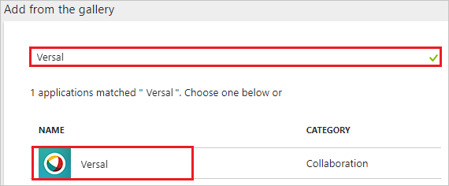
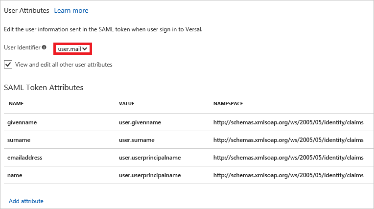
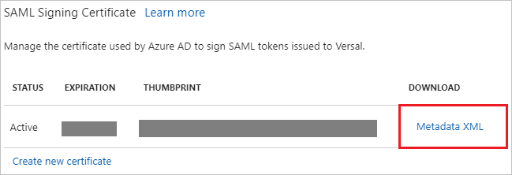
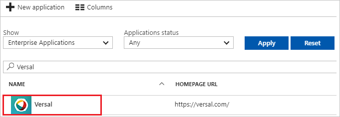

# Tutorial: Azure Active Directory integration with Versal

In this tutorial, you learn how to integrate Versal with Azure Active Directory (Azure AD).

Integrating Versal with Azure AD provides you with the following benefits:

- You can control in Azure AD who has access to Versal.
- You can enable your users to automatically get signed-on to Versal (Single Sign-On) with their Azure AD accounts.
- You can manage your accounts in one central location - the Azure portal.

If you want to know more details about SaaS app integration with Azure AD, see [what is application access and single sign-on with Azure Active Directory](../manage-apps/what-is-single-sign-on.md).

## Prerequisites

To configure Azure AD integration with Versal, you need the following items:

- An Azure AD subscription
- A Versal single sign-on enabled subscription

> [!NOTE]
> To test the steps in this tutorial, we do not recommend using a production environment.

To test the steps in this tutorial, you should follow these recommendations:

- Do not use your production environment, unless it is necessary.
- If you don't have an Azure AD trial environment, you can [get a one-month trial](https://azure.microsoft.com/pricing/free-trial/).

## Scenario description
In this tutorial, you test Azure AD single sign-on in a test environment. 
The scenario outlined in this tutorial consists of two main building blocks:

1. Adding Versal from the gallery
1. Configuring and testing Azure AD single sign-on

## Adding Versal from the gallery
To configure the integration of Versal into Azure AD, you need to add Versal from the gallery to your list of managed SaaS apps.

**To add Versal from the gallery, perform the following steps:**

1. In the **[Azure portal](https://portal.azure.com)**, on the left navigation panel, click **Azure Active Directory** icon. 

	![The Azure Active Directory button][1]

1. Navigate to **Enterprise applications**. Then go to **All applications**.

	![The Enterprise applications blade][2]
	
1. To add new application, click **New application** button on the top of dialog.

	![The New application button][3]

1. In the search box, type **Versal**, select **Versal** from result panel then click **Add** button to add the application.

	

## Configure and test Azure AD single sign-on

In this section, you configure and test Azure AD single sign-on with Versal based on a test user called "Britta Simon".

For single sign-on to work, Azure AD needs to know what the counterpart user in Versal is to a user in Azure AD. In other words, a link relationship between an Azure AD user and the related user in Versal needs to be established.

In Versal, assign the value of the **user name** in Azure AD as the value of the **Username** to establish the link relationship.

To configure and test Azure AD single sign-on with Versal, you need to complete the following building blocks:

1. **[Configure Azure AD Single Sign-On](#configure-azure-ad-single-sign-on)** - to enable your users to use this feature.
1. **[Create an Azure AD test user](#create-an-azure-ad-test-user)** - to test Azure AD single sign-on with Britta Simon.
1. **[Create a Versal test user](#create-a-versal-test-user)** - to have a counterpart of Britta Simon in Versal that is linked to the Azure AD representation of user.
1. **[Assign the Azure AD test user](#assign-the-azure-ad-test-user)** - to enable Britta Simon to use Azure AD single sign-on.
1. **[Test single sign-on](#test-single-sign-on)** - to verify whether the configuration works.

### Configure Azure AD single sign-on

In this section, you enable Azure AD single sign-on in the Azure portal and configure single sign-on in your Versal application.

**To configure Azure AD single sign-on with Versal, perform the following steps:**

1. In the Azure portal, on the **Versal** application integration page, click **Single sign-on**.

	![Configure single sign-on link][4]

1. On the **Single sign-on** dialog, select **Mode** as	**SAML-based Sign-on** to enable single sign-on.
 
	

1. On the **Versal Domain and URLs** section, perform the following steps:

	

    a. In the **Identifier** textbox, type the value: `VERSAL`

	b. In the **Reply URL** textbox, type a URL using the following pattern: `https://versal.com/sso/saml/orgs/<organization_id>`

	> [!NOTE] 
	> Reply URL value is not real. Update this value with the actual Reply URL. Contact [Versal support team](https://support.versal.com/hc/) to get this value.
	
1. Your application expects the SAML assertions in a specific format, which requires you to add custom attribute mappings to your SAML token attributes configuration. The following screenshot shows an example for this. The default value of **User Identifier** is **user.userprincipalname** but **Versal** expects this to be mapped with the user's email address. For that you can use **user.mail** attribute from the list or use the appropriate attribute value based on your organization configuration.
    
	

1. On the **SAML Signing Certificate** section, click **Metadata XML** and then save the metadata file on your computer.

	 

1. Click **Save** button.

	
	
1. To configure single sign-on on **Versal** side, you need to send the downloaded **Metadata XML**  and **SAML Signing Certificate** to [Versal support team](https://support.versal.com/hc/). They will configure your Versal organization to have the SAML SSO connection set properly on both sides.

> [!TIP]
> You can now read a concise version of these instructions inside the [Azure portal](https://portal.azure.com), while you are setting up the app!  After adding this app from the **Active Directory > Enterprise Applications** section, simply click the **Single Sign-On** tab and access the embedded documentation through the **Configuration** section at the bottom. You can read more about the embedded documentation feature here: [Azure AD embedded documentation]( https://go.microsoft.com/fwlink/?linkid=845985)

### Create an Azure AD test user

The objective of this section is to create a test user in the Azure portal called Britta Simon.

   ![Create an Azure AD test user][100]

**To create a test user in Azure AD, perform the following steps:**

1. In the Azure portal, in the left pane, click the **Azure Active Directory** button.

    

1. To display the list of users, go to **Users and groups**, and then click **All users**.

    

1. To open the **User** dialog box, click **Add** at the top of the **All Users** dialog box.

    

1. In the **User** dialog box, perform the following steps:

    

    a. In the **Name** box, type **BrittaSimon**.

    b. In the **User name** box, type the email address of user Britta Simon.

    c. Select the **Show Password** check box, and then write down the value that's displayed in the **Password** box.

    d. Click **Create**.
  
### Create a Versal test user

In this section, you create a user called Britta Simon in Versal. Please follow the [Creating a SAML test user](https://support.versal.com/hc/en-us/articles/115011672887-Creating-a-SAML-test-user)
support guide to create the user Britta Simon within your organization. Users must be created and activated in Versal before you use single sign-on. 

### Assign the Azure AD test user

In this section, you enable Britta Simon to use Azure single sign-on by granting access to Versal.

![Assign the user role][200] 

**To assign Britta Simon to Versal, perform the following steps:**

1. In the Azure portal, open the applications view, and then navigate to the directory view and go to **Enterprise applications** then click **All applications**.

	![Assign User][201] 

1. In the applications list, select **Versal**.

	  

1. In the menu on the left, click **Users and groups**.

	![The "Users and groups" link][202]

1. Click **Add** button. Then select **Users and groups** on **Add Assignment** dialog.

	![The Add Assignment pane][203]

1. On **Users and groups** dialog, select **Britta Simon** in the Users list.

1. Click **Select** button on **Users and groups** dialog.

1. Click **Assign** button on **Add Assignment** dialog.
	
### Test single sign-on

In this section, you test your Azure AD single sign-on configuration using a Versal course embedded within your website.
Please see the [Embedding Organizational Courses](https://support.versal.com/hc/en-us/articles/203271866-Embedding-organizational-courses) **SAML Single Sign-On**
support guide for instructions on how to embed a Versal course with support for Azure AD single sign-on. 

You will need to create a course, share it with your organization, and publish it in order to test course embedding. 
Please see [Creating a course](https://support.versal.com/hc/en-us/articles/203722528-Create-a-course), [Publishing a course](https://support.versal.com/hc/en-us/articles/203753398-Publishing-a-course),
 and [Course and learner management](https://support.versal.com/hc/en-us/articles/206029467-Course-and-learner-management) for more information.  
                     

## Additional resources

* [List of Tutorials on How to Integrate SaaS Apps with Azure Active Directory](tutorial-list.md)
* [What is application access and single sign-on with Azure Active Directory?](../manage-apps/what-is-single-sign-on.md)

<!--Image references-->

[1]: ./media/versal-tutorial/tutorial_general_01.png
[2]: ./media/versal-tutorial/tutorial_general_02.png
[3]: ./media/versal-tutorial/tutorial_general_03.png
[4]: ./media/versal-tutorial/tutorial_general_04.png

[100]: ./media/versal-tutorial/tutorial_general_100.png

[200]: ./media/versal-tutorial/tutorial_general_200.png
[201]: ./media/versal-tutorial/tutorial_general_201.png
[202]: ./media/versal-tutorial/tutorial_general_202.png
[203]: ./media/versal-tutorial/tutorial_general_203.png

