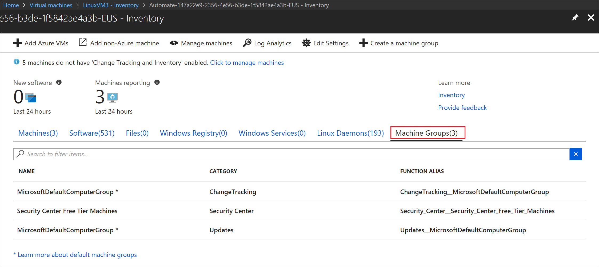
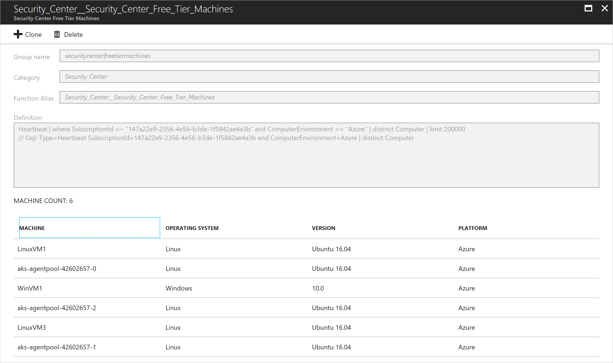
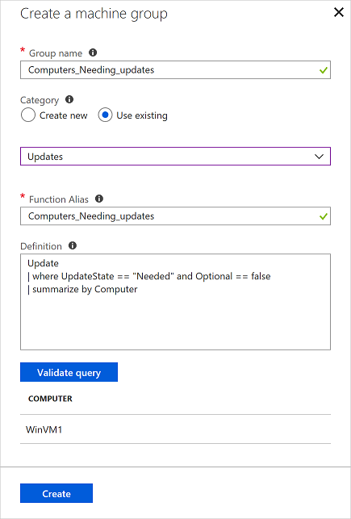

# Manage an Azure virtual machine with inventory collection

You can enable inventory tracking for an Azure virtual machine from the virtual machine's resource page. This method provides a browser-based user interface for setting up and configuring inventory collection.

## Before you begin

If you don't have an Azure subscription, [create a free account](https://azure.microsoft.com/free/).

This article assumes you have a VM to configure the solution on. If you don't have an Azure virtual machine, [create a virtual machine](../virtual-machines/windows/quick-create-portal.md).

## Sign in to the Azure portal

Sign in to the [Azure portal](https://portal.azure.com/).

## Enable inventory collection from the virtual machine resource page

1. In the left pane of the Azure portal, select **Virtual machines**.
2. In the list of virtual machines, select a virtual machine.
3. On the **Resource** menu, under **Operations**, select **Inventory**.
4. Select a log analytics workspace for storing your data logs.
    If no workspace is available to you for that region, you are prompted to create a default workspace and automation account.
5. To start onboarding your computer, select **Enable**.

   

    A status bar notifies you that the solution is being enabled. This process can take up to 15 minutes. During this time, you can close the window, or you can keep it open and it notifies you when the solution is enabled. You can monitor the deployment status from the notifications pane.

   

When the deployment is complete, the status bar disappears. The system is still collecting inventory data, and the data might not be visible yet. A full collection of data can take 24 hours.

## Configure your inventory settings

By default, software, Windows services, and Linux daemons are configured for collection. To collect Windows registry and file inventory, configure the inventory collection settings.

1. In the **Inventory** view, select the **Edit Settings** button at the top of the window.
2. To add a new collection setting, go to the setting category that you want to add by selecting the **Windows Registry**, **Windows Files**, and **Linux Files** tabs.
3. Select the appropriate category and click **Add** at the top of the window.

The following tables provide information about each property that can be configured for the various categories.

### Windows Registry

|Property  |Description  |
|---------|---------|
|Enabled     | Determines if the setting is applied        |
|Item Name     | Friendly name of the file to be tracked        |
|Group     | A group name for logically grouping files        |
|Windows Registry Key   | The path to check for the file For example: "HKEY_LOCAL_MACHINE\SOFTWARE\Microsoft\Windows\CurrentVersion\Explorer\User Shell Folders\Common Startup"      |

### Windows Files

|Property  |Description  |
|---------|---------|
|Enabled     | Determines if the setting is applied        |
|Item Name     | Friendly name of the file to be tracked        |
|Group     | A group name for logically grouping files        |
|Enter Path     | The path to check for the file For example: "c:\temp\myfile.txt"

### Linux Files

|Property  |Description  |
|---------|---------|
|Enabled     | Determines if the setting is applied        |
|Item Name     | Friendly name of the file to be tracked        |
|Group     | A group name for logically grouping files        |
|Enter Path     | The path to check for the file For example: "/etc/*.conf"       |
|Path Type     | Type of item to be tracked, possible values are File and Directory        |
|Recursion     | Determines if recursion is used when looking for the item to be tracked.        |
|Use Sudo     | This setting determines if sudo is used when checking for the item.         |
|Links     | This setting determines how symbolic links dealt with when traversing directories.  **Ignore** - Ignores symbolic links and does not include the files/directories referenced **Follow** - Follows the symbolic links during recursion and also includes the files/directories referenced **Manage** - Follows the symbolic links and allows alter the treatment of returned content      |

## Manage machine groups

Inventory allows you to create and view machine groups in Log Analytics. Machine groups are collections of machines defined by a query in Log Analytics.

To view your machine groups select the **Machine groups** tab on the Inventory page.

Selecting a machine group from the list opens the Machine groups page. This page shows details about the machine group. These details include the log analytics query that is used to define the group. At the bottom of the page, is a paged list of the machines that are part of that group.

Click the **+ Clone** button to clone the machine group. Here you must give the group a new name and alias for the group. The definition can be altered at this time. After changing the query press **Validate query** to preview the machines that would be selected. When you are happy with the group click **Create** to create the machine group

If you want to create a new mchine group, select **+ Create a machine group**. This button opens the **Create a machine group page** where you can define your new group. Click **Create** to create the group.

## Disconnect your virtual machine from management

To remove your virtual machine from inventory management:

1. In the left pane of the Azure portal, select **Log Analytics**, and then select the workspace that you used when you onboarded your virtual machine.
2. In the **Log Analytics** window, on the **Resource** menu, under the **Workspace Data Sources** category, select **Virtual machines**.
3. In the list, select the virtual machine that you want to disconnect. The virtual machine has a green check mark next to **This workspace** in the **OMS Connection** column.

   >[!NOTE]
   >OMS is now referred to as Log Analytics.
   
4. At the top of the next page, select **Disconnect**.
5. In the confirmation window, select **Yes**.
    This action disconnects the machine from management.

## Next steps

* To learn about managing changes in files and registry settings on your virtual machines, see [Track software changes in your environment with the Change Tracking solution](../log-analytics/log-analytics-change-tracking.md).
* To learn about managing Windows and package updates on your virtual machines, see [The Update Management solution in Azure](../operations-management-suite/oms-solution-update-management.md).

