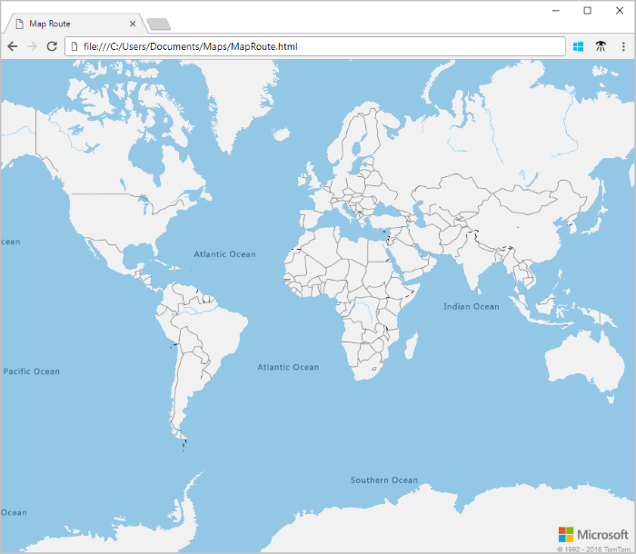
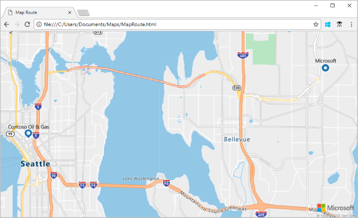
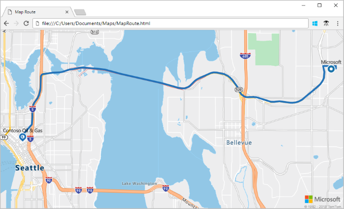

# Route to a point of interest using Azure Maps

This tutorial shows how to use your Azure Maps account and the Route Service SDK to find the route to your point of interest. In this tutorial, you learn how to:

> [!div class="checklist"]
> * Create a new web page using the map control API
> * Set address coordinates
> * Query Route Service for directions to point of interest

## Prerequisites

Before you proceed, follow the steps in the previous tutorial to [create your Azure Maps account](./tutorial-search-location.md#createaccount), and [get the subscription key for your account](./tutorial-search-location.md#getkey).

<a id="getcoordinates"></a>

## Create a new map

The following steps show you how to create a static HTML page embedded with the Map Control API.

1. On your local machine, create a new file and name it **MapRoute.html**.
2. Add the following HTML components to the file:

    ```HTML
    <!DOCTYPE html>
    <html>
    <head>
        <title>Map Route</title>
        <meta charset="utf-8" />
        <meta name="viewport" content="width=device-width, initial-scale=1, shrink-to-fit=no" />
        
        <!-- Add references to the Azure Maps Map control JavaScript and CSS files. -->
        <link rel="stylesheet" href="https://atlas.microsoft.com/sdk/css/atlas.min.css?api-version=1" type="text/css" />
        <script src="https://atlas.microsoft.com/sdk/js/atlas.min.js?api-version=1"></script>

        <!-- Add a reference to the Azure Maps Services Module JavaScript file. -->
        <script src="https://atlas.microsoft.com/sdk/js/atlas-service.js?api-version=1"></script>
        
        <script>
            var map, datasource, client;

            function GetMap() {
                //Add Map Control JavaScript code here.
            }
	    </script>
        <style>
            html,
            body {
                width: 100%;
                height: 100%;
                padding: 0;
                margin: 0;
            }

            #map {
                width: 100%;
                height: 100%;
            }
        </style>
    </head>
    <body onload="GetMap()">
        <div id="myMap"></div>
    </body>
    </html>
    ```
    
    Notice that the HTML header includes the CSS and JavaScript resource files hosted by the Azure Map Control library. Note the `onload` event on the body of the page, which will call the `GetMap` function when the body of the page has loaded. This function will contain the inline JavaScript code to access the Azure Maps APIs. 

3. Add the following JavaScript code to the `GetMap` function. Replace the string **\<Your Azure Maps Key\>** with the primary key that you copied from your Maps account.

    ```JavaScript
    //Add your Azure Maps subscription key to the map SDK. 
    atlas.setSubscriptionKey('<Your Azure Maps Key>');

    //Initialize a map instance.
    map = new atlas.Map('myMap');
    ```

    The `atlas.Map` provides the control for a visual and interactive web map, and is a component of the Azure Map Control API.

4. Save the file and open it in your browser. At this point, you have a basic map that you can develop further.

   

## Define how the route will be rendered

In this tutorial, a simple route will be rendered using a symbol icon for the start and end of the route, and a line for the route path.

1. In the GetMap function, after initializing the map, add the following JavaScript code.

    ```JavaScript
    //Wait until the map resources have fully loaded.
    map.events.add('load', function () {

        //Create a data source and add it to the map.
        datasource = new atlas.source.DataSource();
        map.sources.add(datasource);

        //Add a layer for rendering the route lines and have it render under the map labels.
        map.layers.add(new atlas.layer.LineLayer(datasource, null, {
            strokeColor: '#2272B9',
            strokeWidth: 5,
            lineJoin: 'round',
            lineCap: 'round',
            filter: ['==', '$type', 'LineString']
        }), 'labels');

        //Add a layer for rendering point data.
        map.layers.add(new atlas.layer.SymbolLayer(datasource, null, {
            iconOptions: {
                image: ['get', 'icon'],
                allowOverlap: true
           },
            textOptions: {
                textField: ['get', 'title'],
                offset: [0, 1.2]
            },
            filter: ['==', '$type', 'Point']
        }));
    });
    ```
    
    A load event is added to the map, which will fire when the map resources have been fully loaded. In the map load event handler, a data source is created to store the route line as well as the start and end points. A line layer is created and attached to the data source to defined how the route line will be rendered. The route line will be rendered a nice shade of blue with a width of 5 pixels and rounded line joins and caps. A filter is added to ensure this layer only renders GeoJSON LineString data. When adding the layer to the map a second parameter with the value of `'labels'` is passed in which specifies to render this layer below the map labels. This will ensure that the route line doesn't cover up the road labels. A symbol layer is created and attached to the data source. This layer specifies how the start and end points will be rendered, in this case expressions have been added to retrieve the icon image and text label information from properties on each point object. 
    
2. For this tutorial, set the start point as Microsoft, and the end point as a gas station in Seattle. In the map load event handler, add the following code.

    ```JavaScript
    //Create the GeoJSON objects which represent the start and end point of the route.
    var startPoint = new atlas.data.Feature(new atlas.data.Point([-122.130137, 47.644702]), {
        title: 'Microsoft',
        icon: 'pin-round-blue'
    });

    var endPoint = new atlas.data.Feature(new atlas.data.Point([-122.3352, 47.61397]), {
        title: 'Contoso Oil & Gas',
        icon: 'pin-blue'
    });    
    ```

    This code creates two [GeoJSON Point objects](https://en.wikipedia.org/wiki/GeoJSON) to represent the start and end points of the route. A `title` and `icon` property is added to each point.
    
3. Next, add the following JavaScript code to add the pins for the start and end points to the map:

    ```JavaScript
    //Add the data to the data source.
    datasource.add([startPoint, endPoint]);
    
    //Fit the map window to the bounding box defined by the start and end positions.
    map.setCamera({
        bounds: atlas.data.BoundingBox.fromData([startPoint, endPoint]),
        padding: 100
    });
    ```
    
    The start and end points are added to the data source. The bounding box for the start and end points is calculated using the `atlas.data.BoundingBox.fromData` function. This bounding box is used to set the map cameras view over the start and end point using the **map.setCamera** function. A padding is added to compensate for the pixel dimensions of the symbol icons.

3. Save the **MapRoute.html** file and refresh your browser. Now the map is centered over Seattle, and you can see the round blue pin marking the start point and the blue pin marking the finish point.

   

<a id="getroute"></a>

## Get directions

This section shows how to use the Maps route service API to find the route from a given start point to a destination. The route service provides APIs to plan *fastest*, *shortest*, *eco*, or *thrilling* routes between two locations. It also allows users to plan routes in the future by using Azure's extensive historic traffic database and predicting route durations for any day and time. For more information, see [Get route directions](https://docs.microsoft.com/rest/api/maps/route/getroutedirections). All of the following functionalities should be added **within the map load eventListener** to ensure that they load after the map loads fully.

1. Instantiate the service client, by adding the following Javascript code in the map load event handler.

    ```JavaScript
    //If the service client hasn't already been created, create an instance.
    if (!client) {
        client = new atlas.service.Client(atlas.getSubscriptionKey());
    }
    ```

2. Add the following block of code to construct a route query string.
    ```JavaScript
    //Create the route request with the query being the start and end point in the format 'startLongitude,startLatitude:endLongitude,endLatitude'.
    var routeQuery = startPoint.geometry.coordinates[1] +
        ',' +
        startPoint.geometry.coordinates[0] +
        ':' +
        endPoint.geometry.coordinates[1] +
        ',' +
        endPoint.geometry.coordinates[0];
    ```

3. To get the route, add the following block of code to the script. It queries the Azure Maps routing service through the [getRouteDirections](https://docs.microsoft.com/javascript/api/azure-maps-rest/services.route?view=azure-iot-typescript-latest#getroutedirections) method and then parses the response into GeoJSON format using the [getGeoJsonRoutes](https://docs.microsoft.com/javascript/api/azure-maps-rest/atlas.service.geojson.geojsonroutedirectionsresponse?view=azure-iot-typescript-latest#getgeojsonroutes). It then adds route line in the response to the data source, which automatically renders it on the map.

    ```JavaScript
    //Execute the car route query then add the route to the map once a response is received.
    client.route.getRouteDirections(routeQuery).then(function (response) {
        // Parse the response into GeoJSON
        var geoJsonResponse = new atlas.service.geojson.GeoJsonRouteDirectionsResponse(response);

        //Add the route line to the data source.
        datasource.add(geoJsonResponse.getGeoJsonRoutes().features[0]);
    });
    ```

5. Save the **MapRoute.html** file and refresh your web browser. For a successful connection with the Maps APIs, you should see a map similar to the following.

    

## Next steps

In this tutorial, you learned how to:

> [!div class="checklist"]
> * Create a new web page using the map control API
> * Set address coordinates
> * Query the route service for directions to point of interest

You can access the code sample for this tutorial here:

> [Find route with Azure Maps](https://github.com/Azure-Samples/AzureMapsCodeSamples/blob/master/AzureMapsCodeSamples/Tutorials/route.html)

[See this sample live here](https://azuremapscodesamples.azurewebsites.net/?sample=Route%20to%20a%20destination)

The next tutorial demonstrates how to create a route query with restrictions like mode of travel or type of cargo, then display multiple routes on the same map.

> [!div class="nextstepaction"]
> [Find routes for different modes of travel](./tutorial-prioritized-routes.md)
