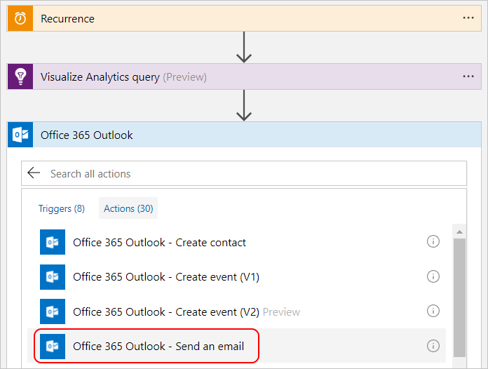
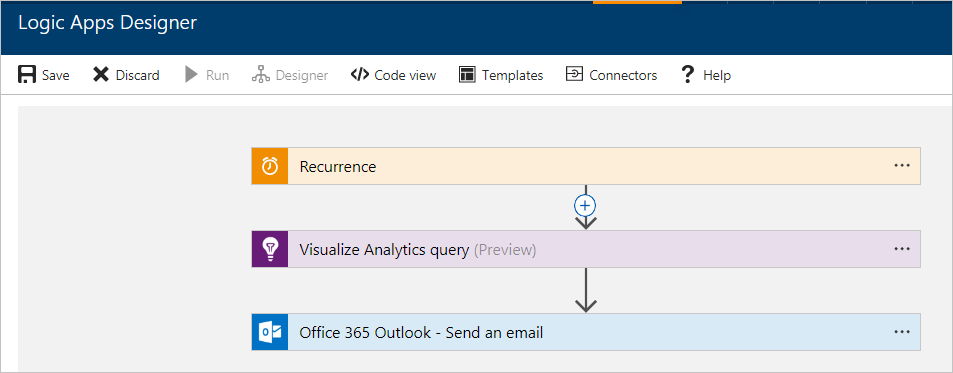

# Automate Application Insights processes by using Logic Apps

Do you find yourself repeatedly running the same queries on your telemetry data to check whether your service is functioning properly? Are you looking to automate these queries for finding trends and anomalies and then build your own workflows around them? The Azure Application Insights connector (preview) for Logic Apps is the right tool for this purpose.

With this integration, you can automate numerous processes without writing a single line of code. You can create a logic app with the Application Insights connector to quickly automate any Application Insights process. 

You can add additional actions as well. The Logic Apps feature of Azure App Service makes hundreds of actions available. For example, by using a logic app, you can automatically send an email notification or create a bug in Azure DevOps. You can also use one of the many available [templates](https://docs.microsoft.com/azure/logic-apps/logic-apps-use-logic-app-templates) to help speed up the process of creating your logic app. 

## Create a logic app for Application Insights

In this tutorial, you learn how to create a logic app that uses the Analytics autocluster algorithm to group attributes in the data for a web application. The flow automatically sends the results by email, just one example of how you can use Application Insights Analytics and Logic Apps together. 

### Step 1: Create a logic app
1. Sign in to the [Azure portal](https://portal.azure.com).
1. Click **Create a resource**, select **Web + Mobile**, and then select **Logic App**.

    

### Step 2: Create a trigger for your logic app
1. In the **Logic App Designer** window, under **Start with a common trigger**, select **Recurrence**.

    

1. In the **Frequency** box, select **Day** and then, in the **Interval** box, type **1**.

    

### Step 3: Add an Application Insights action
1. Click **New step**, and then click **Add an action**.

1. In the **Choose an action** search box, type **Azure Application Insights**.

1. Under **Actions**, click **Azure Application Insights - Visualize Analytics query Preview**.

    

### Step 4: Connect to an Application Insights resource

To complete this step, you need an application ID and an API key for your resource. You can retrieve them from the Azure portal, as shown in the following diagram:

 

Provide a name for your connection, the application ID, and the API key.


### Step 5: Specify the Analytics query and chart type
In the following example, the query selects the failed requests within the last day and correlates them with exceptions that occurred as part of the operation. Analytics correlates the failed requests, based on the operation_Id identifier. The query then segments the results by using the autocluster algorithm. 

When you create your own queries, verify that they are working properly in Analytics before you add it to your flow.

1. In the **Query** box, add the following Analytics query: 

    ```
    requests
    | where timestamp > ago(1d)
    | where success == "False"
    | project name, operation_Id
    | join ( exceptions
        | project problemId, outerMessage, operation_Id
    ) on operation_Id
    | evaluate autocluster()
    ```

1. In the **Chart Type** box, select **Html Table**.

    

### Step 6: Configure the logic app to send email

1. Click **New step**, and then select **Add an action**.

1. In the search box, type **Office 365 Outlook**.

1. Click **Office 365 Outlook - Send an email**.

    

1. In the **Send an email** window, do the following:

   a. Type the email address of the recipient.

   b. Type a subject for the email.

   c. Click anywhere in the **Body** box and then, on the dynamic content menu that opens at the right, select **Body**.

   d. Click **Show advanced options**.

      

1. On the dynamic content menu, do the following:

    a. Select **Attachment Name**.

    b. Select **Attachment Content**.
    
    c. In the **Is HTML** box, select **Yes**.

      

### Step 7: Save and test your logic app
* Click **Save** to save your changes.

You can wait for the trigger to run the logic app, or you can run the logic app immediately by selecting **Run**.



When your logic app runs, the recipients you specified in the email list will receive an email that looks like the following:


## Next steps

- Learn more about creating [Analytics queries](../../azure-monitor/log-query/get-started-queries.md).
- Learn more about [Logic Apps](https://docs.microsoft.com/azure/logic-apps/logic-apps-what-are-logic-apps).


<!--Link references-->


