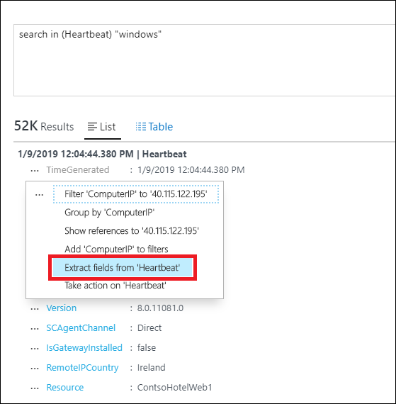
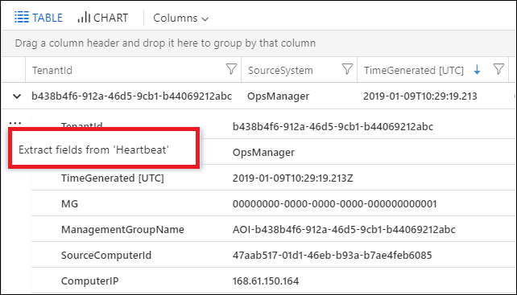
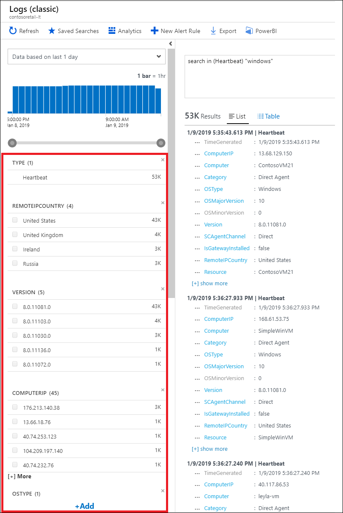
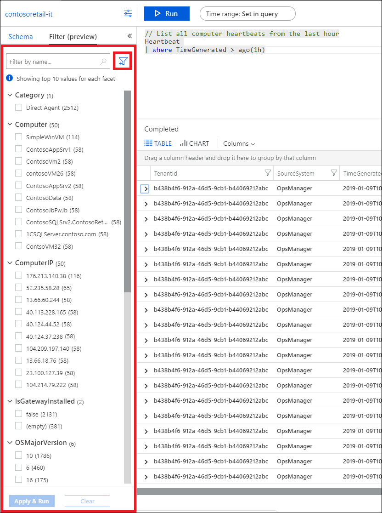
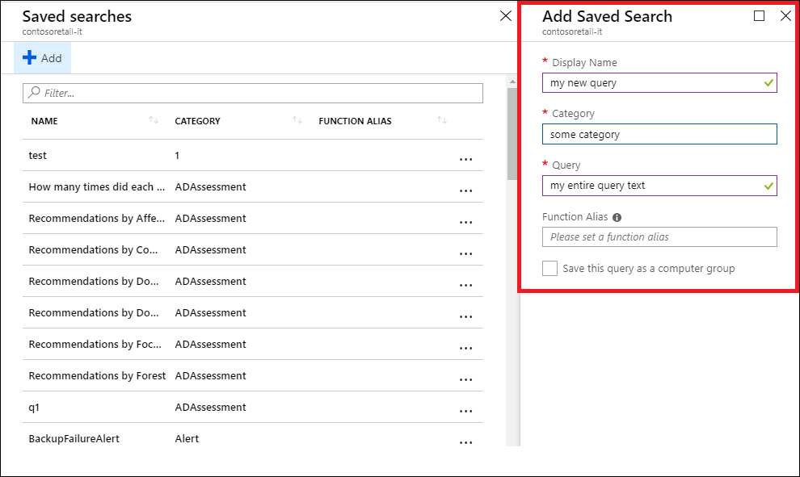
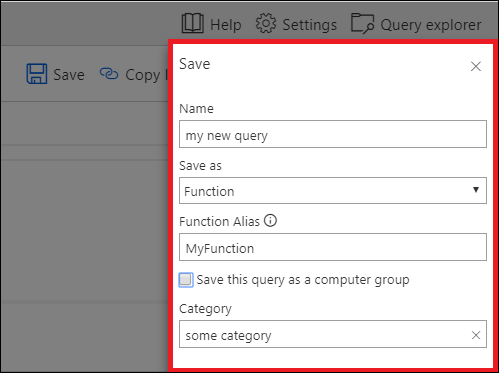
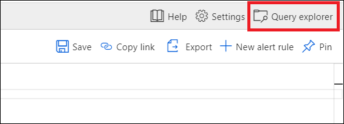
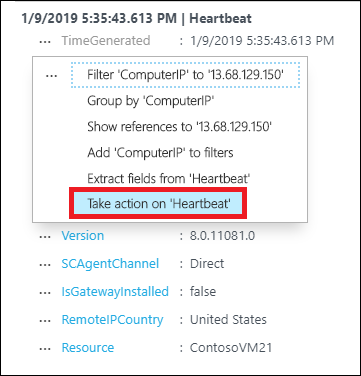
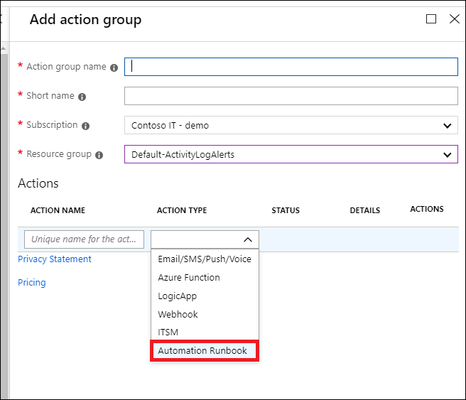

# Transition from Log Analytics log search to Azure Monitor logs
The log search in Log Analytics was recently replaced with a new experience for analyzing Azure Monitor logs. The Log search page is currently still accessible through the **Logs (classic)** menu item in the **Log Analytics workspaces** page in the Azure portal but will be removed February 15th, 2019. This article describes differences between the two experiences to help you transition from log search. 

## Extract custom fields 
In Log Search, you extract [custom fields](../platform/custom-fields.md) from the List view, where a field’s menu includes the action _Extract fields from Table_.

In Azure Monitor logs, you extract custom fields from the table view. Expand a record by clicking the arrow to its left then click the ellipsis to access the _Extract fields_ action.

## Filter results of a query
In Log Search, a list of filters are displayed as search results are delivered. Select a filter and click **Apply** to run the query with the selected filter.

In Azure Monitor logs, select *Filter (preview)* to display filters. Click on the filter icon to display addition filters. Select a filter and click **Apply & Run** to run the query with the selected filter.

## Functions and computer groups
To save a search in Log Search, select **Saved searches** and **Add** to provide a name, category, and query text. Create a [computer group](../platform/computer-groups.md) by adding a function alias.

To save the current query in Azure Monitor logs, select **Save**. Change **Save as** to _Function_ and provide a **Function Alias** to create a [function](functions.md).

## Saved searches
In Log Search, your saved searches are available through the action bar item **Saved searches**. In Azure Monitor logs, access saved queries from **Query Explorer**.

## Take action
In Log Search, you can [start a runbook](take-action.md) from a search result by selectionselecting **Take action**.

In Azure Monitor logs, [create an alert from the log query](../platform/alerts-log.md). Configure an action group with one or more actions that will run in response to the alert.

## Next steps

- Learn more about the new [Azure Monitor logs experience](get-started-portal.md).