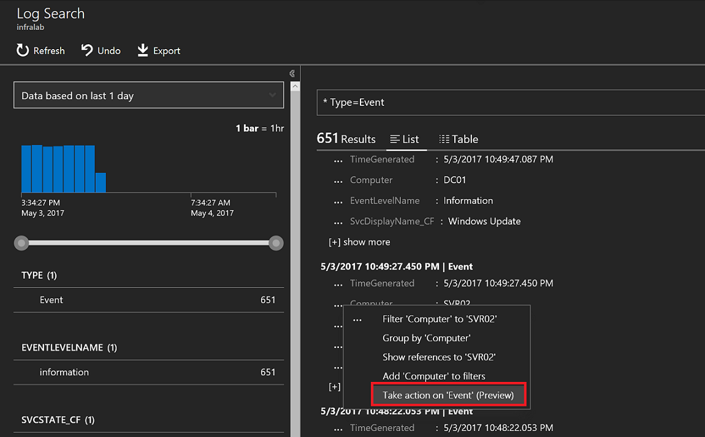
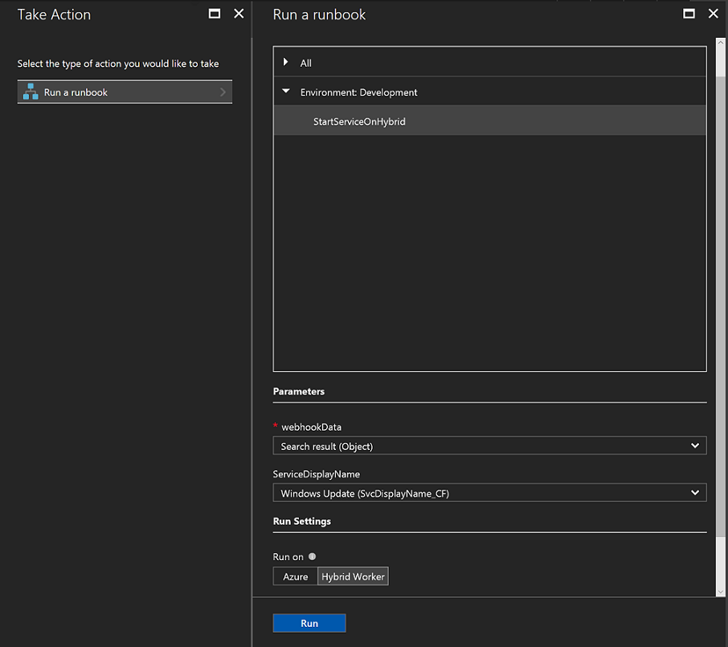

# Take Action with an Automation Runbook from a Log Analytics log search result

From a log search result in Azure Log Analytics, you can now select **Take action** to run an Automation runbook.  The runbook can be used to remediate the issue or take some other action such as collect troubleshooting information, send an email, or create a service request. 

## Components and features used
* [Azure Automation account](../../automation/automation-quickstart-create-account.md)
* [Log Analytics workspace](../../azure-monitor/log-query/log-query-overview.md)

## To initiate runbook from log search

To take action on an event and initiate a runbook from your log search results, you start by creating a log search and from the results you can invoke a runbook on-demand.  This can be achieved from the log search feature in the [Azure portal](../../azure-monitor/log-query/log-query-overview.md).  In this example, we perform a log search from the Azure portal with a basic demonstration of this feature.

1. In the Azure portal, click **All services** and select **Log Analytics**.  
2. Select your Log Analytics workspace.
3. On the workspace, select **Log Search**.  
4. On the Log Search page, perform a log search.  
5. From the log search results, click the ellipse to the left of one of the fields and from the popup, select **Take action on**.    
6. Select **Run a runbook** and select a runbook to run.  You can select any runbook in the Automation account that is linked to the Log Analytics workspace.  Note the following:

	* Runbooks are organized by tags
	* Runbook input parameter values can be selected directly from the fields of the search result.  A drop-down list will appear displaying all the available fields from the result to select from.  
	* You can choose to run the runbook on a [hybrid runbook worker](../../automation/automation-hybrid-runbook-worker.md) that you have installed on the machine that has the issue if you have a corresponding Hybrid Runbook Worker group that only contains this machine as a member.  If the name of the Hybrid Worker group matches the name of the computer that is in the log search result, then the group is selected automatically.    

6. After you click **Run**, the runbook job page opens to allow you to review the status of the job.   

If you select a runbook that was configured to be [called from a Log Analytics alert](../../automation/automation-create-alert-triggered-runbook.md), it has an input parameter called **WebhookData** that is **Object** type.  If the input parameter is mandatory, you need to pass the search results to the runbook so it can convert the JSON-formatted string into an object type allowing you to filter on specific items that you will reference in runbook activities.  You do this by selecting **Search result (Object)** from the drop-down list.      
    
## Next steps

* Review the [Log Analytics log search reference](../../azure-monitor/log-query/log-query-overview.md) to view all of the search fields and facets available in Log Analytics.
* To learn how to invoke an Automation runbook automatically, review [calling an Azure Automation runbook from a Log Analytics alert](../../automation/automation-create-alert-triggered-runbook.md).  
