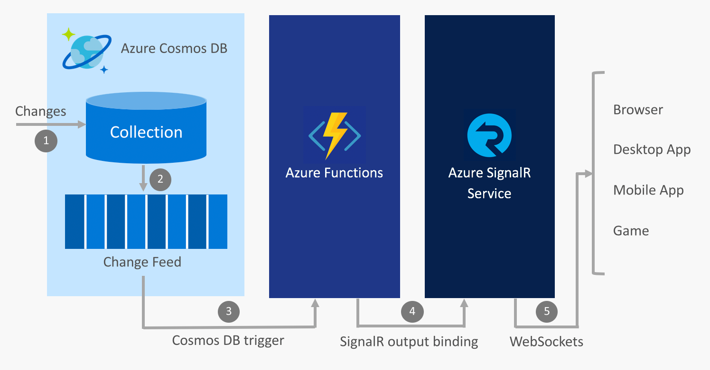

# Build Real-time Apps with Azure Functions and Azure SignalR Service

Because Azure SignalR Service and Azure Functions are both fully managed, highly scalable services that allow you to focus on building applications instead of managing infrastructure, it's common to use the two services together to provide real-time communications in a [serverless](https://azure.microsoft.com/solutions/serverless/) environment.

## Integrate real-time communications with Azure services

Azure Functions allow you to write code in [several languages](../azure-functions/supported-languages.md), including JavaScript, C#, and Java, that triggers whenever events occur in the cloud. Examples of these events include:

* HTTP and webhook requests
* Periodic timers
* Events from Azure services, such as:
    - Event Grid
    - Event Hubs
    - Service Bus
    - Cosmos DB change feed
    - Storage - blobs and queues
    - Logic Apps connectors such as Salesforce and SQL Server

By using Azure Functions to integrate these events with Azure SignalR Service, you have the ability to notify thousands of clients whenever events occur.

Some common scenarios for real-time serverless messaging that you can implement with Azure Functions and SignalR Service include:

* Visualize IoT device telemetry on a real-time dashboard or map
* Update data in an application when documents update in Cosmos DB
* Send in-app notifications when new orders are created in Salesforce

## SignalR Service bindings for Azure Functions

The SignalR Service bindings for Azure Functions allow an Azure Function app to publish messages to clients connected to SignalR Service. Clients can connect to the service using a SignalR client SDK that is available in .NET, JavaScript, and Java, with more languages coming soon.

### An example scenario

An example of how to use the SignalR Service bindings is using Azure Functions to integrate with Azure Cosmos DB and SignalR Service to send real-time messages when new events appear on a Cosmos DB change feed.

1. A change is made in a Cosmos DB collection
2. The change event is propagated to the Cosmos DB change feed
3. An Azure Functions is triggered by the change event using the Cosmos DB trigger
4. The SignalR Service output binding publishes a message to SignalR Service
5. SignalR Service publishes the message to all connected clients

### Authentication and users

SignalR Service allows you to broadcast messages to all clients or only to a subset of clients, such as those belonging to a single user. The SignalR Service bindings for Azure Functions can be combined with App Service Authentication to authenticate users with providers such as Azure Active Directory, Facebook, and Twitter. You can then send messages directly to these authenticated users.

## Next steps

In this article, you got an overview of how to use Azure Functions with SignalR Service to enable a wide array of serverless real-time messaging scenarios. Follow one of these quickstarts to learn more.

* [Azure SignalR Service Serverless Quickstart - C#](signalr-quickstart-azure-functions-csharp.md)
* [Azure SignalR Service Serverless Quickstart - JavaScript](signalr-quickstart-azure-functions-javascript.md)