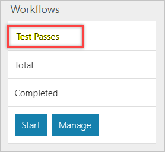
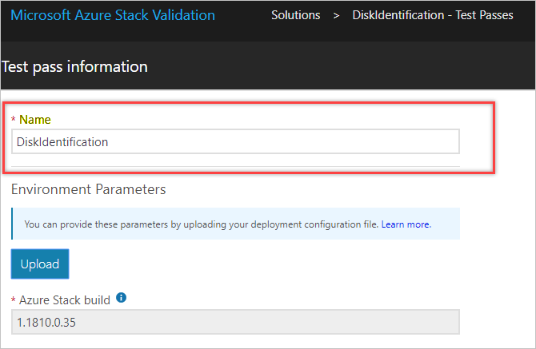
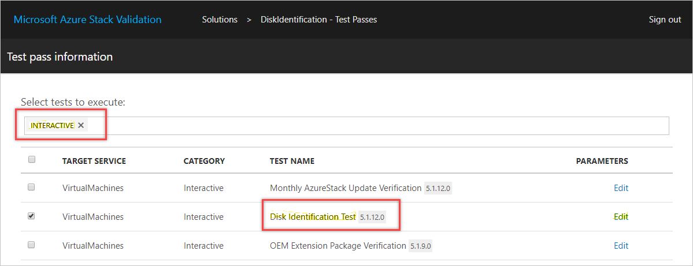
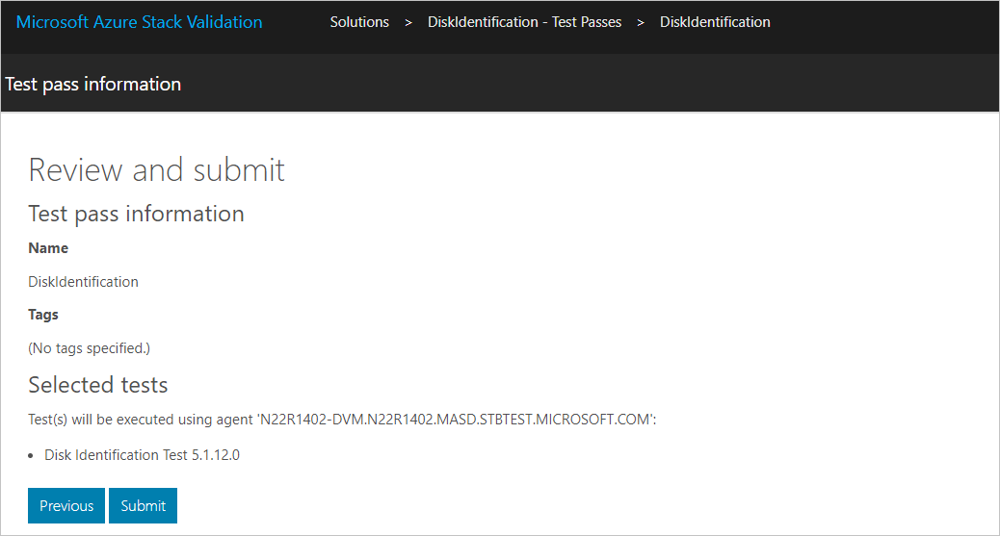
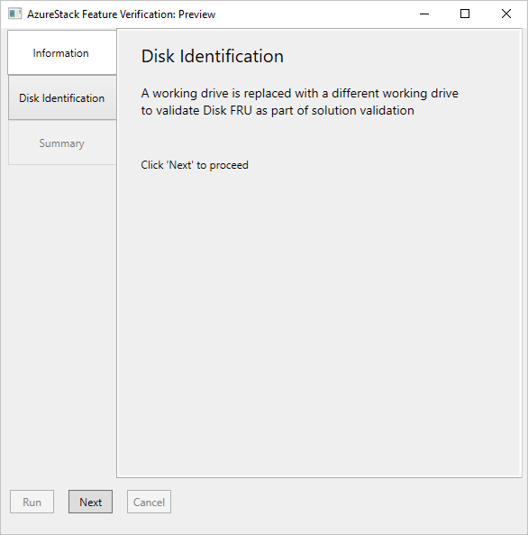
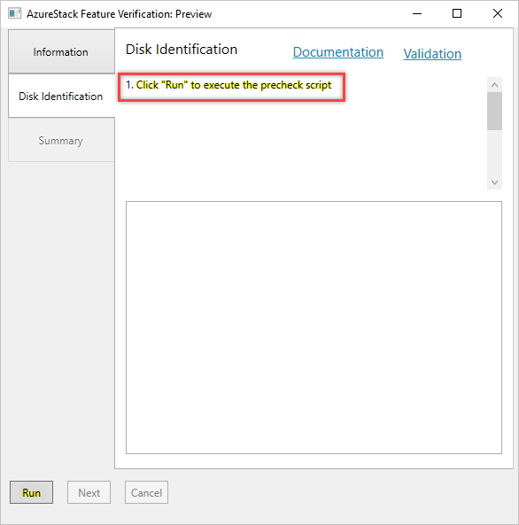
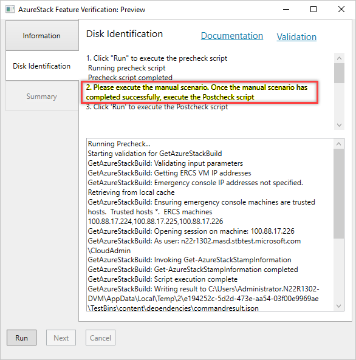
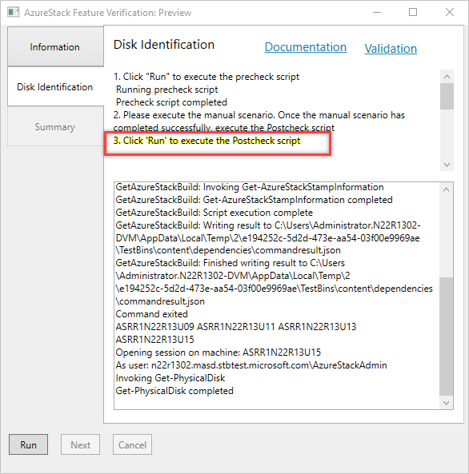
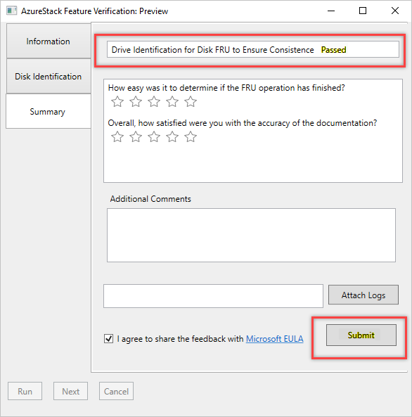
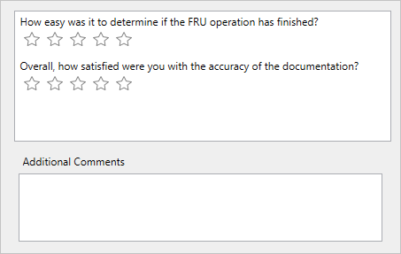

# Interactive feature verification testing  

[!INCLUDE [Azure_Stack_Partner](./includes/azure-stack-partner-appliesto.md)]

You can use the interactive feature verification testing framework to request tests for your system. When you request a test, Microsoft uses the framework to prepare tests that require manual interactive steps. Microsoft can use the framework to chain together several standalone automated tests.

This article describes a simple manual scenario. The test checks replacing a disk in Azure Stack. The framework gathers diagnostic logs at each step. You can debug issues as you find them. The framework also allows the sharing of logs produced by other tools or processes, and enables you to provide feedback on the scenario.

## Overview of a test pass

A test for disk replacement is a common scenario. In this example, the test has seven steps:

1.  Create a new **Test Pass** workflow.
2.  Select the **Disk Identification Test**.
3.  Start the test.
4.  Choose the actions in the interactive verification scenario.
5.  Check the result of the scenario.
6.  Send the test result to Microsoft.
7.  Check the status in the VaaS portal.

## Create a new test pass

1.  Navigate to the [Azure Stack Validation portal](https://www.azurestackvalidation.com) and sign in.

2.  Create a new solution or choose an existing one.

3.  Select **Start** on the **Test Pass** tile.

    

4.  Enter a name for the  **Test Pass** workflow.

5.  Enter the environment and common test parameters by following the instructions in the [Workflow common parameters for Azure Stack Validation as a Service](azure-stack-vaas-parameters.md) article.

6.  The diagnostics connection string must follow the format specified in the [Test parameters](azure-stack-vaas-parameters.md#test-parameters) section in the [Workflow common parameters](azure-stack-vaas-parameters.md) article.

7.  Enter the required parameters for the test.

8.  Select the agent to run the interactive test run.

> [!Note]  
> Domain admin user and password must be specified for disk identification interactive feature verification test.

## Select the test

1.  Select **Disk Identification Test\<version>**.

    > [!Note]  
    > The version of the test will increment as improvements to the test collateral are made. The highest version should always be used unless Microsoft indicates otherwise.

    

2.  Provide the domain admin user and password by selecting **Edit**.

3.  Select the appropriate test execution agent/DVM to launch the test on.

    

4.  Select **Submit** to start the test.

## Start the test

The Disk Identification Test prompts show on the computer that runs the VaaS agent. Usually this is the DVM or Jumpbox for the Azure Stack instance.

## Choose the actions

1.  Follow the **Documentation** and **Validation** links to review instructions from Microsoft on how to perform this scenario.

    

2.  Select **Next**.

    

3.  Follow the instructions to run the precheck script.

    

4.  Once the precheck script is completed successfully, run the manual scenario (Disk replacement) as per the **Documentation** and **Validation** links from the **Information** tab.

    

5.  Do not close the dialog box while you are performing the manual scenario.

6.  When you are finished performing the manual scenario, follow the instructions to run the post check script.

    

7.  On successful completion of the manual scenario (Disk replacement), select **Next**.

    

> [!Important]  
> If you close the window, the test will stop before it is done.

## Check the status

1.  When the test is complete, you will be asked to provide feedback.

    

2.  These questions will help Microsoft assess the success rate and release quality of the scenario.

## Send the test result

1.  Attach any log files you wish to submit to Microsoft.

    

2.  Accept the feedback submission EULA.

3.  Select **Submit** to send the results to Microsoft.

## Next steps

- [Monitor and manage tests in the VaaS portal](azure-stack-vaas-monitor-test.md)
