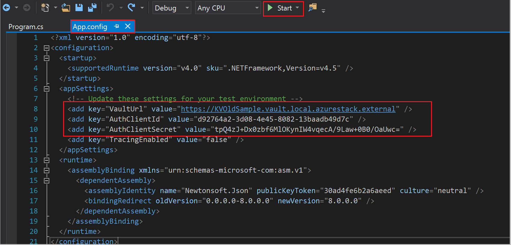

# A sample application that uses keys and secrets stored in a key vault

*Applies to: Azure Stack integrated systems and Azure Stack Development Kit*

Follow the steps in this article to run a sample application named **HelloKeyVault** that retrieves keys and secrets from a key vault in Azure Stack.

## Prerequisites

You can install the following prerequisites from the Azure Stack [Development Kit](azure-stack-connect-azure-stack.md#connect-to-azure-stack-with-remote-desktop), or from a Windows-based external client if you are [connected through VPN](azure-stack-connect-azure-stack.md#connect-to-azure-stack-with-vpn):

* Install [Azure Stack-compatible Azure PowerShell modules](azure-stack-powershell-install.md).
* Download the [tools required to work with Azure Stack](azure-stack-powershell-download.md).

## Create and get the key vault and application settings

To prepare for the sample application:

* Create a key vault in Azure Stack.
* Register an application in Azure Active Directory (Azure AD).

You can use the Azure portal or PowerShell to prepare for the sample application. This article shows how to create a key vault and register an application by using PowerShell.

>[!NOTE]
>By default, the PowerShell script creates a new application in Active Directory. However, you can register one of your existing applications.

Before running the following script, make sure you provide values for the `aadTenantName` and `applicationPassword` variables. If you don't specify a value for `applicationPassword`, this script generates a random password.

```powershell
$vaultName           = 'myVault'
$resourceGroupName   = 'myResourceGroup'
$applicationName     = 'myApp'
$location            = 'local'

# Password for the application. If not specified, this script will generate a random password during app creation.
$applicationPassword = ''

# Function to generate a random password for the application.
Function GenerateSymmetricKey()
{
    $key = New-Object byte[](32)
    $rng = [System.Security.Cryptography.RNGCryptoServiceProvider]::Create()
    $rng.GetBytes($key)
    return [System.Convert]::ToBase64String($key)
}

Write-Host 'Please log into your Azure Stack user environment' -foregroundcolor Green

$tenantARM = "https://management.local.azurestack.external"
$aadTenantName = "FILL THIS IN WITH YOUR AAD TENANT NAME. FOR EXAMPLE: myazurestack.onmicrosoft.com"

# Configure the Azure Stack operator’s PowerShell environment.
Add-AzureRMEnvironment `
  -Name "AzureStackUser" `
  -ArmEndpoint $tenantARM

Set-AzureRmEnvironment `
  -Name "AzureStackAdmin" `
  -GraphAudience "https://graph.windows.net/"

$TenantID = Get-AzsDirectoryTenantId `
  -AADTenantName $aadTenantName `
  -EnvironmentName AzureStackUser

# Sign in to the user portal.
Add-AzureRmAccount `
  -EnvironmentName "AzureStackUser" `
  -TenantId $TenantID `

$now = [System.DateTime]::Now
$oneYearFromNow = $now.AddYears(1)

$applicationPassword = GenerateSymmetricKey

# Create a new Azure AD application.
$identifierUri = [string]::Format("http://localhost:8080/{0}",[Guid]::NewGuid().ToString("N"))
$homePage = "http://contoso.com"

Write-Host "Creating a new AAD Application"
$ADApp = New-AzureRmADApplication `
  -DisplayName $applicationName `
  -HomePage $homePage `
  -IdentifierUris $identifierUri `
  -StartDate $now `
  -EndDate $oneYearFromNow `
  -Password $applicationPassword

Write-Host "Creating a new AAD service principal"
$servicePrincipal = New-AzureRmADServicePrincipal `
  -ApplicationId $ADApp.ApplicationId

# Create a new resource group and a key vault in that resource group.
New-AzureRmResourceGroup `
  -Name $resourceGroupName `
  -Location $location

Write-Host "Creating vault $vaultName"
$vault = New-AzureRmKeyVault -VaultName $vaultName `
  -ResourceGroupName $resourceGroupName `
  -Sku standard `
  -Location $location

# Specify full privileges to the vault for the application.
Write-Host "Setting access policy"
Set-AzureRmKeyVaultAccessPolicy -VaultName $vaultName `
  -ObjectId $servicePrincipal.Id `
  -PermissionsToKeys all `
  -PermissionsToSecrets all

Write-Host "Paste the following settings into the app.config file for the HelloKeyVault project:"
'<add key="VaultUrl" value="' + $vault.VaultUri + '"/>'
'<add key="AuthClientId" value="' + $servicePrincipal.ApplicationId + '"/>'
'<add key="AuthClientSecret" value="' + $applicationPassword + '"/>'
Write-Host
```

The following image shows the output from the script used to create the key vault:


Make a note of the **VaultUrl**, **AuthClientId**, and **AuthClientSecret** values returned by the previous script. You use these values to run the HelloKeyVault application.

## Download and configure the sample application

Download the key vault sample from the Azure [Key Vault client samples](https://www.microsoft.com/download/details.aspx?id=45343) page. Extract the contents of the .zip file on your development workstation. There are two applications in the samples folder. This article uses **HelloKeyVault**.

To load the **HelloKeyVault** sample:

* Browse to the **Microsoft.Azure.KeyVault.Samples** > **samples** > **HelloKeyVault** folder.
* Open the **HelloKeyVault** application in Visual Studio.

### Configure the sample application

In Visual Studio:

* Open the HelloKeyVault\App.config file and find the &lt;**appSettings**&gt; element.
* Update the **VaultUrl**, **AuthClientId**, and **AuthClientSecret** keys with the values returned by those used to create the key vault. By default, the App.config file has a placeholder for `AuthCertThumbprint`. Replace this placeholder with `AuthClientSecret`.

  

* Rebuild the solution.

## Run the application

When you run HelloKeyVault, the application signs in to Azure AD, and then uses the AuthClientSecret token to authenticate to the key vault in Azure Stack.

You can use the HelloKeyVault sample to:

* Perform basic operations such as create, encrypt, wrap, and delete on the keys and secrets.
* Pass parameters such as `encrypt` and `decrypt` to HelloKeyVault, and apply the specified changes to a key vault.

## Next steps

- [Deploy a VM with a Key Vault password](azure-stack-key-vault-deploy-vm-with-secret.md)
- [Deploy a VM with a Key Vault certificate](azure-stack-key-vault-push-secret-into-vm.md)
