# Delete a Recovery Services vault

This article describes how to remove all items from a Recovery Services vault, and then delete it. You can't delete a Recovery Services vault if it is registered to a server and holds backup data. If you try to delete a vault, but can't, the vault is still configured to receive backup data.

To learn how to delete a vault, see the section, [Delete a vault from Azure portal](backup-azure-delete-vault.md#delete-a-vault-from-azure-portal). If you don't want to retain any data in the Recovery Services vault, and want to delete the vault, see the section, [Delete the vault by force](backup-azure-delete-vault.md#delete-the-recovery-services-vault-by-force). If you aren't sure what's in the vault, and you need to make sure that you can delete the vault, see the section, [Remove vault dependencies and delete vault](backup-azure-delete-vault.md#remove-vault-dependencies-and-delete-vault).

## Delete a vault from Azure portal

If you already have the Recovery Services vault open, skip to the second step.

1. Open the Azure portal, and from the Dashboard open the vault you want to delete.

   If you don't have the Recovery Services vault pinned to the Dashboard, on the Hub menu, click **All Services** and in the list of resources, type **Recovery Services**. As you begin typing, the list filters based on your input. To view the list of vaults in your subscription, click **Recovery Services vaults**.

   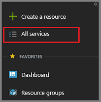 <br/>

   The list of Recovery Services vaults is displayed. 

   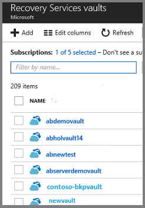

1. From the list, select the vault you want to delete. When you select the vault, its vault dashboard opens.

    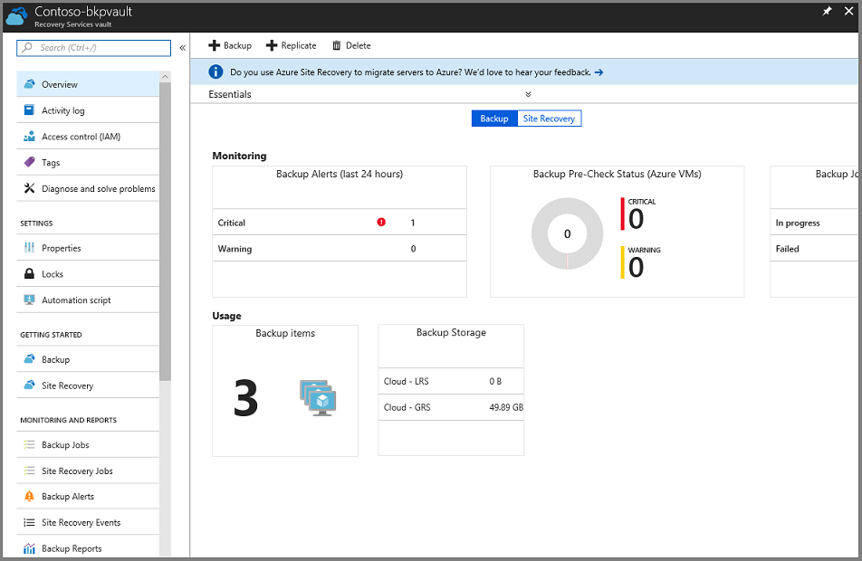

1. To delete a vault, in the vault dashboard, click **Delete**. You'll be asked to verify that you want to delete the vault.

    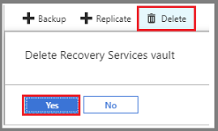

    If the **Vault deletion error** appears, you can either remove the dependencies from the vault, or you can use PowerShell to delete the vault by force. The following sections explain how to accomplish these tasks.

    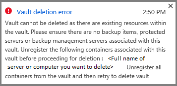


## Delete the Recovery Services vault by force

You can use PowerShell to delete a Recovery Services vault by force. By force means the Recovery Services vault, and all associated backup data, is permanently deleted. 

> [!Warning]
> When using PowerShell to delete a Recovery Services vault, be certain that you want to permanently delete all backup data in the vault.
>

To delete a Recovery Services vault:

1. Sign in to your Azure account.

   Sign in to your Azure subscription with the `Connect-AzureRmAccount` command and follow the on-screen directions.

   ```powershell
    Connect-AzureRmAccount
   ```
   The first time you use Azure Backup, you must register the Azure Recovery Service provider in your subscription with [Register-AzureRmResourceProvider](/powershell/module/AzureRM.Resources/Register-AzureRmResourceProvider).

   ```powershell
    Register-AzureRmResourceProvider -ProviderNamespace "Microsoft.RecoveryServices"
   ```

1. Open a PowerShell window with Administrator privileges.

1. Use `Set-ExecutionPolicy Unrestricted` to remove any restrictions.

1. Run the following command to download the Azure Resource Manager Client package from chocolately.org.

    `iex ((New-Object System.Net.WebClient).DownloadString('https://chocolatey.org/install.ps1'))`

1. Use the following command to install the Azure Resource Manager API Client.

   `choco.exe install armclient`

1. In the Azure portal, gather the Subscription ID and associated resource group name for the Recovery Services vault you want to delete.

1. In PowerShell, run the following command using your subscription ID, resource group name, and Recovery Services vault name. When you run the command, it deletes the vault and all dependencies.

   ```powershell
   ARMClient.exe delete /subscriptions/<subscriptionID>/resourceGroups/<resourcegroupname>/providers/Microsoft.RecoveryServices/vaults/<recovery services vault name>?api-version=2015-03-15
   ```
   The vault must be empty before you can delete it. Otherwise you get an error citing "Vault cannot be deleted as there are existing resources within this vault". The following command demonstrates how to remove a container within a vault:

   ```powershell
   ARMClient.exe delete /subscriptions/<subscriptionID>/resourceGroups/<resourcegroupname>/providers/Microsoft.RecoveryServices/vaults/<recovery services vault name>/registeredIdentities/<container name>?api-version=2016-06-01
   ```
   
1. Sign in to your subscription in the Azure portal and verify the vault is deleted.


## Remove vault dependencies and delete vault

To manually remove the vault dependencies, delete the configuration between each item or server, and Recovery Services vault. As you go through the following procedure, use the **Backup Items** menu (see image) for:

* Azure Storage (Azure Files) backups
* SQL Server in Azure VM backups
* Azure virtual machines backups
* Microsoft Azure Recovery Services agent backups

Use the **Backup Infrastructure** menu (see image) for:

* Azure Backup Server backups
* System Center DPM backups

    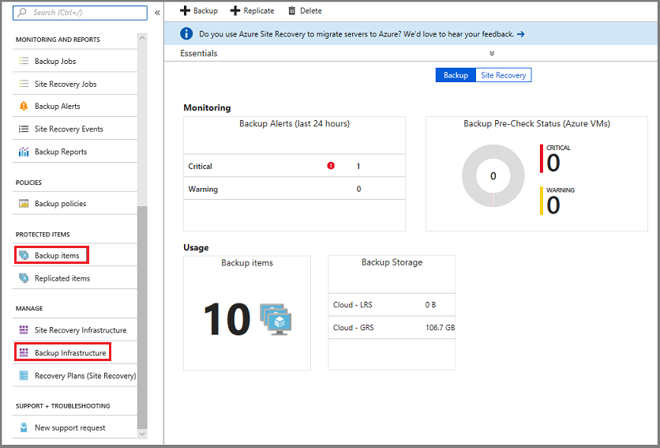

1. In the vault dashboard menu, scroll down to the Protected Items section, and click **Backup Items**. In this menu, you can stop and delete Azure File Servers, SQL Servers in Azure VM, and Azure virtual machines. In this example, we'll remove backup data from an Azure File Server.

    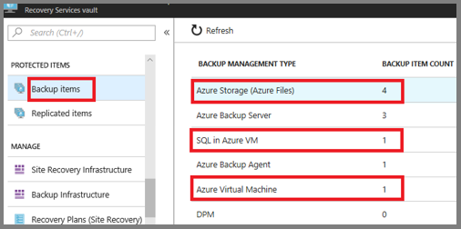

1. Select a backup type to view all items of that type.

    

1. For all items in the list, right-click the item, and from the context menu, select **Stop backup**.

     

    The Stop Backup menu opens.

1. On the **Stop Backup** menu, from the **Choose an option** menu, select **Delete Backup Data**, type the name of the item, and click **Stop backup**.

    Type the name of the item, to verify you want to delete it. The **Stop Backup** button activates once you verify the item. If you retain the data, you won't be able to delete the vault.

    

    If you want, provide a reason why you're deleting the data, and add comments. To verify the job completed, check the Azure Messages . <br/>
    Once the job completes, the service sends a message: *the backup process was stopped and the backup data was deleted*.

1. After deleting an item in the list, on the **Backup Items** menu, click **Refresh** to see the items in the vault.

      

      When there are no items in the list, scroll to the **Essentials** pane in the Recovery Services vault menu. There shouldn't be any **Backup items**, **Backup management servers**, or **Replicated items** listed. If items still appear in the vault, return to step three and choose a different item type list.  

1. When there are no more items in the vault toolbar, click **Delete**.

    

1. To verify that you want to delete the vault, click **Yes**.

    The vault is deleted and the portal returns to the **New** service menu.

## Removing Azure Backup Server or DPM

1. In the vault dashboard menu, scroll down to the Manage section, and click **Backup Infrastructure**. 

1. In the submenu, click **Backup Management Servers** to view the Azure Backup Servers and System Center DPM server. you can stop and delete Azure File Servers, SQL Servers in Azure VM, and Azure virtual machines. 

    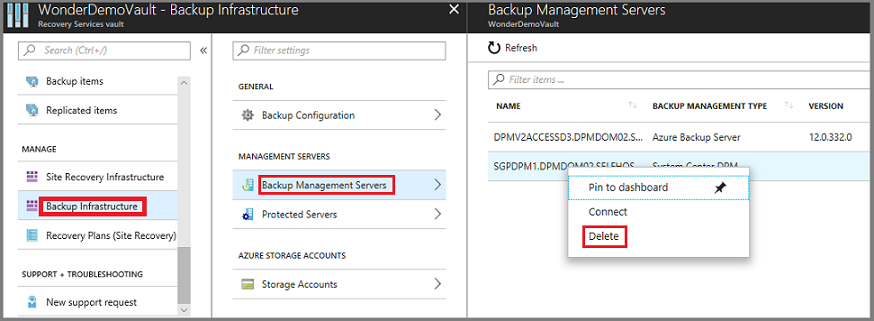

1. Right-click the item you want to delete, and from the sub-menu, select **Delete**.

    

    The Stop Backup menu opens.

1. On the **Stop Backup** menu, from the **Choose an option** menu, select **Delete Backup Data**, type the name of the item, and click **Stop backup**.

    To verify you want to delete, type its name. The **Stop Backup** button activates once you verify the item. If you retain the data, you can't delete the vault.

    

    Optionally, you can provide a reason why you are deleting the data, and add comments. To verify that the job has completed, check the Azure Messages . <br/>
    Once the job is complete, the service sends a message: the backup process was stopped and the backup data was deleted.

1. After deleting an item in the list, on the **Backup Items** menu, click **Refresh** to see the remaining items in the vault.

      

      When there are no items in the list, scroll to the **Essentials** pane in the Recovery Services vault menu. There shouldn't be any **Backup items**, **Backup management servers**, or **Replicated items** listed. If items still appear in the vault, return to step three and choose a different item type list.  
1. When there are no more items in the vault, on the vault dashboard click **Delete**.

    

1. To verify that you want to delete the vault, click **Yes**.

    The vault is deleted and the portal returns to the **New** service menu.


## Removing Azure Backup agent recovery points

1. In the vault dashboard menu, scroll down to the Manage section, and click **Backup Infrastructure**.

1. In the sub-menu, click **Protected Servers** to view the list of protected server types, including Azure Backup agent.

    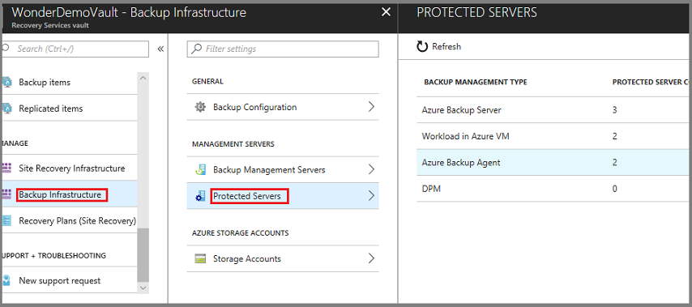

1. In the **Protected Servers** list, click Azure Backup Agent.

    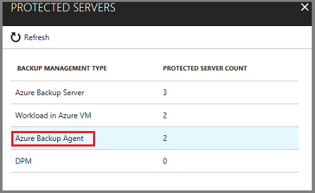

    The list of servers protected using Azure Backup agent, opens.

    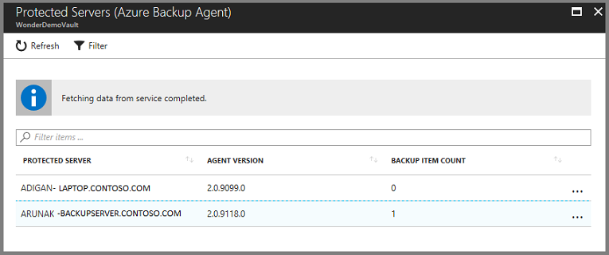

1. In the list of servers, click one to open its menu.

    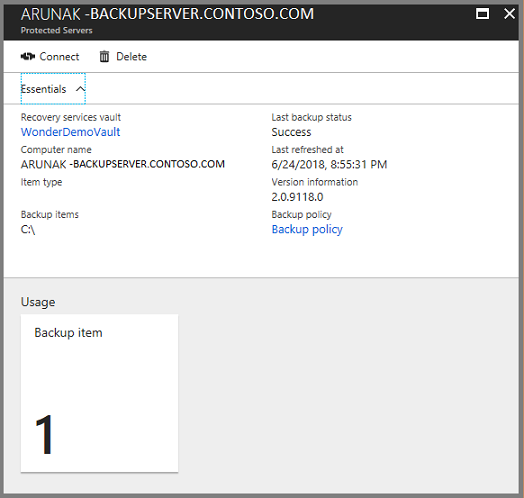

1. On the selected server's dashboard menu, click **Delete**.

    

1. On the **Delete** menu, type the name of the item, and click **Delete**.

    Type the name of the item, to verify you want to delete it. The **Delete** button activates once you verify the item.

    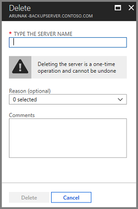

    Optionally, you can provide a reason why you are deleting the data, and add comments. To verify that the job has completed, check the Azure Messages . <br/>
    Once the job is complete, the service sends a message: the backup process was stopped and the backup data was deleted.

1. After deleting an item in the list, on the **Backup Items** menu, click **Refresh** to see the remaining items in the vault.

      

      When there are no items in the list, scroll to the **Essentials** pane in the Recovery Services vault menu. There shouldn't be any **Backup items**, **Backup management servers**, or **Replicated items** listed. If items still appear in the vault, return to step three and choose a different item type list.  
1. When there are no more items in the vault, on the vault dashboard click **Delete**.

    

1. To verify that you want to delete the vault, click **Yes**.

    The vault is deleted and the portal returns to the **New** service menu.

## What if I stop the backup process but retain the data?

If you stop the backup process but accidentally *retain* the data, you must delete the backup data before you can delete the vault. To delete the backup data:

1. On the **Backup Items** menu, right-click the item, and on the context menu click **Delete backup data**.

    

    The **Delete Backup Data** menu opens.
1. On the **Delete Backup Data** menu, type the name of the item, and click **Delete**.

    

    Once you have deleted the data, return to step 4c and continue with the process.
