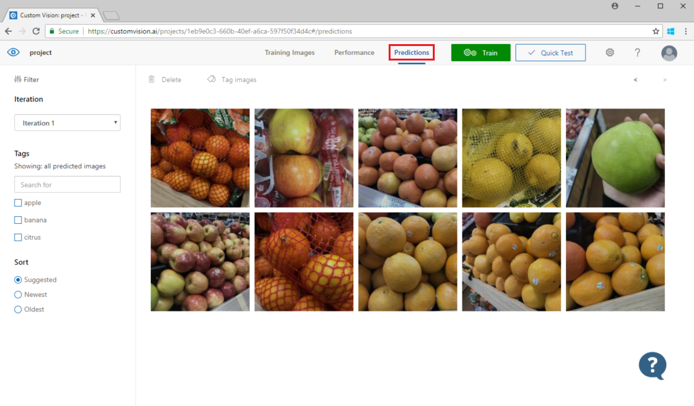
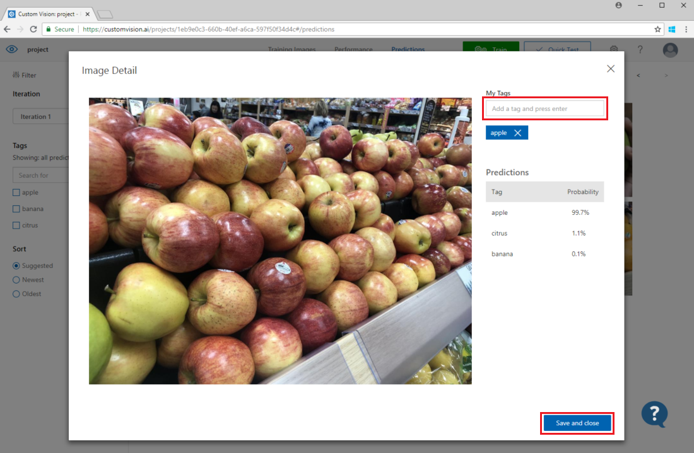
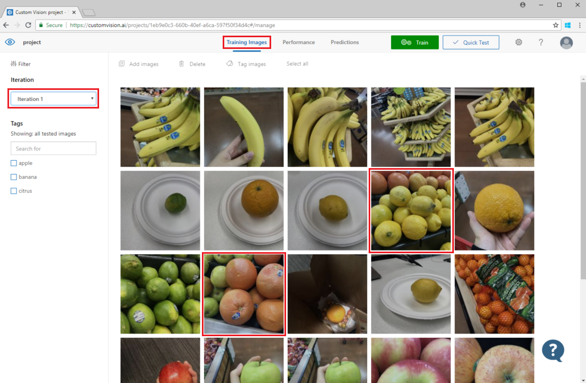
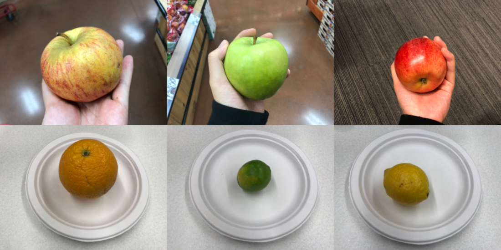

# How to improve your classifier

Learn how to improve the quality of your Custom Vision Service classifier. The quality of your classifier is dependent on the amount, quality, and variety of the labeled data you provide to it and how balanced the dataset is. A good classifier normally has a balanced training dataset that is representative of what will be submitted to the classifier. The process of building such a classifier is often iterative. It's common to take a few rounds of training to reach expected results.

Here are the common steps taken to improve a classifier. These steps aren't hard and fast rules, but heuristics that will help you build a better classifier.

1. First-round training
1. Add more images and balance data
1. Retrain
1. Add images with varying background, lighting, object size, camera angle, and style
1. Retrain & feed in image for prediction
1. Examine prediction results
1. Modify existing training data

## Data quantity and data balance

The most important thing is to upload enough images to train the classifier. At least 50 images per label for the training set are recommended as a starting point. With fewer images, there's a strong risk that you're overfitting. While your performance numbers may suggest good quality, you may struggle against real world data. Training the classifier with more images will generally increase the accuracy of prediction results.

Another consideration is that you should make sure that your data is balanced. For instance, having 500 images for one label and 50 images for another label will produce an imbalanced training dataset, causing the model to be more accurate in predicting one label than another. You're likely to see better results if you maintain at least a 1:2 ratio between the label with the fewest images and the label with the most images. For example, if the label with the greatest number of images has 500 images, the label with the least images needs to have at least 250 images for training.

## Train more diverse images

Provide images that are representative of what will be submitted to the classifier during normal use. For example, if you're training an “apple” classifier, your classifier might not be as accurate if you only train photos of apples in plates but make predictions on photos of apples on trees. Including a variety of images will make sure that your classifier isn't biased and can generalize well. Below are some ways you can make your training set more diverse:

__Background:__ Provide images of your object in front of different backgrounds (that is, fruit on plate versus fruit in grocery bag). Photos in context are better than photos in front of neutral backgrounds as they provide more information for the classifier.

__Lighting:__ Provide images with varied lighting (that is, taken with flash, high exposure, etc.), especially if the images used for prediction have different lighting. It is also helpful to include images with varied saturation, hue, and brightness.

__Object Size:__ Provide images in which the objects are of varied sizing capturing different parts of the object. For example, a photo of bunches of bananas and a closeup of a single banana. Different sizing helps the classifier generalize better.

__Camera Angle:__ Provide images taken with different camera angles. If all your photos are taken with a set of fixed cameras (such as surveillance cameras), make sure you assign a different label to every camera even if they capture the same objects to avoid overfitting - modeling unrelated objects (such as lampposts) as the key feature.

__Style:__ Provide images of different styles of the same class (that is, different kinds of citrus). However, if you have images of objects of drastically different styles (that is, Mickey Mouse versus a real-life rat), it is recommended to label them as separate classes to better represent their distinct features.

## Use images submitted for prediction

The Custom Vision Service stores images submitted to the prediction endpoint. To use these images to improve the classifier, use the following steps:

1. To view images submitted to the classifier, open the [Custom Vision web page](https://customvision.ai), go to your project, and select the __Predictions__ tab. The default view shows images from the current iteration. You can use the __Iteration__ drop down field to view images submitted during previous iterations.

    

2. Hover over an image to see the tags that were predicted by the classifier. Images are ranked so that the images that can bring the most gains to the classifier are at the top. To select a different sorting, use the __Sort__ section. To add an image to your existing training data, select the image, select the correct tag, and click on __Save and close__. The image will be removed from __Predictions__ and added to the training images. You can view it by selecting the __Training Images__ tab.

    

3. Use the __Train__ button to retrain the classifier.

## Visually inspect predictions

To inspect image predictions, select the __Training Images__ tab and then select __Iteration History__. Images that are outlined with a red box were predicted incorrectly.

Sometimes visual inspection can identify patterns that you can then correct by adding additional training data or modifying existing training data. For example, a classifier for apple vs. lime may incorrectly label all green apples as limes. You may be able to correct this problem by adding and providing training data that contains tagged images of green apples.

## Unexpected classification

Sometimes the classifier incorrectly learns characteristics that your images have in common. For example, if you are creating a classifier for apples vs. citrus, and are supplied images of apples in hands and of citrus in white plates, the classifier may train for hands vs. white plates instead of apples vs. citrus.

To correct this problem, use the above guidance on training with more varied images: provide images with different angles, backgrounds, object size, groups, and other variants.

## Negative image handling

The Custom Vision Service supports some automatic negative image handling. In the case where you are building a grape vs. banana classifier, and submit an image of a shoe for prediction, the classifier should score that image as close to 0% for both grape and banana.

On the other hand, in cases where the negative images are just a variation of the images used in training, it is likely that the model will classify the negative images as a labeled class due to the great similarities. For example, if you have an orange vs. grapefruit classifier, and you feed in an image of a clementine, it may score the clementine as orange. This may occur since many features of the clementine (color, shape, texture, natural habitat, etc.) resemble that of oranges.  If your negative images are of this nature, it is recommended to create one or more separate tags ("Other") and label negative images with this tag during training to allow the model to better differentiate between these classes.

## Next steps

Learn how you can test images programmatically by submitting them to the Prediction API.

> [!div class="nextstepaction"]
[Use the prediction API](use-prediction-api.md)
