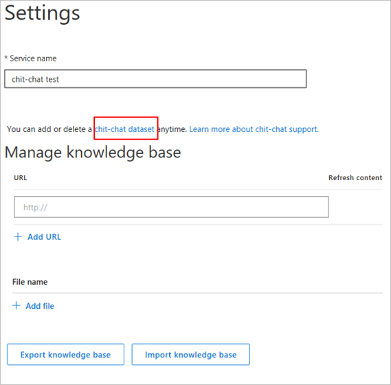
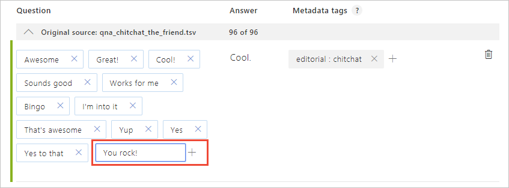
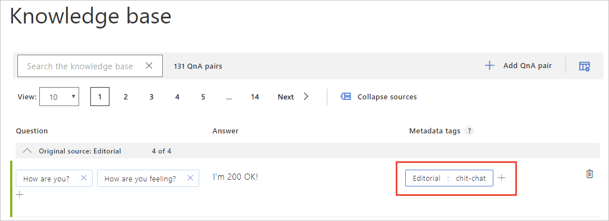
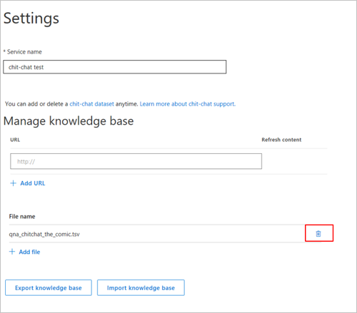

# Add Chit-chat to a knowledge base

Adding chit-chat to your bot makes it more conversational and engaging. The chit-chat feature in QnA maker allows you to easily add a pre-populated set of the top chit-chat, into your knowledge base (KB). This can be a starting point for your bot's personality, and it will save you the time and cost of writing them from scratch.  

This dataset has about 100 scenarios of chit-chat in the voice of three personas - The Professional, The Friend, The Comic. Choose the persona that most closely resembles your bot's voice. Given a user query, QnA Maker tries to match it with the closest known chit-chat QnA. 

Some examples of the different personalities:
<!-- added quotes so acrolinx doesn't score these sentences -->
|User query|The Professional|The Friend|The Comic|
|--|--|--|--|
|`You are awesome`|`I aim to serve.`|`That's so nice of you!`|`Flattery. I like it.`|
|`Are you hungry?`|`I don't need to eat.`|`I only do food for thought.`|`Eating would require a lot of things I don't have. Like a digestive system. And silverware.`|
|`Sing a song`|`I'm afraid I'm not musically inclined.`|`La la la, tra la la. I'm awesome at this.`|`You can't handle my dulcet tones.`|
|`Will you marry me?`|`I think it's best if we stick to a professional relationship.`|`Aw, that's sweet.`|`Sure. Take me to city hall. See what happens.`|

> [!NOTE]
> Chit-chat support is currently available in English only. 

## Add chit-chat during KB creation
During knowledge base creation, after adding your source URLs and files, there is an option for adding chit-chat. Choose the personality that you want as your chit-chat base. If you do not want to add chit-chat, or if you already have chit-chat support in your data sources, choose **None**. 
   

## Add Chit-chat to an existing KB
Select your KB, and navigate to the **Settings** page. There is a link to all the chit-chat datasets in the appropriate **.tsv** format. Download the personality you want, then upload it as a file source. Make sure not to edit the format or the metadata when you download and upload the file. 
  

## Edit your chit-chat questions and answers
When you edit your KB, you will see a new source for chit-chat, based on the personality you selected. You can now add altered questions or edit the responses, just like with any other source. 

## Add additional chit-chat questions and answers
You can add new chit-chat QnA that is not in the predefined set. Ensure that you are not duplicating a QnA pair that is already covered in the chit-chat set. When you add any new chit-chat QnA, it gets added to your **Editorial** source. To ensure the ranker understands that this is chit-chat, add the metadata key/value pair "Editorial: chit-chat", as seen in the following image:
   

## Delete chit-chat from an existing KB
Select your KB, and navigate to the **Settings** page. Your specific chit-chat source is listed as a file, with the selected personality name. You can delete this as a source file.

## Next steps

> [!div class="nextstepaction"]
> [Import a knowledge base](../Tutorials/migrate-knowledge-base.md)

## See also 

[QnA Maker overview](../Overview/overview.md)
