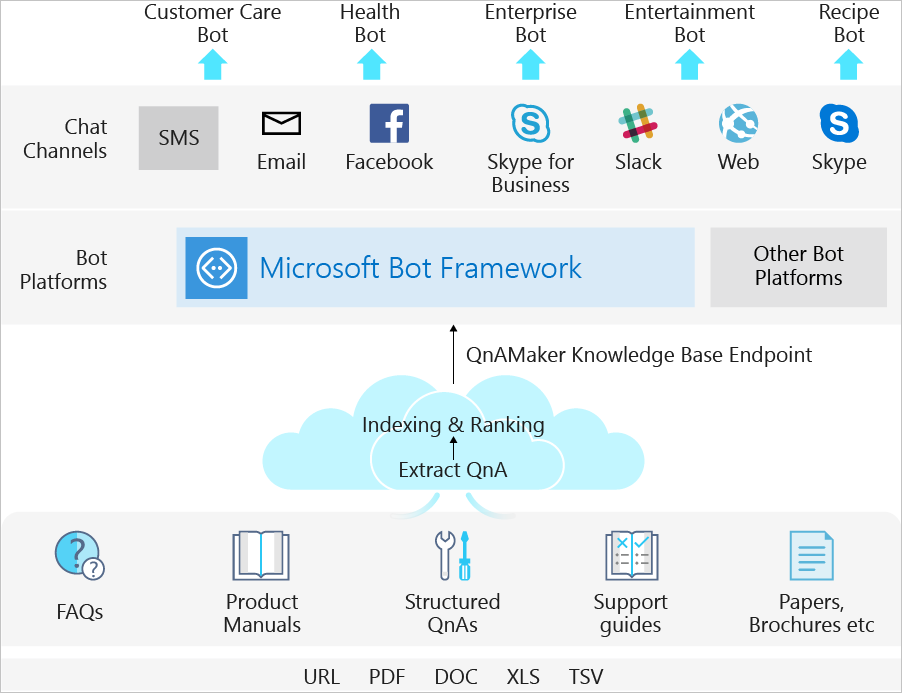
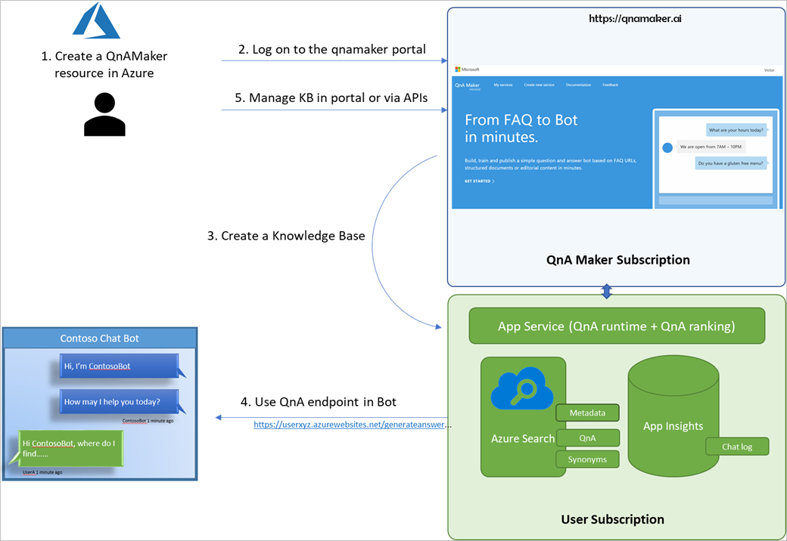

# What is QnA Maker?

QnA Maker is a cloud-based API service that creates a conversational, question and answer layer over your data. 

QnA Maker enables you to create a knowledge-base(KB) from your semi-structured content such as Frequently Asked Question (FAQ) URLs, product manuals, support documents and custom questions and answers. The QnA Maker service answers your users' natural language questions by matching it with the best possible answer from the QnAs in your Knowledge base.

The easy-to-use [web portal](https://qnamaker.ai) enables you to create, manage, train and publish your service without any developer experience. Once the service is published to an endpoint, a client application such as a chat bot can manage the conversation with a user to get questions and respond with the answers. 



## Key QnA Maker processes

QnA Maker provides two key services for your data:

* **Extraction**: Structured question-answer data is extracted from structured & semi-structured [data sources](../Concepts/data-sources-supported.md) like FAQs and product manuals. This extraction can be done as part of the KB [creation](https://aka.ms/qnamaker-docs-createkb) or later, as part of the editing process.

* **Matching**: Once your knowledge base has been [trained and tested](https://aka.ms/qnamaker-docs-trainkb), you [publish](https://aka.ms/qnamaker-docs-publishkb) it. This enables an endpoint to your QnA Maker knowledge base, which you can then use in your bot or client app. This endpoint accepts a user question and responds with the best answer in the knowledge base, along with a confidence score for the match.

```JSON
{
    "answers": [
        {
            "questions": [
                "How do I share a knowledge base with other?"
            ],
            "answer": "Sharing works at the level of a QnA Maker service, i.e. all knowledge bases in the services will be shared. Read [here](https://docs.microsoft.com/azure/cognitive-services/qnamaker/how-to/collaborate-knowledge-base)how to collaborate on a knowledge base.",
            "score": 70.95,
            "id": 4,
            "source": "https://docs.microsoft.com/azure/cognitive-services/qnamaker/faqs",
            "metadata": []
        }
    ]
}

```

## QnA Maker architecture

The QnA Maker architecture consists of the following two components:

1. **QnA Maker management services**: The management experience for a QnA Maker knowledge base, which includes the initial creation, updating, training, and publishing. These activities can be done through the [portal](https://qnamaker.ai) or the [management APIs](https://aka.ms/qnamaker-v4-apis). 

2. **QnA Maker data and runtime**: This is deployed in your Azure subscription in your specified region. Your KB content is stored in [Azure Search](https://azure.microsoft.com/services/search/), and the endpoint deployed as an [App service](https://azure.microsoft.com/services/app-service/). You can also choose to deploy an [Application insights](https://azure.microsoft.com/services/application-insights/) resource for analytics.




## Service highlights

- A complete **no-code** experience to [create a FAQ bot](https://aka.ms/qnamaker-docs-create-faqbot).
- **No network throttling for predictions**. Pay for hosting the service and not for the number of transactions. See the [pricing page](https://aka.ms/qnamaker-docs-pricing) for more details.
- **Scale as needed**. Choose the appropriate SKUs of the individual components that suit your scenario. See how to [choose capacity](https://aka.ms/qnamaker-docs-capacity) for your QnA Maker service.
- **Full data compliance**. The prediction service components are deployed in your Azure subscription and within the compliance boundary.


## Next steps

> [!div class="nextstepaction"]
> [Create a QnA Maker service](../how-to/set-up-qnamaker-service-azure.md)
