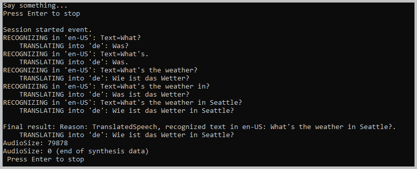

# Quickstart: Translate speech with the Speech SDK for .NET Core

In this quickstart, you'll create a simple .NET Core application that captures user speech from your computer's microphone, translates the speech, and transcribes the translated text to the command line in real time. This application is designed to run on 64-bit Windows, and is built with the [Speech SDK NuGet package](https://aka.ms/csspeech/nuget) and Microsoft Visual Studio 2017.

For a complete list of languages available for speech translation, see [language support](language-support.md).

## Prerequisites

This quickstart requires:

* [.NET Core SDK](https://dotnet.microsoft.com/download)
* [Visual Studio 2017](https://visualstudio.microsoft.com/downloads/)
* An Azure subscription key for the Speech Service. [Get one for free](get-started.md).

## Create a Visual Studio project

[!INCLUDE [](../../../includes/cognitive-services-speech-service-quickstart-dotnetcore-create-proj.md)]

## Add sample code

1. Open `Program.cs`, and replace all the code in it with the following.

    ```csharp
    using System;
    using System.Threading.Tasks;
    using Microsoft.CognitiveServices.Speech;
    using Microsoft.CognitiveServices.Speech.Translation;

    namespace helloworld
    {
        class Program
        {
            public static async Task TranslationContinuousRecognitionAsync()
            {
                // Creates an instance of a speech translation config with specified subscription key and service region.
                // Replace with your own subscription key and service region (e.g., "westus").
                var config = SpeechTranslationConfig.FromSubscription("YourSubscriptionKey", "YourServiceRegion");

                // Sets source and target languages.
                string fromLanguage = "en-US";
                config.SpeechRecognitionLanguage = fromLanguage;
                config.AddTargetLanguage("de");

                // Sets voice name of synthesis output.
                const string GermanVoice = "de-DE-Hedda";
                config.VoiceName = GermanVoice;
                // Creates a translation recognizer using microphone as audio input.
                using (var recognizer = new TranslationRecognizer(config))
                {
                    // Subscribes to events.
                    recognizer.Recognizing += (s, e) =>
                    {
                        Console.WriteLine($"RECOGNIZING in '{fromLanguage}': Text={e.Result.Text}");
                        foreach (var element in e.Result.Translations)
                        {
                            Console.WriteLine($"    TRANSLATING into '{element.Key}': {element.Value}");
                        }
                    };

                    recognizer.Recognized += (s, e) =>
                    {
                        if (e.Result.Reason == ResultReason.TranslatedSpeech)
                        {
                            Console.WriteLine($"\nFinal result: Reason: {e.Result.Reason.ToString()}, recognized text in {fromLanguage}: {e.Result.Text}.");
                            foreach (var element in e.Result.Translations)
                            {
                                Console.WriteLine($"    TRANSLATING into '{element.Key}': {element.Value}");
                            }
                        }
                    };

                    recognizer.Synthesizing += (s, e) =>
                    {
                        var audio = e.Result.GetAudio();
                        Console.WriteLine(audio.Length != 0
                            ? $"AudioSize: {audio.Length}"
                            : $"AudioSize: {audio.Length} (end of synthesis data)");
                    };

                    recognizer.Canceled += (s, e) =>
                    {
                        Console.WriteLine($"\nRecognition canceled. Reason: {e.Reason}; ErrorDetails: {e.ErrorDetails}");
                    };

                    recognizer.SessionStarted += (s, e) =>
                    {
                        Console.WriteLine("\nSession started event.");
                    };

                    recognizer.SessionStopped += (s, e) =>
                    {
                        Console.WriteLine("\nSession stopped event.");
                    };

                    // Starts continuous recognition. Uses StopContinuousRecognitionAsync() to stop recognition.
                    Console.WriteLine("Say something...");
                    await recognizer.StartContinuousRecognitionAsync().ConfigureAwait(false);

                    do
                    {
                        Console.WriteLine("Press Enter to stop");
                    } while (Console.ReadKey().Key != ConsoleKey.Enter);

                    // Stops continuous recognition.
                    await recognizer.StopContinuousRecognitionAsync().ConfigureAwait(false);
                }
            }

            static void Main(string[] args)
            {
                TranslationContinuousRecognitionAsync().Wait();
            }
        }
    }
    ```

1. In the same file, replace the string `YourSubscriptionKey` with your subscription key.

1. Also replace the string `YourServiceRegion` with the [region](regions.md) associated with your subscription (for example, `westus` for the free trial subscription).

1. Save changes to the project.

## Build and run the app

1. Build the application. From the menu bar, choose **Build** > **Build Solution**. The code should compile without errors.

    

1. Start the application. From the menu bar, choose **Debug** > **Start Debugging**, or press **F5**.

    

1. A console window appears, prompting you to say something. Speak an English phrase or sentence. Your speech is transmitted to the Speech service, translated, and transcribed to text, which appears in the same window.

    


## Next steps

Additional samples, such as how to read speech from an audio file, and output translated text as synthesized speech, are available on GitHub.

> [!div class="nextstepaction"]
> [Explore C# samples on GitHub](https://aka.ms/csspeech/samples)

## See also

- [Customize acoustic models](how-to-customize-acoustic-models.md)
- [Customize language models](how-to-customize-language-model.md)
