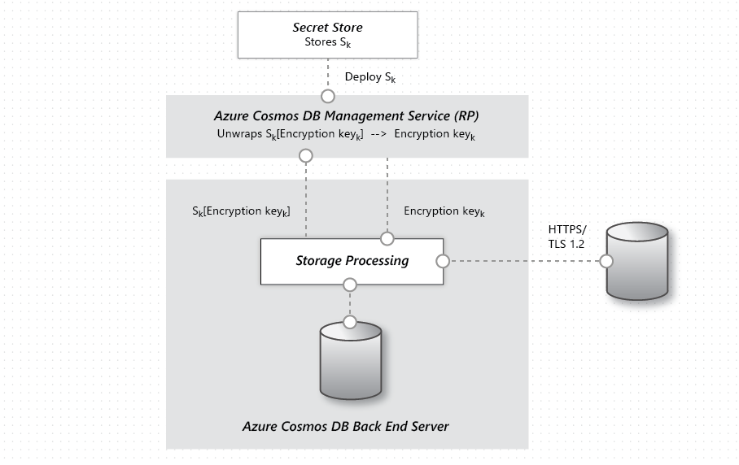

# Data encryption in Azure Cosmos DB 

Encryption at rest is a phrase that commonly refers to the encryption of data on nonvolatile storage devices, such as solid state drives (SSDs) and hard disk drives (HDDs). Cosmos DB stores its primary databases on SSDs. Its media attachments and backups are stored in Azure Blob storage, which is generally backed up by HDDs. With the release of encryption at rest for Cosmos DB, all your databases, media attachments, and backups are encrypted. Your data is now encrypted in transit (over the network) and at rest (nonvolatile storage), giving you end-to-end encryption.

As a PaaS service, Cosmos DB is very easy to use. Because all user data stored in Cosmos DB is encrypted at rest and in transport, you don't have to take any action. Another way to put this is that encryption at rest is "on" by default. There are no controls to turn it off or on. We provide this feature while we continue to meet our [availability and performance SLAs](https://azure.microsoft.com/support/legal/sla/cosmos-db).

## Implementation of encryption at rest for Azure Cosmos DB

Encryption at rest is implemented by using a number of security technologies, including secure key storage systems, encrypted networks, and cryptographic APIs. Systems that decrypt and process data have to communicate with systems that manage keys. The diagram shows how storage of encrypted data and the management of keys is separated. 

The basic flow of a user request is as follows:
- The user database account is made ready, and storage keys are retrieved via a request to the Management Service Resource Provider.
- A user creates a connection to Cosmos DB via HTTPS/secure transport. (The SDKs abstract the details.)
- The user sends a JSON document to be stored over the previously created secure connection.
- The JSON document is indexed unless the user has turned off indexing.
- Both the JSON document and index data are written to secure storage.
- Periodically, data is read from the secure storage and backed up to the Azure Encrypted Blob Store.

## Frequently asked questions

### Q: How much more does Azure Storage cost if Storage Service Encryption is enabled?
A: There is no additional cost.

### Q: Who manages the encryption keys?
A: The keys are managed by Microsoft.

### Q: How often are encryption keys rotated?
A: Microsoft has a set of internal guidelines for encryption key rotation, which Cosmos DB follows. The specific guidelines are not published. Microsoft does publish the [Security Development Lifecycle (SDL)](https://www.microsoft.com/sdl/default.aspx), which is seen as a subset of internal guidance and has useful best practices for developers.

### Q: Can I use my own encryption keys?
A: Cosmos DB is a PaaS service, and we worked hard to keep the service easy to use. We've noticed this question is often asked as a proxy question for meeting a compliance requirement like PCI-DSS. As part of building this feature, we worked with compliance auditors to ensure that customers who use Cosmos DB meet their requirements without the need to manage keys themselves.

### Q: What regions have encryption turned on?
A: All Azure Cosmos DB regions have encryption turned on for all user data.

### Q: Does encryption affect the performance latency and throughput SLAs?
A: There is no impact or changes to the performance SLAs now that encryption at rest is enabled for all existing and new accounts. You can read more on the [SLA for Cosmos DB](https://azure.microsoft.com/support/legal/sla/cosmos-db) page to see the latest guarantees.

### Q: Does the local emulator support encryption at rest?
A: The emulator is a standalone dev/test tool and does not use the key management services that the managed Cosmos DB service uses. Our recommendation is to enable BitLocker on drives where you are storing sensitive emulator test data. The [emulator supports changing the default data directory](local-emulator.md) as well as using a well-known location.

## Next steps

For an overview of Cosmos DB security and the latest improvements, see [Azure Cosmos DB database security](database-security.md).
For more information about Microsoft certifications, see the [Azure Trust Center](https://azure.microsoft.com/support/trust-center/).
