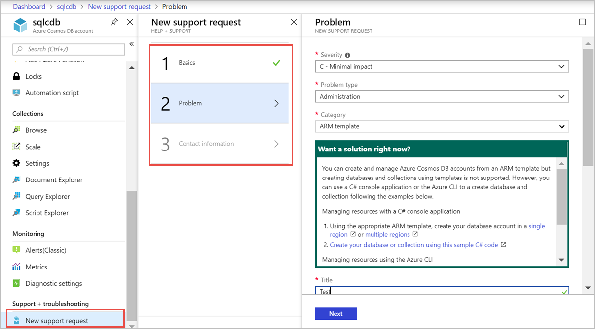

# Restore data from a backup in Azure Cosmos DB 

If you accidentally delete your database or a container, you can [file a support ticket]( https://portal.azure.com/?#blade/Microsoft_Azure_Support/HelpAndSupportBlade) or [call Azure support]( https://azure.microsoft.com/support/options/) to restore the data from automatic online backups. Azure support is available for selected plans only such as **Standard**, **Developer, and plans higher than them. Azure support is not available with **Basic** plan. To learn about different support plans, see the [Azure support plans](https://azure.microsoft.com/support/plans/) page. 

To restore a specific snapshot of the backup, Azure Cosmos DB requires that the data is available for the duration of the backup cycle for that snapshot.

## Request a restore

You should have the following details before requesting a restore:

* Have your subscription ID ready.

* Based on how your data was accidentally deleted or modified, you should prepare to have additional information. It is advised that you have the information available ahead to minimize the back-and-forth that can be detrimental in some time sensitive cases.

* If the entire Azure Cosmos DB account is deleted, you need to provide the name of the deleted account. If you create another account with the same name as the deleted account, share that with the support team because it helps to determine the right account to choose. It's recommended to file different support tickets for each deleted account because it minimizes the confusion of the state of the restore.

* If one or more databases are deleted, you should provide the Azure Cosmos account, as well as the Azure Cosmos database names and specify if a new database with the same name exists.

* If one or more containers are deleted, you should provide the Azure Cosmos account name, database names, and the container names. And specify if a container with the same name exists.

When data corruption occurs and if the documents within a container are modified or deleted, **delete the container as soon as possible**. By deleting the container, you can avoid Azure Cosmos DB from overwriting the backups. If for some reason the deletion is not possible, you should file a ticket as soon as possible. In addition to Azure Cosmos account name, database names, collection names, you should specify the point in time to which the data can be restored to. It is important to be as precise as possible to help us determine the best available backups at that time. It is also important to specify the time in UTC. 

The following screenshot illustrates how to create a support request for a container(collection/graph/table) to restore data by using Azure portal. Provide additional details such as type of data, purpose of the restore, time when the data was deleted to help us prioritize the request.

## Post-restore actions

After you restore the data, you get a notification about the name of the new account (it’s typically in the format `<original-name>-restored1`) and the time when the account was restored to. The restored account will have the same provisioned throughput, indexing policies and it is in same region as the original account. A user who is the subscription admin or a coadmin can see the restored account.

After the data is restored, you should inspect and validate the data in the restored account and make sure it contains the version that you are expecting. If everything looks good, you should migrate the data back to your original account using [Azure Cosmos DB change feed](change-feed.md) or [Azure Data Factory](../data-factory/connector-azure-cosmos-db.md).

It is advised that you delete the container or database immediately after migrating the data. If you don't delete the restored databases or containers, they will incur cost for request units, storage, and egress.

## Next steps

Next you can learn about how to migrate the data back to your original account using the following articles:

* To make a restore request, contact Azure Support, [file a ticket from the Azure portal](https://portal.azure.com/?#blade/Microsoft_Azure_Support/HelpAndSupportBlade)
* [Use Cosmos DB change feed](change-feed.md) to move data to Azure Cosmos DB.

* [Use Azure Data Factory](../data-factory/connector-azure-cosmos-db.md) to move data to Azure Cosmos DB.
