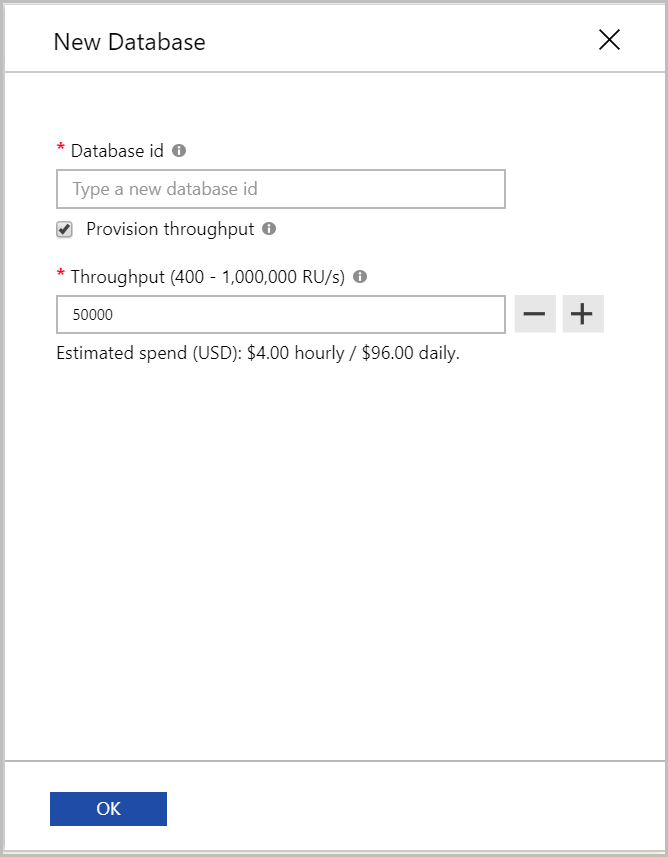

# Provision throughput on an Azure Cosmos database

This article explains how to provision throughput for a database in Azure Cosmos DB. You can provision throughput for a single [container](how-to-provision-container-throughput.md), or for a database and share the throughput among the containers within it. You can provision database level throughput by using the Azure portal or Cosmos DB SDKs.

## Provision throughput using Azure portal

### <a id="portal-sql"></a>SQL (Core) API

1. Sign in to [Azure portal](https://portal.azure.com/).

1. [Create a new Cosmos DB account](create-sql-api-dotnet.md#create-a-database-account) or select an existing account.

1. Open the **Data Explorer** pane and select **New Database**. Next fill the form with the following details:

   * Enter a Database Id. 
   * Select Provision throughput.
   * Enter a throughput, for example 1000 RUs.
   * Select **OK**.



## Provision throughput using .NET SDK

> [!Note]
> Use the SQL API to provision throughput for all APIs. You can optionally use the example below for Cassandra API as well.

### <a id="dotnet-all"></a>All APIs

```csharp
//set the throughput for the database
RequestOptions options = new RequestOptions
{
    OfferThroughput = 10000
};

//create the database
await client.CreateDatabaseIfNotExistsAsync(
    new Database {Id = databaseName},  
    options);
```

### <a id="dotnet-cassandra"></a>Cassandra API

```csharp
// Create a Cassandra keyspace and provision throughput of 10000 RU/s
session.Execute(CREATE KEYSPACE IF NOT EXISTS myKeySpace WITH cosmosdb_provisioned_throughput=10000);
```

## Next steps

See the following articles to learn about provisioning throughput in Cosmos DB:

* [How to provision throughput for a container](how-to-provision-container-throughput.md)
* [Request units and throughput in Azure Cosmos DB](request-units.md)
