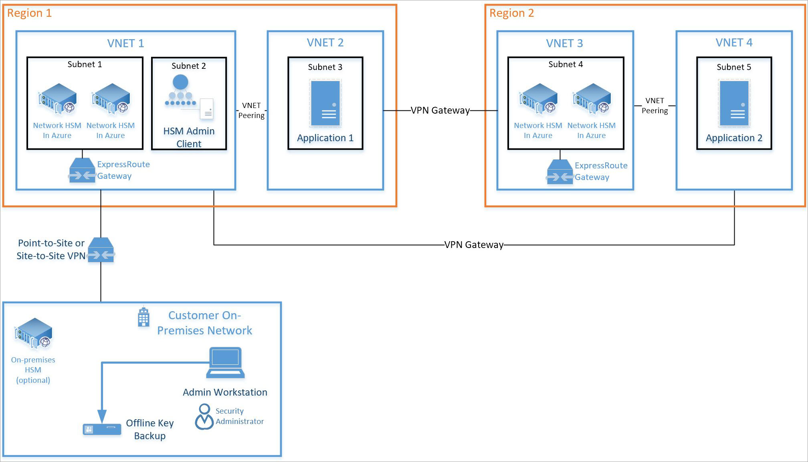

---
title: High availability - Azure Dedicated HSM | Microsoft Docs
description: Azure Dedicated HSM high availability example and basic considerations
services: dedicated-hsm
author: barclayn
manager: mbaldwin
ms.custom: "mvc, seodec18"
ms.service: key-vault
ms.workload: identity
ms.tgt_pltfrm: na
ms.devlang: na
ms.topic: conceptual
ms.date: 12/07/2018
ms.author: barclayn

---
# Azure Dedicated HSM high availability

Azure Dedicated HSM is underpinned by Microsoft’s highly available datacenters. However, any highly available datacenter is vulnerable to localized failures and in extreme circumstances, regional level failures. Microsoft deploys HSM devices in different datacenters within a region to ensure provisioning multiple devices does not lead to those devices sharing a single rack. A further level of high availability can be achieved by pairing these HSMs across the datacenters in a region. It is also possible to pair devices across regions to address regional failover in a disaster recovery situation. With this multi-layered high availability configuration, any device failure will be automatically addressed to keep applications working. All datacenters also have spare devices and components on-site so any failed device can be replaced in a timely fashion.

## High availability example

Information on how to configure HSM devices for high availability at the software level is in the 'Gemalto Luna Network HSM Administration Guide'. This document is available on the  [Gemalto Customer Support Portal](https://supportportal.gemalto.com/csm/).

The following diagram shows a highly available architecture. It uses multiple devices in region and multiple devices paired in a separate region. This architecture uses a minimum of four HSM devices and virtual networking components.

## Next steps

It is recommended that all key concepts of the service, such as high availability and security, are well understood before device provisioning and application design or deployment.
Further concept level topics:

* [Deployment Architecture](deployment-architecture.md)
* [Physical Security](physical-security.md)
* [Networking](networking.md)
* [Supportability](supportability.md)
* [Monitoring](monitoring.md)

For specific details on configuring HSM devices for high availability, please refer to the Gemalto Customer Support Portal for the Administrator Guides and see section 6.
