# Set up a device template

A device template is a blueprint that defines the characteristics and behaviors of a type of device that connects to an Azure IoT Central application.

For example, a builder can create a device template for an IoT-connected fan that has:

- Temperature telemetry measurement

- Fan motor error event measurement

- Fan operating state measurement

- Fan speed setting

- Location property

- Rules that send alerts

- Dashboard that gives you an overall view of the device

From this device template, an operator can create and connect real fan devices with names such as **fan-1** and **fan-2**. All these fans have measurements, settings, properties, rules, and a dashboard that users of your application can monitor and manage.

> [!NOTE]
> Only builders and administrators can create, edit, and delete device templates. Any user can create devices on the **Device Explorer** page from existing device templates.

## Create a device template

1. Go to the **Application Builder** page.

2. To create a blank template, select **Create Device Template**, and then select **Custom**.

3. Enter a name (e.g. Refrigerator-1) for your new device template and select **Create**.

   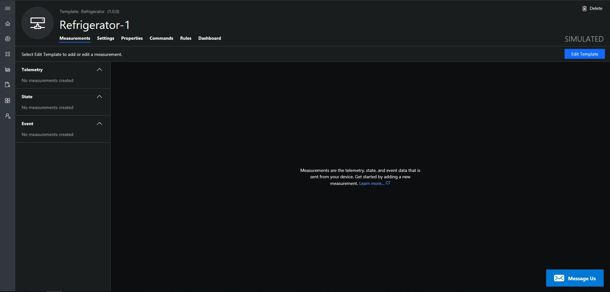

4. Now you’re on the **Device Details** page of a new simulated device. A simulated device is automatically created for you when you create a device template. It reports data and can be controlled just like a real device.

Now let's look at each of the tabs on the **Device Details** page.

## Measurements

Measurements are the data that comes from your device. You can add multiple measurements to your device template to match the capabilities of your device.

- **Telemetry** measurements are the numerical data points that your device collects over time. They're represented as a continuous stream. An example is temperature.
- **Event** measurements are point-in-time data that represents something of significance on the device. A severity level represents the importance of an event. An example is a fan motor error.
- **State** measurements represent the state of the device or its components over a period of time. For example, a fan mode can be defined as having **Operating** and **Stopped** as the two possible states.

### Create a telemetry measurement
To add a new telemetry measurement, select **Edit Template**, and then click the **+ New Measurement** button. Select **Telemetry** as the measurement type, and enter the details on the **Create Telemetry** form.

> [!NOTE]
> The field names in the device template must match the property names in the corresponding device code in order for the telemetry measurement to be displayed in the application when a real device is connected. Do the same when you configure settings, device properties, and commands as you continue to define the device template in the following sections.

For example, you can add a new temperature telemetry measurement:
| Display Name        | Field Name    |  Units    | Min   |Max|
| --------------------| ------------- |-----------|-------|---|
| Temperature         | temp          |  degC     |  0    |100|

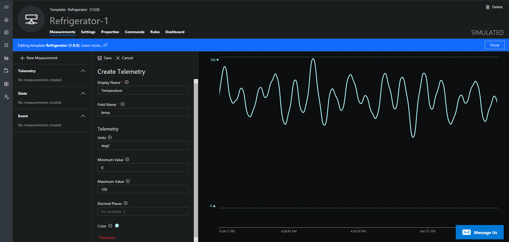

After you select **Done**, the **Temperature** measurement appears in the list of measurements. In a short while, you can see the visualization of the temperature data that the simulated device has generated. When you create a device template, a simulated device is generated from the template that enables you to test the behavior of your application before a physical/real device is connected.

> [!NOTE]
  The data type of the telemetry measurement is a floating point number.

### Create an event measurement
To add a new event measurement, select **Edit Template**, and then click the **+ New Measurement** button. Select **Event** as the measurement type, and enter the details on the **Create Event** form.

Provide the **Display Name**, **Field Name**, and **Severity** details for the event. You can choose from the three available levels of severity: **Error**, **Warning**, and **Information**.  

For example, you can add a new **Fan Motor Error** event.

| Display Name        | Field Name    |  Default Severity | 
| --------------------| ------------- |-----------|
| Fan Motor Error     | fanmotorerror |  Error    | 

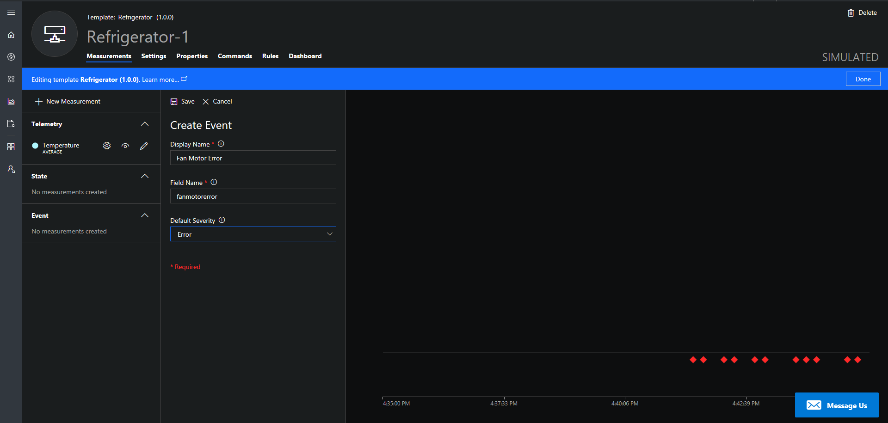

After you select **Done**, the **Fan Motor Error** measurement appears in the list of measurements. An operator can see the visualization of the event data that the device is sending.

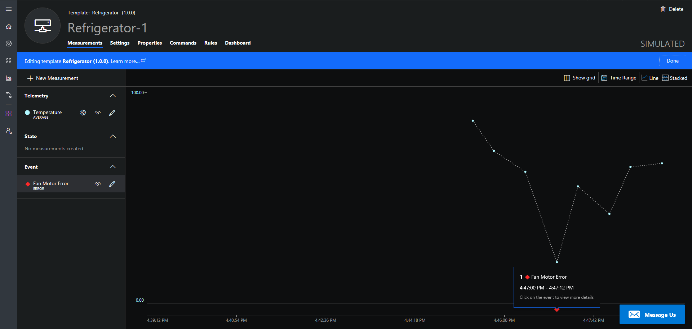

To view more details about the event, select the event icon on the chart.

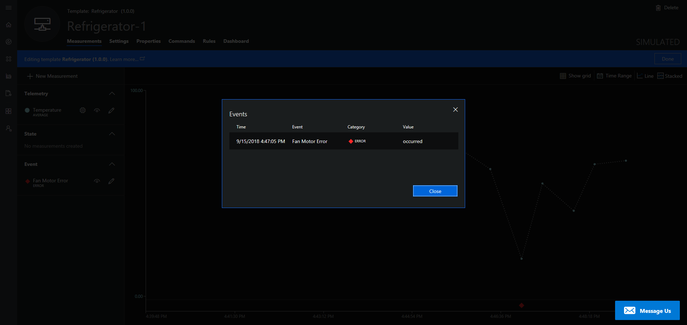

> [!NOTE]
  The data type of the Event measurement is string.

### Create a state measurement
To add a new state measurement, select **Edit Template**, and then click the **+ New Measurement** button. Select **State** as the measurement type, and enter the details on the **Create State** form.

Provide the details for **Display Name**, **Field Name**, and **Values** of the state. Each value can also have a display name that will be used when the value appears in charts and tables.

For example, you can add a new **Fan Mode** state that has two possible values that the device can send, **Operating** and **Stopped**.

| Display Name | Field Name    |  Value 1   | Display Name | Value 2    |Display Name  | 
| -------------| ------------- |----------- | -------------| -----------| -------------|
| Fan Mode     | fanmode       |  1         | Operating    |     0      | Stopped      |

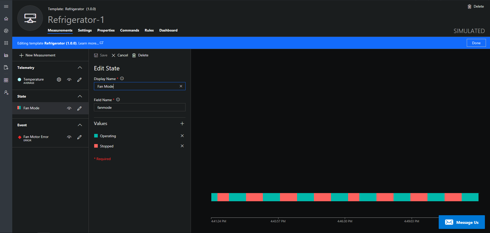

After you select **Done**, the **Fan Mode** state measurement appears in the list of measurements. The operator can see the visualization of the state data that the device is sending.

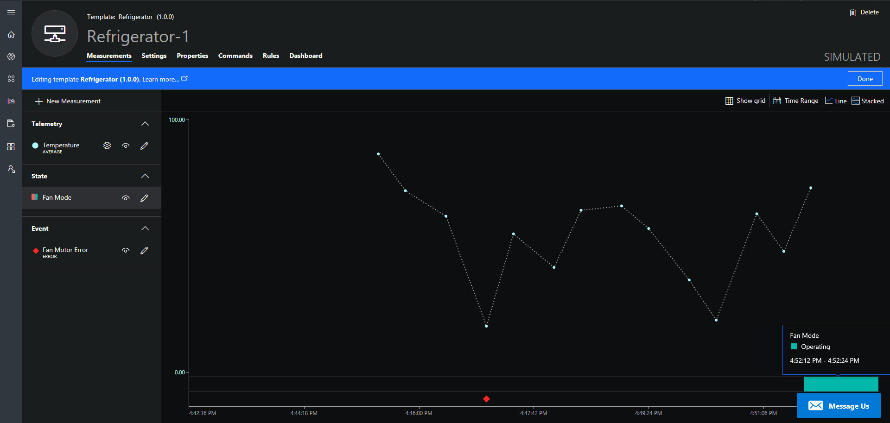

If the device sends too many data points in a small duration, the state measurement appears with a different visual, as shown in the following screenshot. If you click on the chart, all the data points within that time period are displayed in a chronological order. You can also narrow down the time range to see the measurement plotted on the chart.

> [!NOTE]
  The data type of the State measurement is string.

## Settings

Settings control a device. They enable operators of your application to provide inputs to the device. You can add multiple settings to your device template that appear as tiles on the **Settings** tab for operators to use. You can add many types of settings: number, text, date, toggle, pick list, and section label. 

Settings can be in one of three states. The device reports these states.

- **Synced**: The device has changed to reflect the setting value.

- **Pending**: The device is currently changing to the setting value.

- **Error**: The device has returned an error.

For example, you can add a new fan speed setting by selecting **Edit Template** and entering in the new **Number** setting:

| Display Name  | Field Name    |  Units  | Decimals |Initial|
| --------------| ------------- |---------| ---------|---- |
| Fan Speed     | fanSpeed      | RPM     | 2        | 0   |

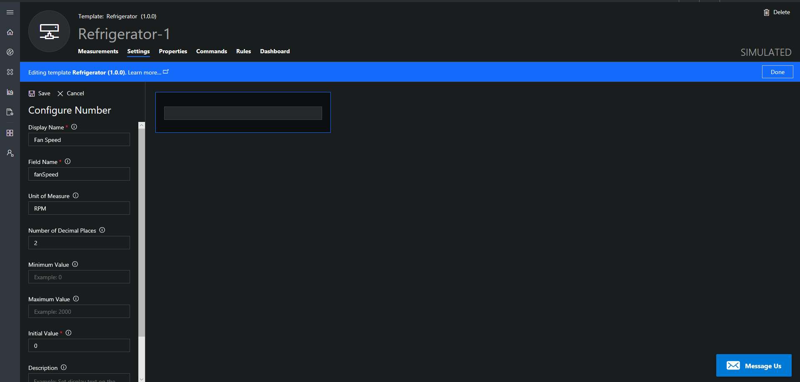

After you select **Save**, the **Fan Speed** setting appears as a tile and is ready to be used to change the fan speed of the device.

After you create a tile, select **Done** at the upper-right part of the screen. Once the real device is connected to the application, the setting value will change to synced.

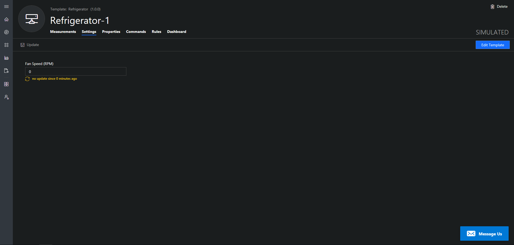

## Properties

Properties are the device metadata that's associated with the device, such as device location and serial number. You can add multiple properties to your device template that appear as tiles on the **Properties** tab. You can add many types of properties: number, text, date, toggle, device property, label, and location. An operator can specify the values for properties when they create a device, and they can edit these values at any time. However, device properties are read-only and are sent from the device to the application, and cannot be changed by the operator. When the real device is connected, the device property tile will be updated in the application. 

There are two categories of properties:

- **Device** properties that the device reports to the IoT Central application. These are read-only values reported by the device and will be updated in the application when the real device is connected. 
- **Application** properties that are stored purely in the application and can be edited by the operator. The device doesn't recognize application properties.

For example, you can add device location as a new **Text** property (an application property) by selecting **Edit Template** and entering in the new property:

| Display Name  | Field Name | Trim Leading Spaces  | Trim Trailing Spaces  | Case Sensitivity| Min Length | Max Length |
| --------------| -----------|---------| ---------|---- |----|----|
| Location      | loc        | Off     |  Off     | mixed  | 0 | 100|

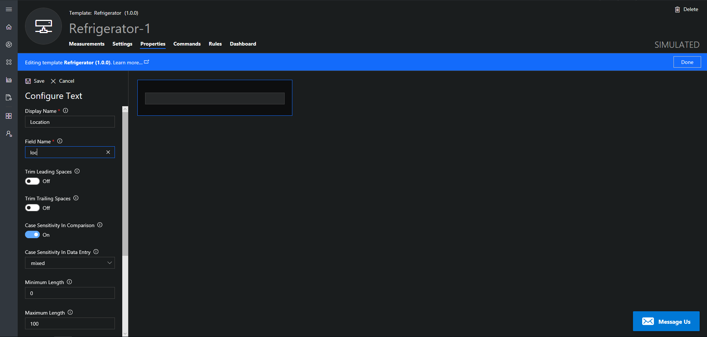

After you select **Save**, device location appears as a tile:

After you create the tile, you can change the application property value. First, select **Done** in the upper-right part of the screen.

### Create a location property through Azure Maps
You can give geographic context to your location data in Azure IoT Central and map any latitude and longitude coordinates of a street address. Or you can simply map latitude and longitude coordinates. Azure Maps enables this capability in IoT Central.

You can add two types of location properties:
- **Location as an application property**, which is stored purely in the application. The device doesn't recognize application properties.
- **Location as a device property**, which the device reports to the application.

#### Add location as an application property 
You can create a location property as an application property by using Azure Maps in your IoT Central application. 
For example, you can add the device installation address. 

1. On the **Properties** tab, select **Edit Template**.

   

2. In the library, select **Location**.
3. Configure **Display Name**, **Field Name**, and (optionally) **Initial Value** for the location. 

    | Display Name  | Field Name | Initial Value |
    | --------------| -----------|---------| 
    | Installation address | insta_address | Microsoft, 1 Microsoft Way, Redmond, WA 98052   |

   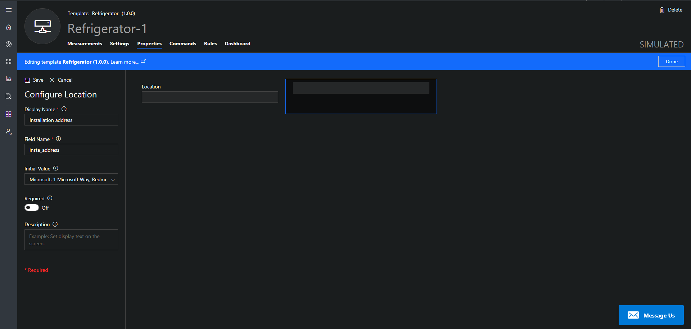

   There are two supported formats to add a location:
   - **Location as an address**
   - **Location as coordinates** 

4. Select **Save** and **Done**. Now an operator can update the location value in the location field form. 

#### Add location as a device property 

You can create a location property as a device property that the device reports. For example, if you want to track the device location:

1. On the **Properties** tab, select **Edit Template**.

   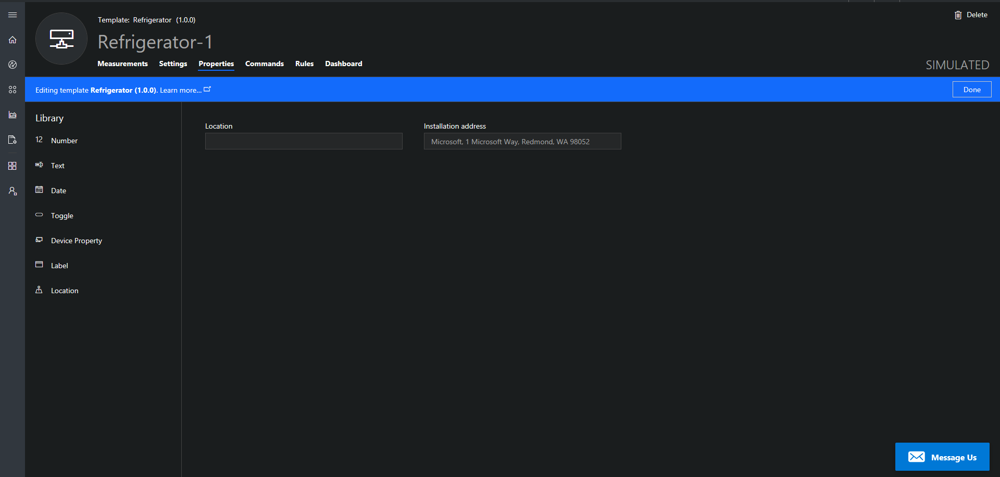

2. Select **Device Property** from the library.
3. Configure the display name and field name, and select **Location** as the data type. 

    | Display Name  | Field Name | Data Type |
    | --------------| -----------|-----------| 
    | Device location | deviceLoc| location  |

   > [!NOTE]
   > The field names must match the property names in the corresponding device code

   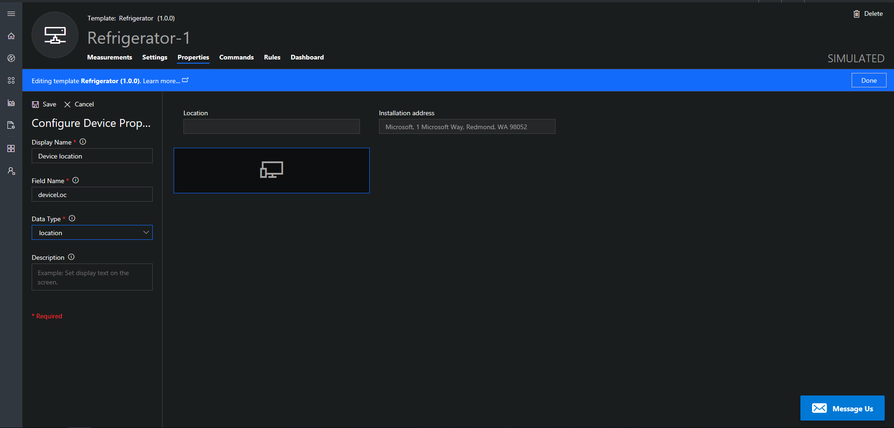

Once the real device is connected, the location that you added as a device property will be updated with the value sent by the device. The installation address, the location that you added as an application property, is an editable tile. Now that you've configured your location property, you can [add a map to visualize the location in the device dashboard](#add-an-azure-maps-location-in-the-dashboard).

## Commands

Commands are used to remotely manage a device. They enable operators of your application to instantly run commands on the device. You can add multiple commands to your device template that appear as tiles on the **Commands** tab for operators to use. As the builder of the device, you have the flexibility to define commands according to your requirements.

How is a command different from a setting? 

* **Setting**: A setting is a configuration that you want to apply to a device, and you want the device to persist that configuration until you change it. For example, you want to set the temperature of your freezer, and you want that setting even when the freezer restarts. 

* **Command**: You use commands to instantly run a command on the device remotely from IoT Central. If a device isn't connected, the command times out and fails. For example, you want to restart a device.  

For example, you can add a new **Echo** command by selecting **Editing Template**, then clicking **+ New Command**, and entering in the new command:

| Display Name  | Field Name | Default Timeout | Data Type |
| --------------| -----------|---------------- | --------- | 
| Echo Command  | echo       |  30             | text      |

After you select **Save** and **Done**,  the **Echo** command appears as a tile and is ready to be used to echo the device once your real device is connected. The field names of your command must match the property names in the corresponding device code in order for commands to be run successfully.

## Rules

Rules enable operators to monitor devices in near real time. Rules automatically invoke actions such as sending an email when the rule is triggered. One type of rule is available today:

- **Telemetry rule**, which is triggered when the selected device telemetry crosses a specified threshold. [Learn more about telemetry rules](howto-create-telemetry-rules.md).

## Dashboard

The dashboard is where an operator can go to see information about a device. As a builder, you can add tiles on this page to help operators understand how the device is behaving. You can add multiple dashboard tiles to your device template. You can add many types of dashboard tiles such as image, line chart, bar chart, Key Performance Indicator (KPI), settings and properties, and label.

For example, you can add a **Settings and Properties** tile to show a selection of the current values of settings and properties by selecting **Edit Template** and the tile from the Library:

Now when an operator views the dashboard, they can see this tile that displays the properties and settings of the device:

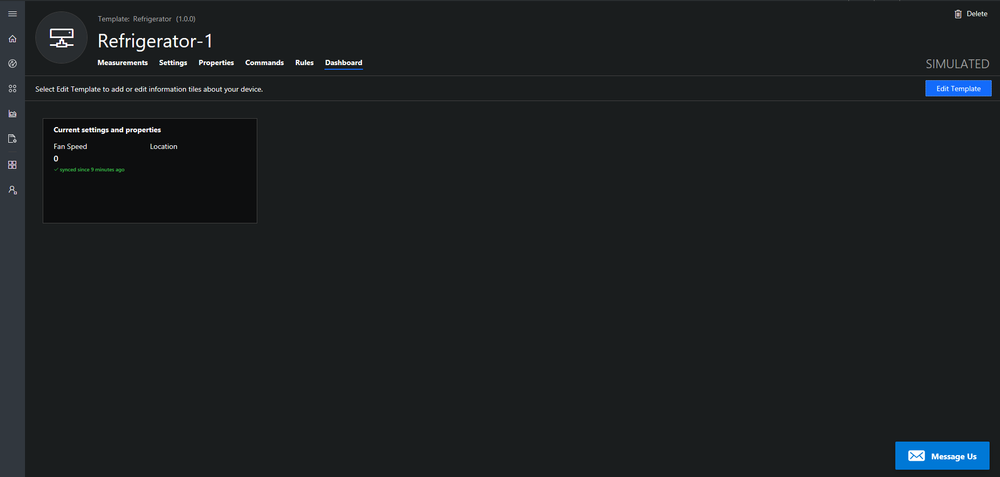

### Add an Azure Maps location in the dashboard

If you configured a location property earlier in [Create a location property through Azure Maps](#create-a-location-property-through-azure-maps), you can visualize the location by using a map in your device dashboard.

1. On the **Dashboard** tab, select **Edit Template**.

   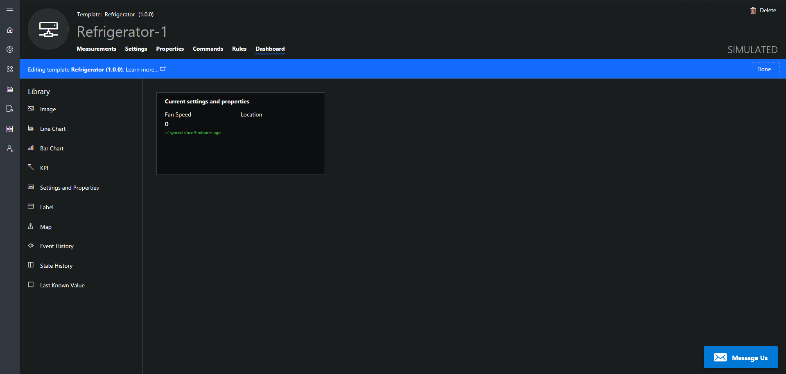

2. On the device dashboard, select **Map** from the library. 
3. Give it a title. The example below has the title Installation Location, then choose the location property that you previously configured under the Properties tab. In the example below, **Installation address** is selected.

   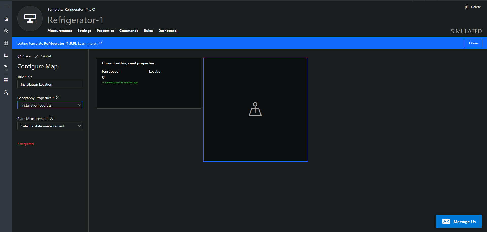

4. Select **Save**. The map tile now displays the location that you selected. 

   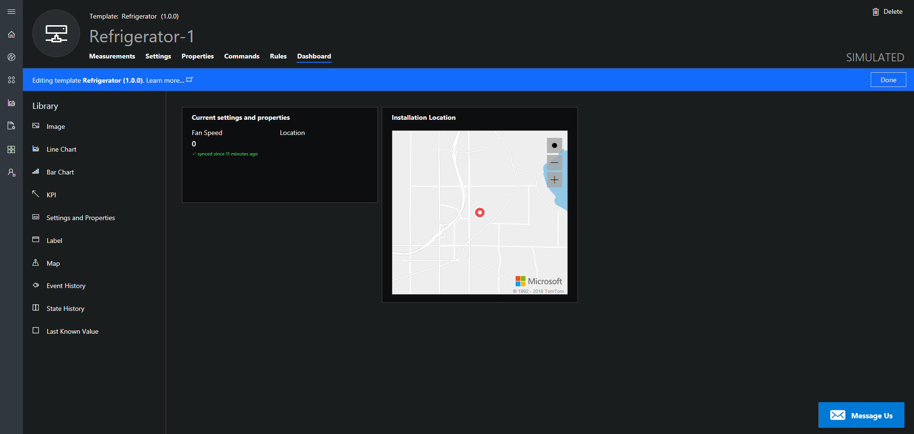 

You can resize the map to your desired size. Now when an operator views the dashboard, they can see all the dashboard tiles that you've configured, including a location map.

## Next steps

Now that you've learned how to set up a device template in your Azure IoT Central application, you can:

> [!div class="nextstepaction"]
> [Create a new device template version](howto-version-devicetemplate.md)
