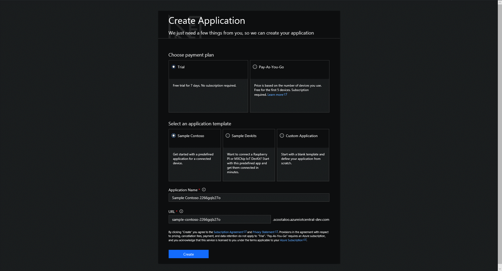

# Create an Azure IoT Central application

As a _builder_, you use the Azure IoT Central UI to define your Microsoft Azure IoT Central application. This quickstart shows you how to create an Azure IoT Central application that contains a sample _device template_ and simulated _devices_.

Navigate to the Azure IoT Central [Application Manager](https://aka.ms/iotcentral) page. You will need to sign in with a Microsoft personal or work or school account.

To start creating a new Azure IoT Central application, select **New Application**. This takes you to the **Create Application** page.

To create a new Azure IoT Central application:

1. Choose a payment plan:
    - **Trial** applications are free for 7 days before they expire. They can be converted to Pay-As-You-Go at any time before they expire.
    - **Pay-As-You-Go** applications are charged per device, with the first 5 devices free.

    Learn more about pricing on the [Azure IoT Central pricing page](https://azure.microsoft.com/pricing/details/iot-central/).

1. Choose a friendly application name, such as **Contoso IoT**. Azure IoT Central generates a unique URL prefix for you. You can change this URL prefix to something more memorable.

1. Choose an application template. An application template can contain predefined items such as device templates and dashboards to help you get started.
    | Application template | Description |
    | -------------------- | ----------- |
    | Sample Contoso       | Creates an application that includes a device template already created for a Refrigerated Vending Machine. Use this template to get started exploring Azure IoT Central. |
    | Sample Devkits       | Creates an application with device templates ready for you to connect an MXChip or Raspberry Pi device. Use this template if you are a device developer experimenting with any of these devices. |
    | Custom application   | Creates an empty application for you to populate with your own device templates and devices. |

1. If you are creating a **Pay-As-You-Go** application, you need to select your *Directory*, *Azure Subscription*, and *Region*. 
    - *Directory* is the Azure Active Directory to create your application. It contains user identities, credentials, and other organizational information. If you don’t have an AAD, one is created for you when you create an Azure subscription.

    - An *Azure Subscription* enables you to create instances of Azure services. IoT Central will provision resources in your subscription. If you don’t have an Azure subscription, you can create one on the [Azure sign-up page](https://aka.ms/createazuresubscription). After you create the Azure subscription, navigate back to the **Create Application** page. Your new subscription appears in the **Azure Subscription** drop-down.

    - *Region* is the physical location where you’d like to create your application. Typically, you should choose the region that is physically closest to your devices to get optimal performance.You can see the regions in which Azure IoT Central is available on the [Products available by region](https://azure.microsoft.com/regions/services/) page.

    > [!Note]
    > Once you choose a region, you cannot later move your application to a different region.

1. Click **Create**.

## Next steps

In this quickstart, you created an IoT Central application. Here's the suggested next step:

> [!div class="nextstepaction"]
> [Take a tour of IoT Central](https://docs.microsoft.com/azure/iot-central/overview-iot-central-tour)
