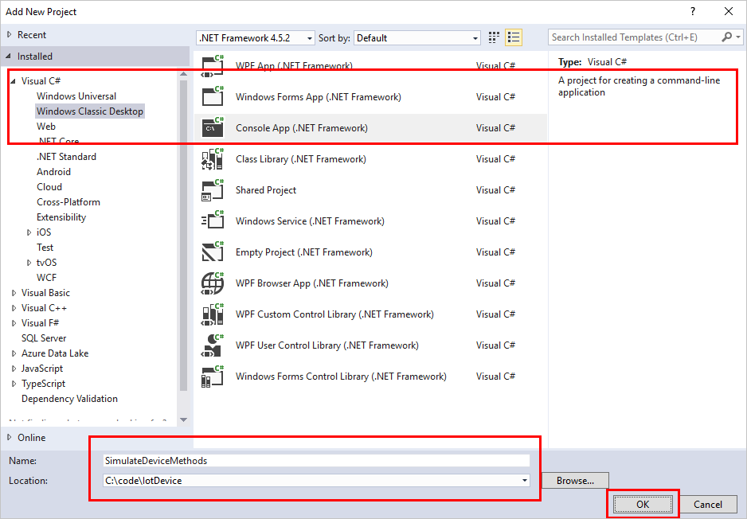
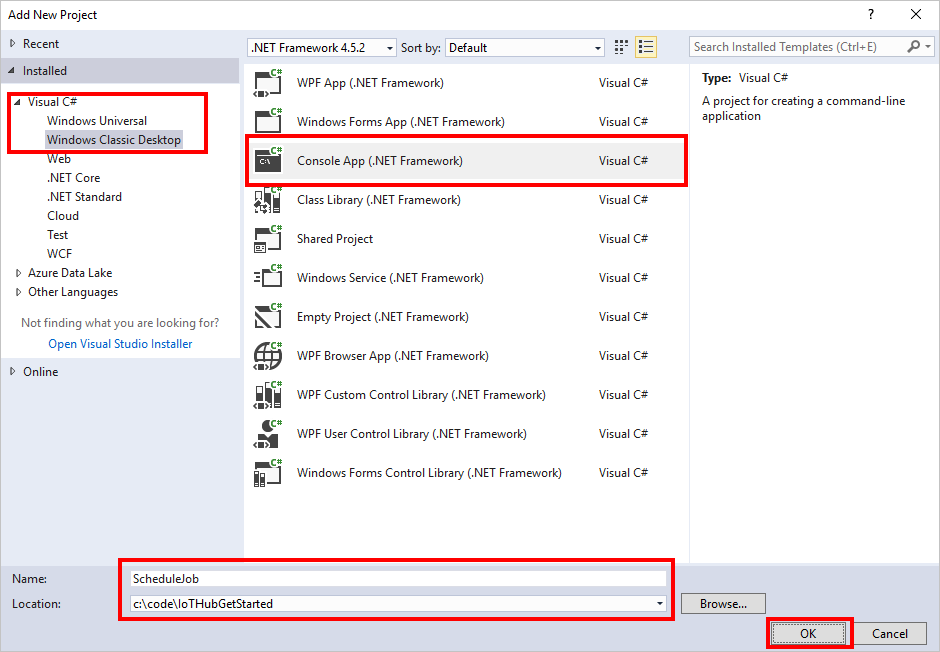
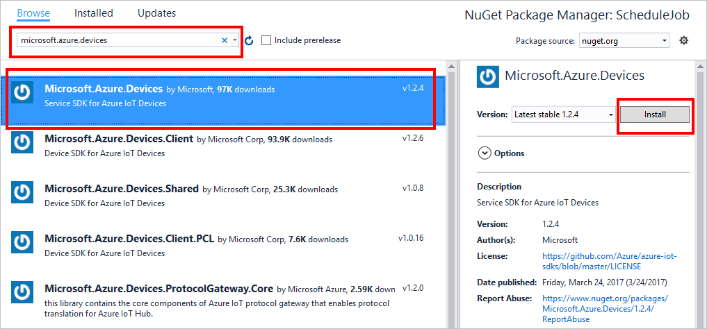
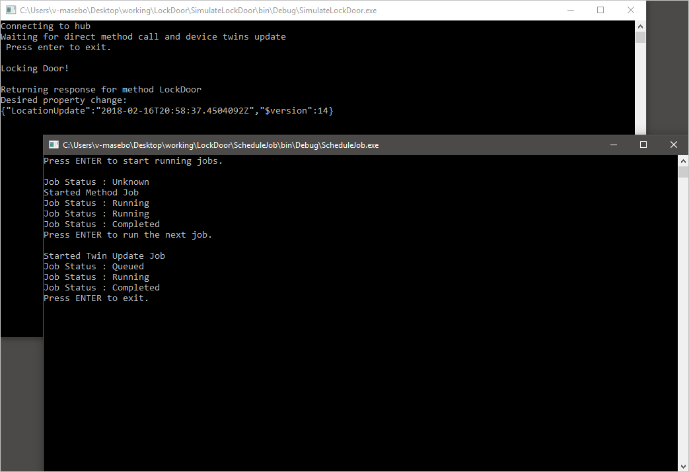

# Schedule and broadcast jobs (.NET/.NET)

[!INCLUDE [iot-hub-selector-schedule-jobs](../../includes/iot-hub-selector-schedule-jobs.md)]

Use Azure IoT Hub to schedule and track jobs that update millions of devices. Use jobs to:

* Update desired properties
* Update tags
* Invoke direct methods

A job wraps one of these actions and tracks the execution against a set of devices that is defined by a device twin query. For example, a back-end app can use a job to invoke a direct method on 10,000 devices that reboots the devices. You specify the set of devices with a device twin query and schedule the job to run at a future time. The job tracks progress as each of the devices receive and execute the reboot direct method.

To learn more about each of these capabilities, see:

* Device twin and properties: [Get started with device twins](iot-hub-csharp-csharp-twin-getstarted.md) and [Tutorial: How to use device twin properties](tutorial-device-twins.md)

* Direct methods: [IoT Hub developer guide - direct methods](iot-hub-devguide-direct-methods.md) and [Tutorial: Use direct methods](quickstart-control-device-dotnet.md)

[!INCLUDE [iot-hub-basic](../../includes/iot-hub-basic-whole.md)]

This tutorial shows you how to:

* Create a device app that implements a direct method called **LockDoor** that can be called by the back-end app.

* Create a back-end app that creates a job to call the **LockDoor** direct method on multiple devices. Another job sends desired property updates to multiple devices.

At the end of this tutorial, you have two .NET (C#) console apps:

**SimulateDeviceMethods** that connects to your IoT hub and implements the **LockDoor** direct method.

**ScheduleJob** that uses jobs to call the **LockDoor** direct method and update the device twin desired properties on multiple devices.

To complete this tutorial, you need the following:

* Visual Studio 2017.
* An active Azure account. If you don't have an account, you can create a [free account](https://azure.microsoft.com/pricing/free-trial/) in just a couple of minutes.

## Create an IoT hub

[!INCLUDE [iot-hub-include-create-hub](../../includes/iot-hub-include-create-hub.md)]

### Retrieve connection string for IoT hub

[!INCLUDE [iot-hub-include-find-connection-string](../../includes/iot-hub-include-find-connection-string.md)]

## Register a new device in the IoT hub

[!INCLUDE [iot-hub-include-create-device](../../includes/iot-hub-include-create-device.md)]

## Create a simulated device app

In this section, you create a .NET console app that responds to a direct method called by the solution back end.

1. In Visual Studio, add a Visual C# Windows Classic Desktop project to the current solution by using the **Console Application** project template. Name the project **SimulateDeviceMethods**.
   
    
    
2. In Solution Explorer, right-click the **SimulateDeviceMethods** project, and then click **Manage NuGet Packages...**.

3. In the **NuGet Package Manager** window, select **Browse** and search for **Microsoft.Azure.Devices.Client**. Select **Install** to install the **Microsoft.Azure.Devices.Client** package, and accept the terms of use. This procedure downloads, installs, and adds a reference to the [Azure IoT device SDK](https://www.nuget.org/packages/Microsoft.Azure.Devices.Client/) NuGet package and its dependencies.
   
    

4. Add the following `using` statements at the top of the **Program.cs** file:
   
    ```csharp
    using Microsoft.Azure.Devices.Client;
    using Microsoft.Azure.Devices.Shared;
    using Newtonsoft.Json;
    ```

5. Add the following fields to the **Program** class. Replace the placeholder value with the device connection string that you noted in the previous section:

    ```csharp
    static string DeviceConnectionString = "<yourDeviceConnectionString>";
    static DeviceClient Client = null;
    ```

6. Add the following to implement the direct method on the device:

    ```csharp
    static Task<MethodResponse> LockDoor(MethodRequest methodRequest, object userContext)
    {
        Console.WriteLine();
        Console.WriteLine("Locking Door!");
        Console.WriteLine("\nReturning response for method {0}", methodRequest.Name);
            
        string result = "'Door was locked.'";
        return Task.FromResult(new MethodResponse(Encoding.UTF8.GetBytes(result), 200));
    }
    ```

7. Add the following to implement the device twins listener on the device:

    ```csharp
    private static async Task OnDesiredPropertyChanged(TwinCollection desiredProperties, 
      object userContext)
    {
        Console.WriteLine("Desired property change:");
        Console.WriteLine(JsonConvert.SerializeObject(desiredProperties));
    }
    ```

8. Finally, add the following code to the **Main** method to open the connection to your IoT hub and initialize the method listener:
   
    ```csharp
    try
    {
        Console.WriteLine("Connecting to hub");
        Client = DeviceClient.CreateFromConnectionString(DeviceConnectionString, 
          TransportType.Mqtt);

        Client.SetMethodHandlerAsync("LockDoor", LockDoor, null);
        Client.SetDesiredPropertyUpdateCallbackAsync(OnDesiredPropertyChanged, null);

        Console.WriteLine("Waiting for direct method call and device twin update\n Press enter to exit.");
        Console.ReadLine();

        Console.WriteLine("Exiting...");

        Client.SetMethodHandlerAsync("LockDoor", null, null);
        Client.CloseAsync().Wait();
    }
    catch (Exception ex)
    {
        Console.WriteLine();
        Console.WriteLine("Error in sample: {0}", ex.Message);
    }
    ```
        
9. Save your work and build your solution.         

> [!NOTE]
> To keep things simple, this tutorial does not implement any retry policy. In production code, you should implement retry policies (such as connection retry), as suggested in the article, [Transient Fault Handling](/azure/architecture/best-practices/transient-faults).
> 

## Schedule jobs for calling a direct method and sending device twin updates

In this section, you create a .NET console app (using C#) that uses jobs to call the **LockDoor** direct method and send desired property updates to multiple devices.

1. In Visual Studio, add a Visual C# Windows Classic Desktop project to the current solution by using the **Console Application** project template. Name the project **ScheduleJob**.

    

2. In Solution Explorer, right-click the **ScheduleJob** project, and then click **Manage NuGet Packages...**.

3. In the **NuGet Package Manager** window, select **Browse**, search for **Microsoft.Azure.Devices**, select **Install** to install the **Microsoft.Azure.Devices** package, and accept the terms of use. This step downloads, installs, and adds a reference to the [Azure IoT service SDK](https://www.nuget.org/packages/Microsoft.Azure.Devices/) NuGet package and its dependencies.

    

4. Add the following `using` statements at the top of the **Program.cs** file:
    
    ```csharp
    using Microsoft.Azure.Devices;
    using Microsoft.Azure.Devices.Shared;
    ```

5. Add the following `using` statement if not already present in the default statements.

    ```csharp
    using System.Threading;
    using System.Threading.Tasks;
    ```

6. Add the following fields to the **Program** class. Replace the placeholders with the IoT Hub connection string for the hub that you created in the previous section and the name of your device.

    ```csharp
    static JobClient jobClient;
    static string connString = "<yourIotHubConnectionString>";
    static string deviceId = "<yourDeviceId>";
    ```

7. Add the following method to the **Program** class:

    ```csharp
    public static async Task MonitorJob(string jobId)
    {
        JobResponse result;
        do
        {
            result = await jobClient.GetJobAsync(jobId);
            Console.WriteLine("Job Status : " + result.Status.ToString());
            Thread.Sleep(2000);
        } while ((result.Status != JobStatus.Completed) && 
          (result.Status != JobStatus.Failed));
    }
    ```

8. Add the following method to the **Program** class:

    ```csharp
    public static async Task StartMethodJob(string jobId)
    {
        CloudToDeviceMethod directMethod = 
          new CloudToDeviceMethod("LockDoor", TimeSpan.FromSeconds(5), 
          TimeSpan.FromSeconds(5));
       
        JobResponse result = await jobClient.ScheduleDeviceMethodAsync(jobId,
            $"DeviceId IN ['{deviceId}']",
            directMethod,
            DateTime.UtcNow,
            (long)TimeSpan.FromMinutes(2).TotalSeconds);

        Console.WriteLine("Started Method Job");
    }
    ```

9. Add another method to the **Program** class:

    ```csharp
    public static async Task StartTwinUpdateJob(string jobId)
    {
        Twin twin = new Twin(deviceId);
        twin.Tags = new TwinCollection();
        twin.Tags["Building"] = "43";
        twin.Tags["Floor"] = "3";
        twin.ETag = "*";

        twin.Properties.Desired["LocationUpdate"] = DateTime.UtcNow;

        JobResponse createJobResponse = jobClient.ScheduleTwinUpdateAsync(
            jobId,
            $"DeviceId IN ['{deviceId}']", 
            twin, 
            DateTime.UtcNow, 
            (long)TimeSpan.FromMinutes(2).TotalSeconds).Result;

        Console.WriteLine("Started Twin Update Job");
    }
    ```

    > [!NOTE]
    > For more information about query syntax, see [IoT Hub query language](https://docs.microsoft.com/azure/iot-hub/iot-hub-devguide-query-language).
    > 

10. Finally, add the following lines to the **Main** method:

    ```csharp
    Console.WriteLine("Press ENTER to start running jobs.");
    Console.ReadLine();

    jobClient = JobClient.CreateFromConnectionString(connString);

    string methodJobId = Guid.NewGuid().ToString();

    StartMethodJob(methodJobId);
    MonitorJob(methodJobId).Wait();
    Console.WriteLine("Press ENTER to run the next job.");
    Console.ReadLine();

    string twinUpdateJobId = Guid.NewGuid().ToString();

    StartTwinUpdateJob(twinUpdateJobId);
    MonitorJob(twinUpdateJobId).Wait();
    Console.WriteLine("Press ENTER to exit.");
    Console.ReadLine();
    ```

11. Save your work and build your solution. 

## Run the apps

You are now ready to run the apps.

1. In the Visual Studio Solution Explorer, right-click your solution, and then click **Build**. **Multiple startup projects**. Make sure `SimulateDeviceMethods` is at the top of the list followed by `ScheduleJob`. Set both their actions to **Start** and click **OK**.

2. Run the projects by clicking **Start** or go to the **Debug** menu and click **Start Debugging**.

3. You see the output from both device and back-end apps.

    

## Next steps

In this tutorial, you used a job to schedule a direct method to a device and the update of the device twin's properties.

To continue getting started with IoT Hub and device management patterns such as remote over the air firmware update, read [Tutorial: How to do a firmware update](tutorial-firmware-update.md).

To learn about deploying AI to edge devices with Azure IoT Edge, see [Getting started with IoT Edge](../iot-edge/tutorial-simulate-device-linux.md).