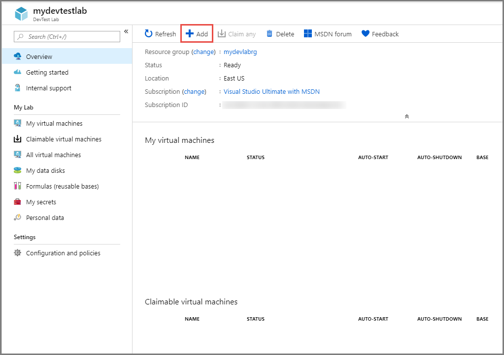

# Create your first VM in a lab in Azure DevTest Labs

When you initially access DevTest Labs and want to create your first VM, you will likely do so using a pre-loaded [base marketplace image](devtest-lab-configure-marketplace-images.md). Later on, you'll also be able to choose from a [custom image and a formula](devtest-lab-add-vm.md) when creating more VMs. 

This tutorial walks you through using the Azure portal to add your first VM to a lab in DevTest Labs.

## Steps to add your first VM to a lab in Azure DevTest Labs
1. Sign in to the [Azure portal](https://go.microsoft.com/fwlink/p/?LinkID=525040).
1. Select **All Services**, and then select **DevTest Labs** in the **DEVOPS** section. If you select * (star) next to **DevTest Labs** in the **DEVOPS** section. This action adds **DevTest Labs** to the left navigational menu so that you can access it easily the next time. Then, you can select **DevTest Labs** on the left navigational menu.

    
1. From the list of labs, select the lab in which you want to create the VM.  
2. On the lab's **Overview** page, select **+ Add**.  

    
1. On the **Choose a base** page, select a marketplace image for the VM.
1. On the **Basic Settings** tab of the **Virtual machine** page, do the following actions: 
    1. Enter a name for the VM in the **Virtual machine name** text box. The text box is pre-filled for you with a unique auto-generated name. The name corresponds to the user name within your email address followed by a unique 3-digit number. This feature saves you the time to think of a machine name and type it every time you create a machine. You can override this auto-filled field with a name of your choice if you wish to. To override the auto-filled name for the VM, enter a name in the **Virtual machine name** text box.
    2. Enter a **User Name** that is granted administrator privileges on the virtual machine. The **user name** for the machine is pre-filled with a unique auto-generated name. The name corresponds to the user name within your email address. This feature saves you the time to decide on a username every time you create a new machine. Again, you can override this auto-filled field with a username of your choice if you wish to. To override the auto-filled value for user name, enter a value in the **User Name** text box. This user is granted **administrator** privileges on the virtual machine.
    3. If you are creating first VM in the lab, enter a **password** for the user. To save this password as a default password in the Azure key vault associated with the lab, select **Save as default password**. The default password is saved in the key vault with the name: **VmPassword**. When you try to create subsequent VMs in the lab, **VmPassword** is automatically selected for the **password**. To override the value, clear the **Use a saved secret** check box, and enter a password. 

        You can also save secrets in the key vault first and then use it while creating a VM in the lab. For more information, see [Store secrets in a key vault](devtest-lab-store-secrets-in-key-vault.md). To use the password stored in the key vault, select **Use a saved secret**, and specify a key value that corresponds to your secret (password).
    4. In the **More options** section, select **Change size**. Select one of the predefined items that specify the processor cores, RAM size, and the hard drive size of the VM to create.
    5. Select **Add or Remove Artifacts**. Select and configure the artifacts that you want to add to the base image.
    **Note:** If you're new to DevTest Labs or configuring artifacts, refer to the [Add an existing artifact to a VM](./devtest-lab-add-vm.md#add-an-existing-artifact-to-a-vm) section, and then return here when finished.
2. Switch to the **Advanced Settings** tab at the top, and do the following actions:
    1. To change the virtual network that the VM is in, select **Change VNet**. 
    2. To change the subnet, select **Change subnet**. 
    3. Specify whether the IP address of the VM is **public, private, or shared**. 
    4. To automatically delete the VM, specify the **expiration date and time**. 
    5. To make the VM claimable by a lab user, select **Yes** for **Make this machine claimable** option. 
    6. Specify the number of the **instances of VM** that you want to make it available to your lab users. 
3. Select **Create** to add the specified VM to the lab.

   The lab page displays the status of the VM's creation - first as **Creating**, then as **Running** after the VM has been started.

## Next steps
* Once the VM has been created, you can connect to the VM by selecting **Connect** on the VM's page.
* Check out [Add a VM to a lab](devtest-lab-add-vm.md) for more complete info about adding subsequent VMs in your lab.
* Explore the [DevTest Labs Azure Resource Manager QuickStart template gallery](https://github.com/Azure/azure-devtestlab/tree/master/ARMTemplates).
