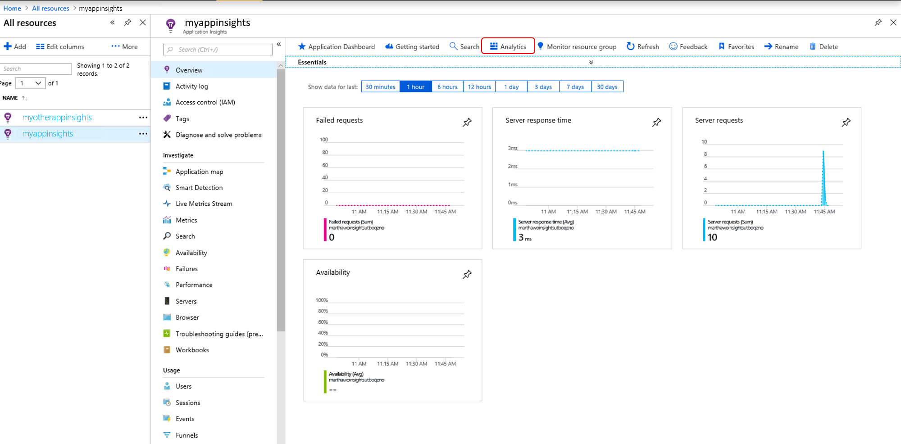
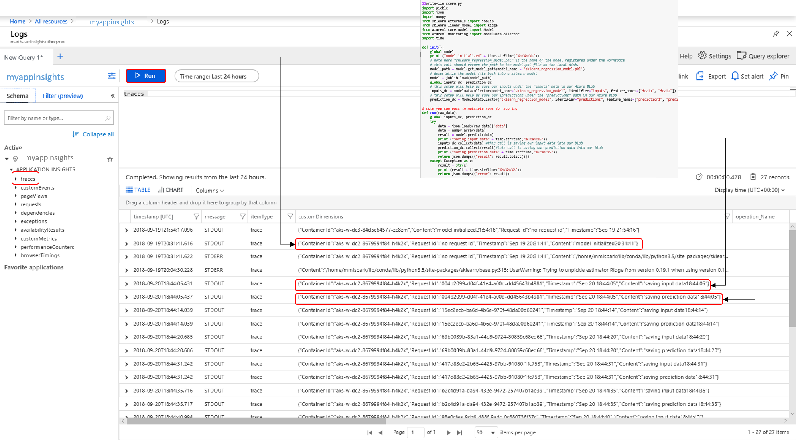

# Monitor your Azure Machine Learning models with Application Insights

In this article, you learn how to set up Azure Application Insights for your Azure Machine Learning service. Application Insights gives you the opportunity to monitor:
* Request rates, response times, and failure rates.
* Dependency rates, response times, and failure rates.
* Exceptions.

[Learn more about Application Insights](../../azure-monitor/app/app-insights-overview.md). 


## Prerequisites

* If you don’t have an Azure subscription, create a free account before you begin. Try the [free or paid version of Azure Machine Learning service](http://aka.ms/AMLFree) today.

* An Azure Machine Learning workspace, a local directory that contains your scripts, and the Azure Machine Learning SDK for Python installed. To learn how to get these prerequisites, see [How to configure a development environment](how-to-configure-environment.md).
* A trained machine learning model to be deployed to Azure Kubernetes Service (AKS) or Azure Container Instance (ACI). If you don't have one, see the [Train image classification model](tutorial-train-models-with-aml.md) tutorial.


## Enable and disable from the SDK

### Update a deployed service
1. Identify the service in your workspace. The value for `ws` is the name of your workspace.

    ```python
    from azureml.core.webservice import Webservice
    aks_service= Webservice(ws, "my-service-name")
    ```
2. Update your service and enable Application Insights. 

    ```python
    aks_service.update(enable_app_insights=True)
    ```

### Log custom traces in your service
If you want to log custom traces, follow the standard deployment process for AKS or ACI in the [How to deploy and where](how-to-deploy-and-where.md) document. Then use the following steps:

1. Update the scoring file by adding print statements.
    
    ```python
    print ("model initialized" + time.strftime("%H:%M:%S"))
    ```

2. Update the service configuration.
    
    ```python
    config = Webservice.deploy_configuration(enable_app_insights=True)
    ```

3. Build an image and deploy it on [AKS](how-to-deploy-to-aks.md) or [ACI](how-to-deploy-to-aci.md).  

### Disable tracking in Python

To disable Application Insights, use the following code:

```python 
## replace <service_name> with the name of the web service
<service_name>.update(enable_app_insights=False)
```
	
## Enable and disable in the portal

You can enable and disable Application Insights in the Azure portal.

1. In the [Azure portal](https://portal.azure.com), open your workspace.

1. On the **Deployments** tab, select the service where you want to enable Application Insights.

   [](./media/how-to-enable-app-insights/Deployments.PNG#lightbox)

3. Select **Edit**.

   [](./media/how-to-enable-app-insights/Edit.PNG#lightbox)

4. In **Advanced Settings**, select the **Enable AppInsights diagnostics** check box.

   [](./media/how-to-enable-app-insights/AdvancedSettings.png#lightbox)

1. Select **Update** at the bottom of the screen to apply the changes. 

### Disable
1. In the [Azure portal](https://portal.azure.com), open your workspace.
1. Select **Deployments**, select the service, and select **Edit**.

   [](./media/how-to-enable-app-insights/Edit.PNG#lightbox)

1. In **Advanced Settings**, clear the **Enable AppInsights diagnostics** check box. 

   [](./media/how-to-enable-app-insights/uncheck.png#lightbox)

1. Select **Update** at the bottom of the screen to apply the changes. 
 

## Evaluate data
Your service's data is stored in your Application Insights account, within the same resource group as your Azure Machine Learning service.
To view it:
1. Go to your Machine Learning service workspace in the [Azure portal](https://portal.azure.com) and click on Application Insights link.

    [](./media/how-to-enable-app-insights/AppInsightsLoc.png#lightbox)

1. Select the **Overview** tab to see a basic set of metrics for your service.

   [](./media/how-to-enable-app-insights/overview.png#lightbox)

3. To look into your custom traces, select **Analytics**.
4. In the schema section, select **Traces**. Then select **Run** to run your query. Data should appear in a table format and should map to your custom calls in your scoring file. 

   [](./media/how-to-enable-app-insights/logs.png#lightbox)

To learn more about how to use Application Insights, see [What is Application Insights?](../../azure-monitor/app/app-insights-overview.md).
    

## Example notebook

The [how-to-use-azureml/deployment/enable-app-insights-in-production-service/enable-app-insights-in-production-service.ipynb](https://github.com/Azure/MachineLearningNotebooks/blob/master/how-to-use-azureml/deployment/enable-app-insights-in-production-service/enable-app-insights-in-production-service.ipynb) notebook demonstrates concepts in this article. 
 
[!INCLUDE [aml-clone-in-azure-notebook](../../../includes/aml-clone-for-examples.md)]

## Next steps
You can also collect data on your models in production. Read the article  [Collect data for models in production](how-to-enable-data-collection.md). 


## Other references
* [Azure Monitor for containers](https://docs.microsoft.com/azure/monitoring/monitoring-container-insights-overview?toc=%2fazure%2fmonitoring%2ftoc.json)
