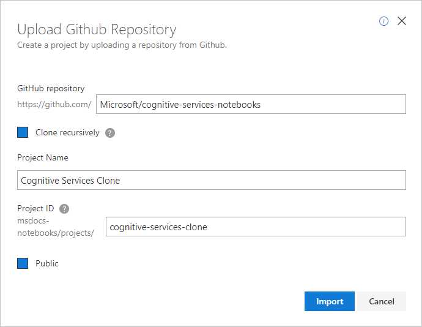
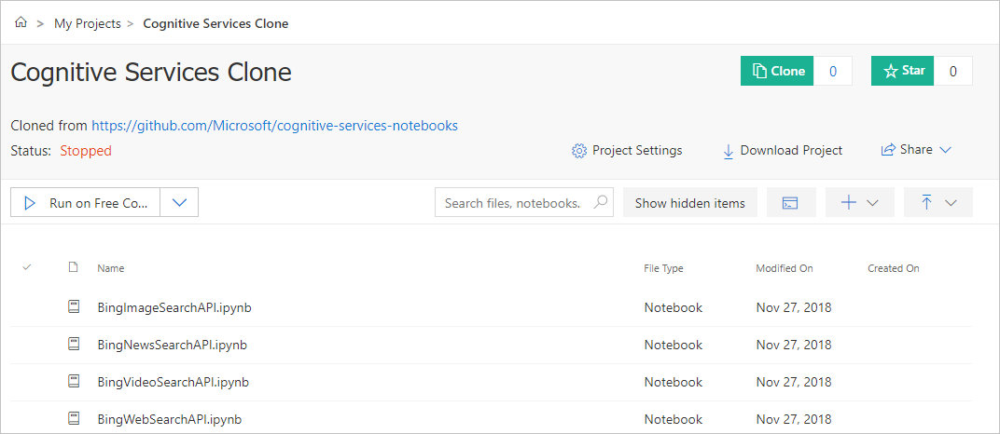
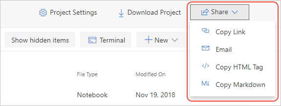
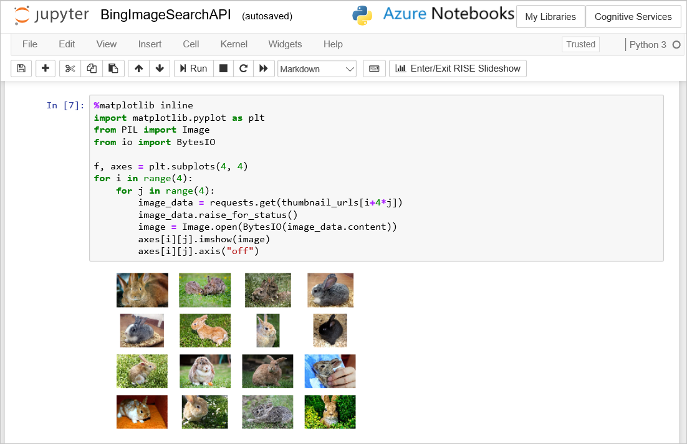
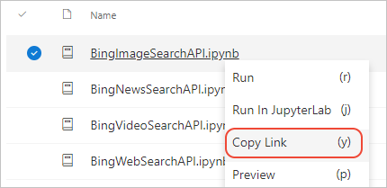

# Quickstart: Clone a notebook

Many data scientists and developers store their notebooks in [GitHub repositories](https://github.com), a free service that provides storage and version control for many different project types. GitHub is often used as a means of collaborating on Jupyter notebooks that are run locally. In such cases, every collaborator maintains a local copy of the repository and runs the notebooks from that copy.

Cloning creates a copy of a GitHub notebook in your Azure Notebooks account instead. This clone is independent from its original repository; changes are stored in your Azure Notebooks account only and don't affect the original. Because your clone is in the cloud, you can share the project with other collaborators who need not make any local copies or even have Jupyter installed on their own computers. You might also clone a notebook simply as a starting point for a project of your own or to obtain data files.

## Clone Azure Cognitive Services notebooks

1. Go to [Azure Notebooks](https://notebooks.azure.com) and sign in. (For details, see [Quickstart - Sign in to Azure Notebooks](quickstart-sign-in-azure-notebooks.md)).

1. From your public profile page, select **My Projects** at the top of the page:

    

1. On the **My Projects** page, select the up arrow button (keyboard shortcut: U; the button appears as **Upload GitHub Repo** when the browser window is wide enough):

    

1. In the **Upload GitHub Repository** that appears, enter or set the following details, then select **Import**:

    - **GitHub repository**: Microsoft/cognitive-services-notebooks (this name clones the Jupyter notebooks for Azure Cognitive Services at [https://github.com/Microsoft/cognitive-services-notebooks](https://github.com/Microsoft/cognitive-services-notebooks)).
    - **Clone recursively**: (cleared)
    - **Project name**: Cognitive Services Clone
    - **Project ID**: cognitive-services-clone
    - **Public**: (cleared)

    

1. Be patient while the process completes; cloning a repository can take a few minutes.

1. Once cloning is finished, Azure Notebooks takes you to the new project where you can see the copies of all the files.

    

## Share a notebook

1. To share your copy of the cloned project, use the **Share** control or obtain a link, obtain HTML or Markdown code that contains the link, or create an email message with the link:

    

1. Because you cleared the **Public** option when cloning the project, the clone is private. To make your copy public, select **Project Settings**, set the **Public project** option in the popup, and then select **Save**.

1. Select a notebook in the project to run it. Each notebook in the Azure Cognitive Services repository, for example, is its own self-contained Quickstart. The image below shows the result of using the BingImageSearchAPI notebook, after adding a Cognitive Services API subscription key and changing the search term "puppies" to "bunnies":

    

1. When you're done running the notebook, select **File** > **Close and halt** to close the notebook and its browser window.

1. To share an individual notebook in the project, right-click the notebook and select **Copy link** (keyboard shortcut: y):

    

1. To edit files other than notebooks, right-click the file in the project and select **Edit file** (keyboard shortcut: i). The default action, **Run** (keyboard shortcut: r), only shows the file contents and doesn't allow editing.

## Next steps

> [!div class="nextstepaction"]
> [Tutorial: create an run a Jupyter notebook to do linear regression](tutorial-create-run-jupyter-notebook.md)
