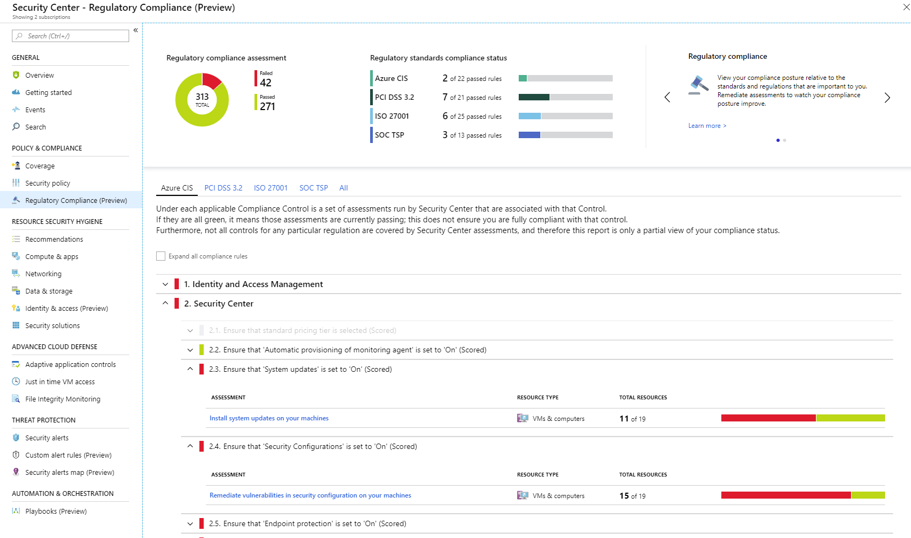
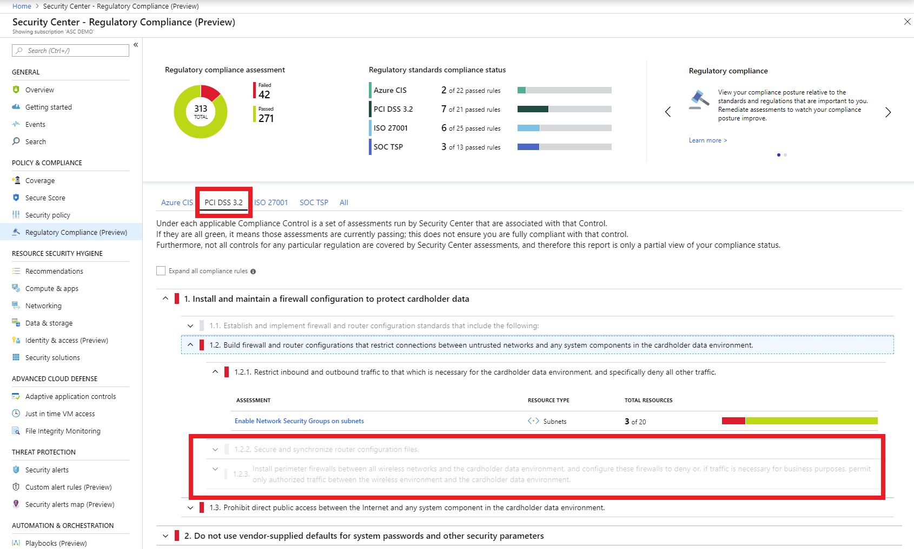
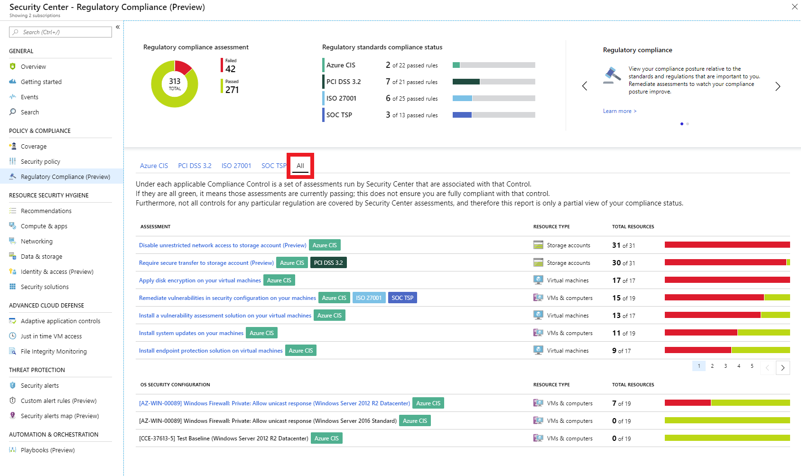
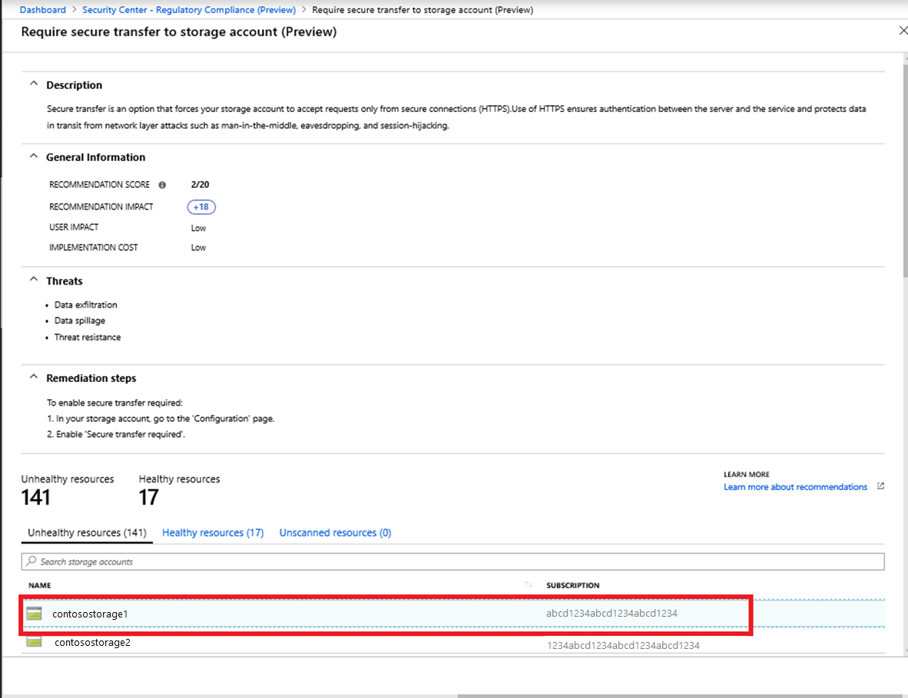
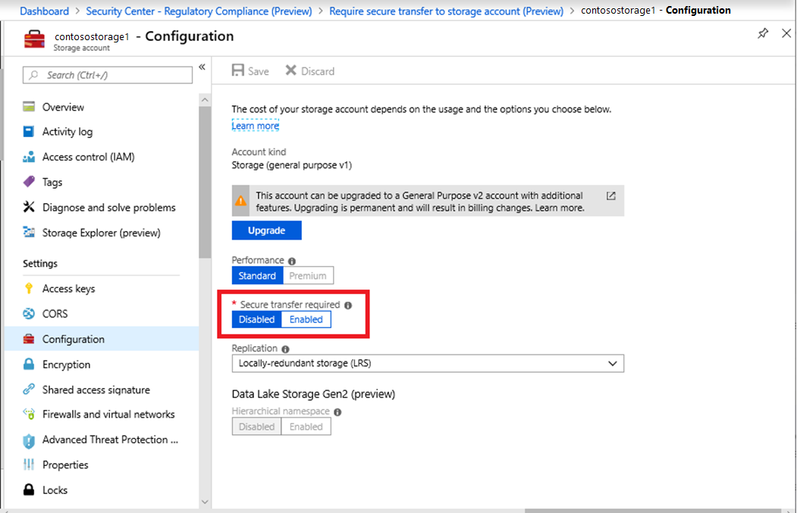

# Tutorial: Improve your regulatory compliance
---

Azure Security Center helps streamline the process for meeting regulatory compliance requirements, using the Regulatory compliance dashboard. In the dashboard, Security Center provides insights into your compliance posture based on continuous assessments of your Azure environment. The assessments performed by Security Center analyze risk factors in your hybrid cloud environment in accordance with security best practices. These assessments are mapped to compliance controls from a supported set of standards. In the Regulatory
compliance dashboard, you have a clear view of the status of all these assessments within your environment in the context of a particular standard or regulation. As you act on the recommendations and reduce risk factors in your environment, you can see your compliance posture improve.

In this tutorial, you will learn how to:

-   Evaluate your regulatory compliance using the Regulatory compliance dashboard

-   Improve your compliance posture by taking action on recommendations

If you don’t have an Azure subscription, create a [free account](https://azure.microsoft.com/free/) before you begin.

## Prerequisites

To step through the features covered in this tutorial, you must have Security Center’s Standard pricing tier. You can try Security Center Standard at no cost.
To learn more, see the [pricing page](https://azure.microsoft.com/pricing/details/security-center/). The quickstart [Onboard your Azure subscription to Security Center Standard](https://docs.microsoft.com/en-us/azure/security-center/security-center-get-started)
walks you through how to upgrade to Standard.

##  Assess your regulatory compliance

Security Center continuously assesses the configuration of your resources to identify security issues and vulnerabilities. These assessments are presented as recommendations, which focus on improving your security hygiene. In the Regulatory compliance dashboard, you can view a set of compliance standards with all their requirements, where supported requirements are mapped to applicable security assessments. This enables you to  view your compliance posture with respect to the standard, based on the status of these assessments.

The regulatory compliance dashboard view can help focus your attention on the gaps in compliance with a standard or regulation that is important to you. This focused view also enables you to continuously monitor your compliance score over time within dynamic cloud and hybrid environments.

>[!NOTE]
> Currently supported regulatory standards are: Azure CIS, PCI DSS 3.2, ISO 27001, and SOC TSP. Additional standards will be reflected in the dashboard as it develops.

1.  In the Security Center main menu, under **POLICY & COMPLIANCE** select **Regulatory compliance dashboard**.  
At the top of the screen, you see a dashboard with an overview of your compliance status with the set of supported compliance regulations. You can see your overall compliance score, and the number of passing vs. failing assessments associated with each standard.

    

2.  Select a tab for a compliance standard that is relevant to you. You will see the list of all controls for that standard. For the applicable controls, you can view the details of passing and failing assessments associated with that control. Some controls are grayed out. These controls do not have any Security Center assessments associated with them. You need to analyze the requirements for these and assess them in your environment on your own. Some of these may be process-related and not technical.

    

3.  Select the **All** tab to see a view of all relevant Security Center recommendations and their associated standards. This view can be useful for identifying all the different standards impacted by a particular recommendation.   
You can potentially use this view to prioritize recommendations you need to resolve. For example, if you see that the recommendation **Enable MFA for accounts with owner permissions on your subscription** is failing on multiple resources and is associated with multiple standards, then resolving this recommendation will have a high impact on your overall compliance score.

    

## Improve your compliance posture

Given the information in the Regulatory compliance dashboard, you can improve your compliance posture by resolving recommendations directly within the dashboard.

1.  Click through any of the failing assessments that appear in the dashboard to view the details for that recommendation. Each recommendation includes a set of remediation steps that should be followed to resolve the issue.

2.  You can select a particular resource to view more details and resolve the recommendation for that resource.  For example, in the **Azure CIS standard** tab, you can click on the recommendation **Require secure transfer to storage account**.

    

3. As you click through to the recommendation information and select an unhealthy resource, it leads you directly to the experience of enabling **secure storage transfer** within the Azure portal. For more information about how to apply recommendations, see [Implementing security recommendations in Azure Security Center](security-center-recommendations.md).

    

4.  After you take action to resolve recommendations, you will see the impact in the compliance dashboard report because your compliance score improves.

    > [!NOTE]
    > Assessments are run approximately every 12 hours, so you will see the impact on your compliance data only after the assessments run.

## Next steps

In this tutorial, you learned about using Security Center’s Regulatory compliance dashboard to:

-   View and monitor your compliance posture, relative to the standards and regulations that are important to you.

-   Improve your compliance status by resolving relevant recommendations and watching the compliance score improve.

The Regulatory compliance dashboard can greatly simplify the compliance process, and significantly cut the time required for gathering compliance evidence for your Azure and hybrid environment.

To learn more about Security Center, see:

-   [Security health monitoring in Azure Security Center](security-center-monitoring.md)--Learn how to monitor the health of your Azure resources.

-   [Managing security recommendations in Azure Security Center](security-center-recommendations.md)--Learn how to use recommendations in Azure Security Center to help protect your Azure resources.

-   [Improve your secure score in Azure Security Center](security-center-secure-score.md)--Learn how to prioritize vulnerabilities and security recommendations to most improve your security posture.

-   [Azure Security Center FAQ](security-center-faq.md)--Find frequently asked questions about using the service.
