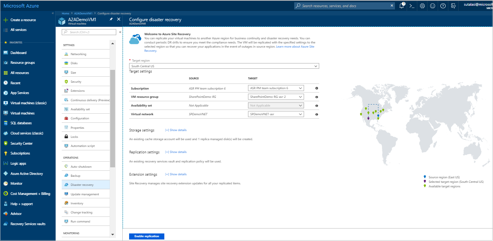
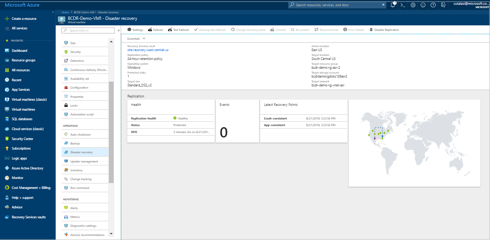
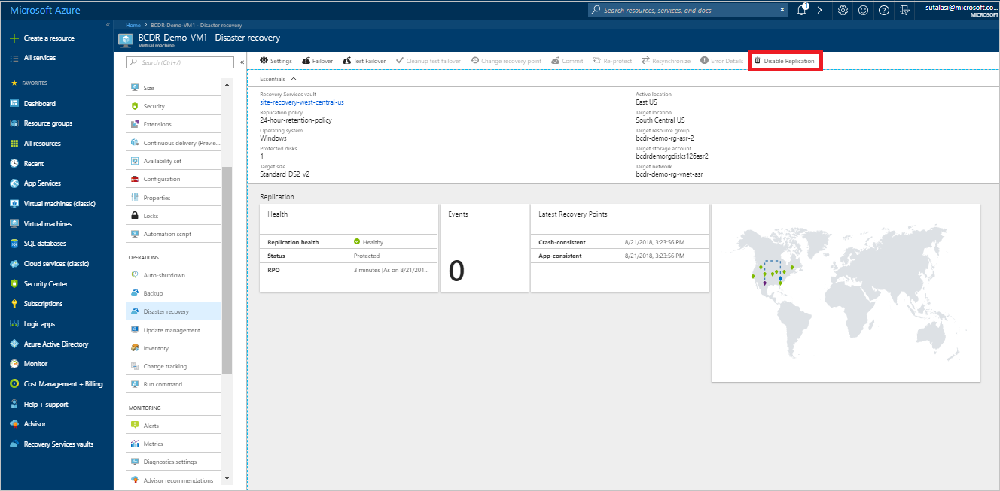

# Set up disaster recovery to a secondary Azure region for an Azure VM        

The [Azure Site Recovery](site-recovery-overview.md) service contributes to your business continuity and disaster recovery (BCDR) strategy by keeping your business apps up and running, during planned and unplanned outages. Site Recovery manages and orchestrates disaster recovery of on-premises machines and Azure virtual machines (VMs), including replication, failover, and recovery.

This quickstart describes how to replicate an Azure VM to a different Azure region.

If you don't have an Azure subscription, create a [free account](https://azure.microsoft.com/free/?WT.mc_id=A261C142F) before you begin.

> [!NOTE]
> This article is intended to guide a new user through the Azure Site Recovery experience with the default options and minimum customization. If you want to know more about the various settings that can be customized, refer to [the tutorial for enabling replication for Azure VMs](azure-to-azure-tutorial-enable-replication.md)

## Log in to Azure

Log in to the Azure portal at http://portal.azure.com.

## Enable replication for the Azure VM

1. In the Azure portal, click **Virtual machines**, and select the VM you want to replicate.
2. In **Operations**, click **Disaster recovery**.
3. In **Configure disaster recovery** > **Target region** select the target region to which you'll replicate.
4. For this Quickstart, accept the other default settings.
5. Click **Enable replication**. This starts a job to enable replication for the VM.

    

## Verify settings

After the replication job has finished, you can check the replication status, modify replication settings, and test the deployment.

1. In the VM menu, click **Disaster recovery**.
2. You can verify replication health, the recovery points that have been created, and source, target regions on the map.

   

## Clean up resources

The VM in the primary region stops replicating when you disable replication for it:

- The source replication settings are cleaned up automatically. Please note that the Site Recovery extension that is installed as part of the replication isn't removed and needs to be removed manually. 
- Site Recovery billing for the VM also stops.

Stop replication as follows

1. Select the VM.
2. In **Disaster recovery**, click **Disable Replication**.

   

## Next steps

In this quickstart, you replicated a single VM to a secondary region. You can now explore more options and try replicating a set of Azure VMs using a recovery plan.

> [!div class="nextstepaction"]
> [Configure disaster recovery for Azure VMs](azure-to-azure-tutorial-enable-replication.md)
