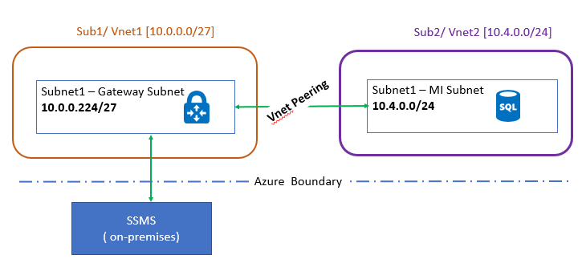
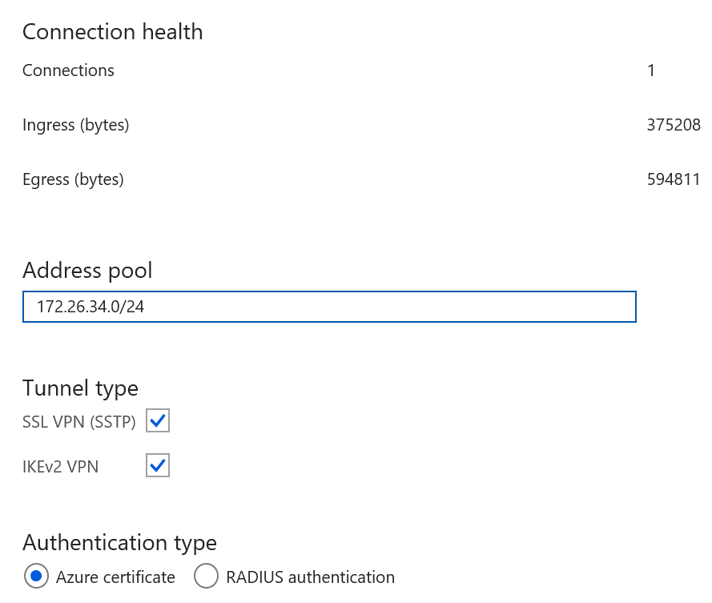

# Connect your application to Azure SQL Database Managed Instance

Today you have multiple choices when deciding how and where you host your application. 
 
You may choose to host application in the cloud either by using Azure App Service or some of Azure's virtual network (VNet) integrated options like Azure App Service Environment, Virtual Machine, Virtual Machine Scale Set. You could also take hybrid cloud approach and keep your applications on-premises. 
 
Whatever choice you made, you can connect it to a Managed Instance.  

  
## Connect an application inside the same VNet 

This scenario is the simplest. Virtual machines inside the VNet can connect to each other directly even if they are inside different subnets. That means that all you need to connect application inside an Azure Application Environment or Virtual Machine is to set the connection string appropriately.  
 
## Connect an application inside a different VNet 

This scenario is a bit more complex because Managed Instance has private IP address in its own VNet. To connect, an application needs access to the VNet where Managed Instance is deployed. So, first you need to make a connection between the application and the Managed Instance VNet. The VNets don’t have to be in the same subscription in order for this scenario to work. 
 
There are two options for connecting VNets: 
- [Azure Virtual Network peering](../virtual-network/virtual-network-peering-overview.md) 
- VNet-to-VNet VPN gateway ([Azure portal](../vpn-gateway/vpn-gateway-howto-vnet-vnet-resource-manager-portal.md), [PowerShell](../vpn-gateway/vpn-gateway-vnet-vnet-rm-ps.md), [Azure CLI](../vpn-gateway/vpn-gateway-howto-vnet-vnet-cli.md)) 
 
The peering option is the preferable one because peering uses the Microsoft backbone network so, from the connectivity perspective, there is no noticeable difference in latency between virtual machines in peered VNet and in the same VNet. VNet peering is limited to the networks in the same region.  
 
> [!IMPORTANT]
> VNet peering scenario for Managed Instance is limited to the networks in the same region due to [constraints of the Global Virtual Network peering](../virtual-network/virtual-network-manage-peering.md#requirements-and-constraints). 

## Connect an on-premises application 

Managed Instance can only be accessed through a private IP address. In order to access it from on-premises, you need to make a Site-to-Site connection between the application and the Managed Instance VNet. 
 
There are two options how to connect on-premises to Azure VNet: 
- Site-to-Site VPN connection ([Azure portal](../vpn-gateway/vpn-gateway-howto-site-to-site-resource-manager-portal.md), [PowerShell](../vpn-gateway/vpn-gateway-create-site-to-site-rm-powershell.md), [Azure CLI](../vpn-gateway/vpn-gateway-howto-site-to-site-resource-manager-cli.md)) 
- [ExpressRoute](../expressroute/expressroute-introduction.md) connection  
 
If you've established on-premises to Azure connection successfully and you can't establish connection to Managed Instance, check if your firewall has open outbound connection on SQL port 1433 as well as 11000-12000 range of ports for redirection. 

## Connect an application on the developers box

Managed Instance can be accessed only through a private IP address so in order to access it from your developer box, you first need to make a connection between your developer box and the Managed Instance VNet. To do so, configure a Point-to-Site connection to a VNet using native Azure certificate authentication. For more information, see  [Configure a point-to-site connection to connect to an Azure SQL Database Managed Instance from on-premises computer](sql-database-managed-instance-configure-p2s.md).

## Connect from on-premises with VNet peering
Another scenario implemented by customers is where VPN gateway is installed in a separate virtual network and a subscription from the one hosting Managed Instance. The two virtual networks are then peered. The following sample architecture diagram shows how this can be implemented.



Once you have the basic infrastructure set up, you need to modify some setting so that the VPN Gateway can see the IP addresses in the virtual network that hosts the Managed Instance. To do so, make the following very specific changes under the **Peering settings**.
1.	In the VNet that hosts the VPN gateway, go to **Peerings**, then to the Managed Instance peered VNet connection, and then click **Allow Gateway Transit**.
2.	In the VNet that hosts the Managed Instance, go to **Peerings**, then to the VPN Gateway peered VNet connection, and then click **Use remote gateways**.

## Connect an Azure App Service hosted application 

Managed Instance can be accessed only through a private IP address so in order to access it from Azure App Service you first need to make a connection between the application and the Managed Instance VNet. See [Integrate your app with an Azure Virtual Network](../app-service/web-sites-integrate-with-vnet.md).  
 
For troubleshooting, see [Troubleshooting VNets and Applications](../app-service/web-sites-integrate-with-vnet.md#troubleshooting). If a connection cannot be established, try [synching the networking configuration](sql-database-managed-instance-sync-network-configuration.md). 
 
A special case of connecting Azure App Service to Managed Instance is when you integrated Azure App Service to a network peered to Managed Instance VNet. That case requires the following configuration to be set up: 

- Managed Instance VNet must NOT have gateway  
- Managed Instance VNet must have Use remote gateways option set 
- Peered VNet must have Allow gateway transit option set 
 
This scenario is illustrated in the following diagram:


>[!NOTE]
>The VNet Integration feature does not integrate an app with a VNet that has an ExpressRoute Gateway. Even if the ExpressRoute Gateway is configured in coexistence mode the VNet Integration does not work. If you need to access resources through an ExpressRoute connection, then you can use an App Service Environment, which runs in your VNet.
>
 
## Troubleshooting connectivity issues

For troubleshooting connectivity issues, review the following:
- If you are unable to connect to Managed Instance from an Azure virtual machine within the same VNet but different subnet, check if you have a Network Security Group set on VM subnet that might be blocking access.Additionally note that you need to open outbound connection on SQL port 1433 as well as ports in range 11000-12000 since those are needed for connecting via redirection inside the Azure boundary. 
- Ensure that BGP Propagation is set to **Enabled** for the route table associated with the VNet.
- If using P2S VPN, check the configuration in the Azure portal to see if you see **Ingress/Egress** numbers. Non-zero numbers indicate that Azure is routing traffic to/from on-premises.

   

- Check that the client machine (that is running the VPN client) has route entries for all the VNets that you need to access. The routes are stored in 
`%AppData%\ Roaming\Microsoft\Network\Connections\Cm\<GUID>\routes.txt`.


   

   As shown in this image, there are two entries for each VNet involved and a third entry for the VPN endpoint that is configured in the Portal.

   Another way to check the routes is via the following command. The output shows the routes to the various subnets: 

   ```cmd
   C:\ >route print -4
   ===========================================================================
   Interface List
   14...54 ee 75 67 6b 39 ......Intel(R) Ethernet Connection (3) I218-LM
   57...........................rndatavnet
   18...94 65 9c 7d e5 ce ......Intel(R) Dual Band Wireless-AC 7265
   1...........................Software Loopback Interface 1
   Adapter===========================================================================
   
   IPv4 Route Table
   ===========================================================================
   Active Routes:
   Network Destination        Netmask          Gateway       Interface  Metric
          0.0.0.0          0.0.0.0       10.83.72.1     10.83.74.112     35
         10.0.0.0    255.255.255.0         On-link       172.26.34.2     43
     
         10.4.0.0    255.255.255.0         On-link       172.26.34.2     43
   ===========================================================================
   Persistent Routes:
   None
   ```

- If using VNet peering, ensure that you have followed the instructions for setting [Allow Gateway Transit and Use Remote Gateways](#connect-from-on-premises-with-vnet-peering). 

## Required versions of drivers and tools

The following minimal versions of the tools and drivers are recommended if you want to connect to Managed Instance:

| Driver/tool | Version |
| --- | --- |
|.NET Framework | 4.6.1 (or .NET Core) | 
|ODBC driver	| v17 |
|PHP driver	| 5.2.0 |
|JDBC driver	| 6.4.0 |
|Node.js driver	| 2.1.1 |
|OLEDB driver	| 18.0.2.0 |
|SSMS	| 17.8.1 or [higher](https://docs.microsoft.com/sql/ssms/download-sql-server-management-studio-ssms?view=sql-server-2017) |

## Next steps

- For information about Managed Instance, see [What is a Managed Instance](sql-database-managed-instance.md).
- For a tutorial showing you how to create a new Managed Instance, see [Create a Managed Instance](sql-database-managed-instance-get-started.md).
