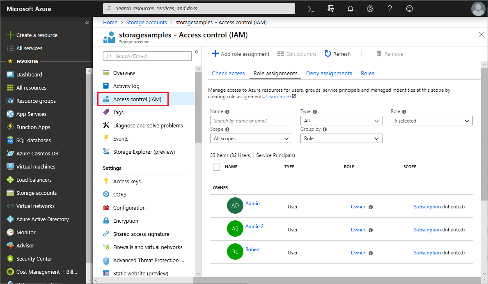
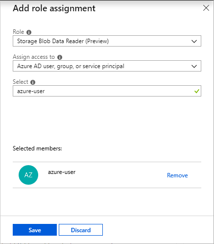
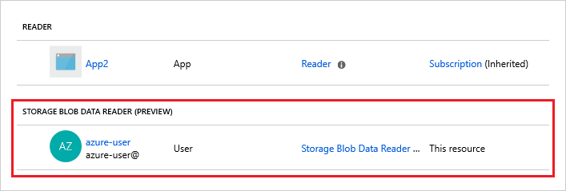
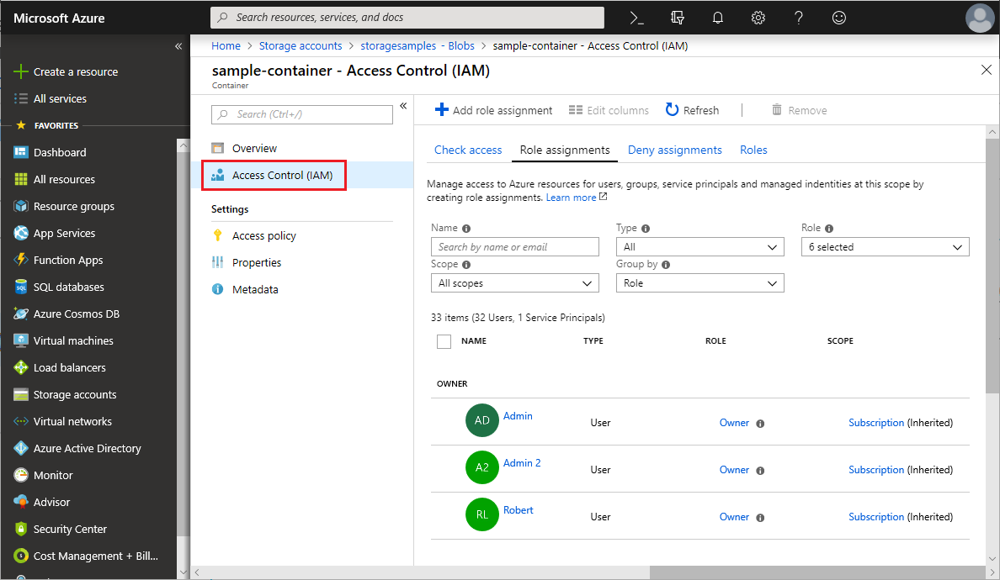

# Manage access rights to Azure Blob and Queue data with RBAC (Preview)

Azure Active Directory (Azure AD) authorizes access rights to secured resources through [role-based access control (RBAC)](https://docs.microsoft.com/azure/role-based-access-control/overview). Azure Storage defines a set of built-in RBAC roles that encompass common sets of permissions used to access containers or queues. When an RBAC role is assigned to an Azure AD identity, that identity is granted access to those resources, according to the specified scope. Access can be scoped to the level of the subscription, the resource group, the storage account, or an individual container or queue. You can assign access rights for Azure Storage resources using the Azure portal, Azure command-line tools, and Azure Management APIs. 

An Azure AD identity may be a user, group, or application service principal, or it may be a managed identity for Azure resources. A security principal can be a user, group, or application service principal. A [managed identity for Azure resources](../../active-directory/managed-identities-azure-resources/overview.md) is an automatically managed identity used to authenticate from applications running in Azure virtual machines, function apps, virtual machine scale sets, and others. For an overview of identity in Azure AD, see [Understand Azure identity solutions](https://docs.microsoft.com/azure/active-directory/understand-azure-identity-solutions).

[!INCLUDE [storage-auth-aad-note-include](../../../includes/storage-auth-aad-note-include.md)]

## RBAC roles for blobs and queues

Azure Storage supports both built-in and custom RBAC roles. Azure Storage offers these built-in RBAC roles for use with Azure AD:

- [Storage Blob Data Owner (Preview)](https://docs.microsoft.com/azure/role-based-access-control/built-in-roles#storage-blob-data-owner-preview): Use to set ownership and manage POSIX access control for Azure Data Lake Storage Gen2 (preview). For more information, see [Access control in Azure Data Lake Storage Gen2](../blobs/data-lake-storage-access-control.md).
- [Storage Blob Data Contributor (Preview)](https://docs.microsoft.com/azure/role-based-access-control/built-in-roles#storage-blob-data-contributor-preview): Use to grant read/write/delete permissions to Blob storage resources.
- [Storage Blob Data Reader (Preview)](https://docs.microsoft.com/azure/role-based-access-control/built-in-roles#storage-blob-data-reader-preview): Use to grant read-only permissions to Blob storage resources.
- [Storage Queue Data Contributor (Preview)](https://docs.microsoft.com/azure/role-based-access-control/built-in-roles#storage-queue-data-contributor-preview): Use to grant read/write/delete permissions to Azure queues.
- [Storage Queue Data Reader (Preview)](https://docs.microsoft.com/azure/role-based-access-control/built-in-roles#storage-queue-data-reader-preview): Use to grant read-only permissions to Azure queues.

For more information about how built-in roles are defined for Azure Storage, see [Understand role definitions](https://docs.microsoft.com/azure/role-based-access-control/role-definitions#management-and-data-operations-preview).

You can also define custom roles for use with containers and queues. For more information, see [Create custom roles for Azure Role-Based Access Control](https://docs.microsoft.com/azure/role-based-access-control/custom-roles). 

[!INCLUDE [storage-auth-aad-note-include](../../../includes/storage-auth-aad-note-include.md)]

## Assign a role to a security principal

Assign an RBAC role to an Azure identity to grant permissions to containers or queues in your storage account. You can scope the role assignment to the storage account, or to a specific container or queue. The following table summarizes the access rights granted by the built-in roles, depending on scope:

|Scope|Blob Data Owner|Blob Data Contributor|Blob Data Reader|Queue Data Contributor|Queue Data Reader|
|---|---|---|---|---|---|
|Subscription level|Read/write access and POSIX access control management to all containers and blobs in the subscription|Read/write access to all containers and blobs in the subscription| Read access to all containers and blobs in the subscription|Read/write access to all queues in the subscription|Read access to all queues in the subscription|
|Resource group level|Read/write access and POSIX access control management to all containers and blobs in the resource group|Read/write access to all containers and blobs in the resource group|Read access to all containers and blobs in the resource group|Read/write access to all queues in the resource group|Read access to all queues in the resource group|
|Storage account level|Read/write access and POSIX access control management to all containers and blobs in the storage account|Read/write access to all containers and blobs in the storage account|Read access to all containers and blobs in the storage account|Read/write access to all queues in the storage account|Read access to all queues in the storage account|
|Container/queue level|Read/write access and POSIX access control management to the specified container and its blobs.|Read/write access to the specified container and its blobs|Read access to the specified container and its blobs|Read/write access to the specified queue|Read access to the specified queue|

> [!NOTE]
> As an owner of your Azure Storage account, you are not automatically assigned permissions to access data. You must explicitly assign yourself an RBAC role for Azure Storage. You can assign it at the level of your subscription, resource group, storage account, or a container or queue.

For details on the permissions required to call Azure Storage operations, see [Permissions for calling REST operations](https://docs.microsoft.com/rest/api/storageservices/authenticate-with-azure-active-directory#permissions-for-calling-rest-operations).

The following sections show how to assign a role scoped to the storage account or scoped to an individual container.

### Assign a role scoped to the storage account in the Azure portal

To assign a built-in role granting access to all containers or queues in the storage account in the Azure portal:

1. In the [Azure portal](https://portal.azure.com), navigate to your storage account.
1. Select your storage account, then select **Access control (IAM)** to display access control settings for the account. Select the **Role assignments** tab to see the list of role assignments.

    

1. Click the **Add role assignment** button to add a new role.
1. In the **Add role assignment** window, select the role to assign to an Azure AD identity. Then search to locate the identity to whom you want to assign that role. For example, the following image shows the **Storage Blob Data Reader (Preview)** role assigned to a user.

    

1. Click **Save**. The identity to whom you assigned the role appears listed under that role. For example, the following image shows that the user added now has read permissions to all blob data in the storage account.

    

### Assign a role scoped to a container or queue in the Azure portal

> [!IMPORTANT]
> You cannot do this if you are using an account with the hierarchical namespace enabled, yet.

The steps for assigning a built-in role scoped to a container or to a queue are similar. The procedure shown here assigns a role scoped to a container, but you can follow the same steps to assign a role scoped to a queue: 

1. In the [Azure portal](https://portal.azure.com), navigate to your storage account and display the **Overview** for the account.
1. Under Services, select **Blobs**. 
1. Locate the container for which you want to assign a role, and display the container's settings. 
1. Select **Access control (IAM)** to display access control settings for the container. Select the **Role assignments** tab to see the list of role assignments.

    
1. Click the **Add role assignment** button to add a new role.
1. In the **Add role assignment** window, select the role that you want to assign to an Azure AD identity. Then search to locate the identity to which you want to assign that role.
1. Click **Save**. The identity to whom you assigned the role appears listed under that role. For example, the following image shows that the user added now has read permissions to data in the container named *sample-container*.

    

## Next steps

- To learn more about RBAC, see [What is role-based access control (RBAC)?](../../role-based-access-control/overview.md).
- To learn how to assign and manage RBAC role assignments with Azure PowerShell, Azure CLI, or the REST API, see these articles:
    - [Manage role-based access control (RBAC) with Azure PowerShell](../../role-based-access-control/role-assignments-powershell.md)
    - [Manage role-based access control (RBAC) with Azure CLI](../../role-based-access-control/role-assignments-cli.md)
    - [Manage role-based access control (RBAC) with the REST API](../../role-based-access-control/role-assignments-rest.md)
- To learn how to authorize access to containers and queues from within your storage applications, see [Use Azure AD with Azure Storage applications](storage-auth-aad-app.md).
- For additional information about Azure AD integration for Azure containers and queues, see the Azure Storage team blog post, [Announcing the Preview of Azure AD Authentication for Azure Storage](https://azure.microsoft.com/blog/announcing-the-preview-of-aad-authentication-for-storage/).
