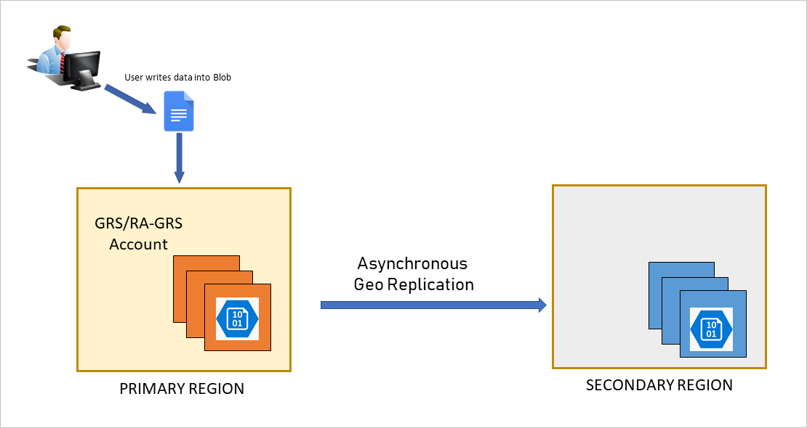
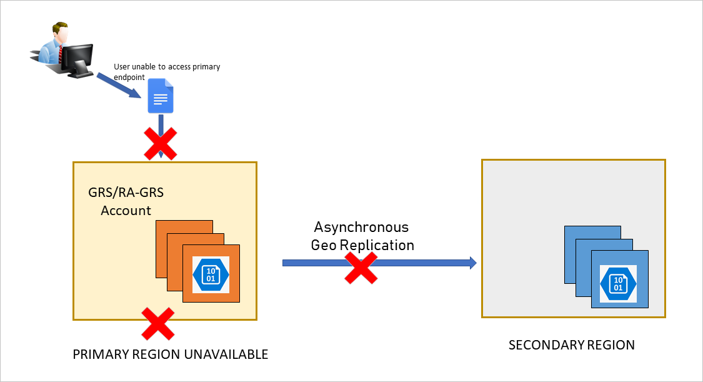
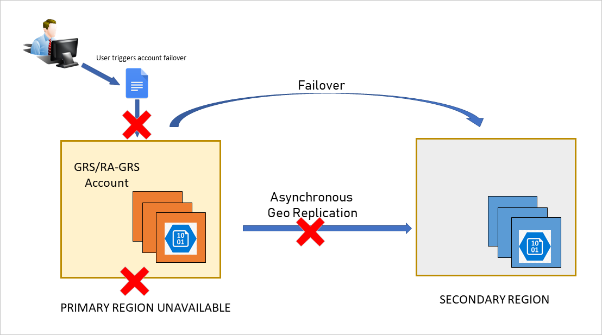

# Disaster recovery and storage account failover (preview) in Azure Storage

Microsoft strives to ensure that Azure services are always available. However, unplanned service outages may occur. If your application requires resiliency, Microsoft recommends using geo-redundant storage, so that your data is replicated in a second region. Additionally, customers should have a disaster recovery plan in place for handling a regional service outage. An important part of a disaster recovery plan is preparing to fail over to the secondary endpoint in the event that the primary endpoint becomes unavailable. 

Azure Storage supports account failover (preview) for geo-redundant storage accounts. With account failover, you can initiate the failover process for your storage account if the primary endpoint becomes unavailable. The failover updates the secondary endpoint to become the primary endpoint for your storage account. Once the failover is complete, clients can begin writing to the new primary endpoint.

This article describes the concepts and process involved with an account failover and discusses how to prepare your storage account for recovery with the least amount of customer impact. To learn how to initiate an account failover in the Azure portal or PowerShell, see [Initiate an account failover (preview)](storage-initiate-account-failover.md).

## Choose the right redundancy option

All storage accounts are replicated for redundancy. Which redundancy option you choose for your account depends on the degree of resiliency you need. For  protection against regional outages, choose geo-redundant storage, with or without the option of read access from the secondary region:  

**Geo-redundant storage (GRS)** replicates your data asynchronously in two geographic regions that are at least hundreds of miles apart. If the primary region suffers an outage, then the secondary region serves as a redundant source for your data. You can initiate a failover to transform the secondary endpoint into the primary endpoint.

**Read-access geo-redundant storage (RA-GRS)** provides geo-redundant storage with the additional benefit of read access to the secondary endpoint. If an outage occurs in the primary endpoint, applications configured for RA-GRS and designed for high availability can continue to read from the secondary endpoint. Microsoft recommends RA-GRS for maximum resiliency for your applications.

Other Azure Storage redundancy options include zone-redundant storage (ZRS), which replicates your data across availability zones in a single region, and locally redundant storage (LRS), which replicates your data in a single data center in a single region. If your storage account is configured for ZRS or LRS, you can convert that account to use GRS or RA-GRS. Configuring your account for geo-redundant storage incurs additional costs. For more information, see [Azure Storage replication](storage-redundancy.md).

> [!WARNING]
> Geo-redundant storage carries a risk of data loss. Data is replicated to the secondary region asynchronously, meaning there is a delay between when data  written to the primary region is written to the secondary region. In the event of an outage, write operations to the primary endpoint that have not yet been replicated to the secondary endpoint will be lost. 

## Design for high availability

It's important to design your application for high availability from the start. Refer to these Azure resources for guidance in designing your application and planning for disaster recovery:

* [Designing resilient applications for Azure](https://docs.microsoft.com/azure/architecture/resiliency/): An overview of the key concepts for architecting highly available applications in Azure.
* [Availability checklist](https://docs.microsoft.com/azure/architecture/checklist/availability): A checklist for verifying that your application implements the best design practices for high availability.
* [Designing highly available applications using RA-GRS](storage-designing-ha-apps-with-ragrs.md): Design guidance for building applications to take advantage of RA-GRS.
* [Tutorial: Build a highly available application with Blob storage](../blobs/storage-create-geo-redundant-storage.md): A tutorial that shows how to build a highly available application that automatically switches between endpoints as failures and recoveries are simulated. 

Additionally, keep in mind these best practices for maintaining high availability for your Azure Storage data:

* **Disks:** Use [Azure Backup](https://azure.microsoft.com/services/backup/) to back up the VM disks used by your Azure virtual machines. Also consider using [Azure Site Recovery](https://azure.microsoft.com/services/site-recovery/) to protect your VMs in the event of a regional disaster.
* **Block blobs:** Turn on [soft delete](../blobs/storage-blob-soft-delete.md) to protect against object-level deletions and overwrites, or copy block blobs to another storage account in a different region using [AzCopy](storage-use-azcopy.md), [Azure PowerShell](storage-powershell-guide-full.md), or the [Azure Data Movement library](https://azure.microsoft.com/blog/introducing-azure-storage-data-movement-library-preview-2/).
* **Files:** Use [AzCopy](storage-use-azcopy.md) or [Azure PowerShell](storage-powershell-guide-full.md) to copy your files to another storage account in a different region.
* **Tables:** use [AzCopy](storage-use-azcopy.md) to export table data to another storage account in a different region.

## Track outages

Customers may subscribe to the [Azure Service Health Dashboard](https://azure.microsoft.com/status/) to track the health and status of Azure Storage and other Azure services.

Microsoft also recommends that you design your application to prepare for the possibility of write failures. Your application should expose write failures in a way that alerts you to the possibility of an outage in the primary region.

## Understand the account failover process

Customer-managed account failover (preview) enables you to fail your entire storage account over to the secondary region if the primary becomes unavailable for any reason. When you force a failover to the secondary region, clients can begin writing data to the secondary endpoint after the failover is complete. The failover typically takes about an hour.

### How an account failover works

Under normal circumstances, a client writes data to an Azure Storage account in the primary region, and that data is replicated asynchronously to the secondary region. The following image shows the scenario when the primary region is available:



If the primary endpoint becomes unavailable for any reason, the client is no longer able to write to the storage account. The following image shows the scenario where the primary has become unavailable, but no recovery has happened yet:



The customer initiates the account failover to the secondary endpoint. The failover process updates the DNS entry provided by Azure Storage so that the secondary endpoint becomes the new primary endpoint for your storage account, as shown in the following image:



Write access is restored for GRS and RA-GRS accounts once the DNS entry has been updated and requests are being directed to the new primary endpoint. Existing storage service endpoints for blobs, tables, queues, and files remain the same after the failover.

> [!IMPORTANT]
> After the failover is complete, the storage account is configured to be locally redundant in the new primary endpoint. To resume replication to the new secondary, configure the account to use geo-redundant storage again (either RA-GRS or GRS).
>
> Keep in mind that converting an LRS account to RA-GRS or GRS incurs a cost. This cost applies to updating the storage account in the new primary region to use RA-GRS or GRS after a failover.  

### Anticipate data loss

> [!CAUTION]
> An account failover usually involves some data loss. It's important to understand the implications of initiating an account failover.  

Because data is written asynchronously from the primary region to the secondary region, there is always a delay before a write to the primary region is replicated to the secondary region. If the primary region becomes unavailable, the most recent writes may not yet have been replicated to the secondary region.

When you force a failover, all data in the primary region is lost as the secondary region becomes the new primary region and the storage account is configured to be locally redundant. All data already replicated to the secondary is maintained when the failover happens. However, any data written to the primary that has not also been replicated to the secondary is lost permanently. 

The **Last Sync Time** property indicates the most recent time that data from the primary region is guaranteed to have been written to the secondary region. All data written prior to the last sync time  is available on the secondary, while data written after the last sync time may not have been written to the secondary and may be lost. Use this property in the event of an outage to estimate the amount of data loss you may incur by initiating an account failover. 

As a best practice, design your application so that you can use the last sync time to evaluate expected data loss. For example, if you are logging all write operations, then you can compare the time of your last write operations to the last sync time to determine which writes have not been synced to the secondary.

### Use caution when failing back to the original primary

After you fail over from the primary to the secondary region, your storage account is configured to be locally redundant in the new primary region. You can configure the account for geo-redundancy again by updating it to use GRS or RA-GRS. When the account is configured for geo-redundancy again after a failover, the new primary region immediately begins replicating data to the new secondary region, which was the primary before the original failover. However, it may take a period of time before existing data in the primary is fully replicated to the new secondary.

After the storage account is reconfigured for geo-redundancy, it's possible to initiate another failover from the new primary back to the new secondary. In this case, the original primary region prior to the failover becomes the primary region again, and is configured to be locally redundant. All data in the post-failover primary region (the original secondary) is then lost. If most of the data in the storage account has not been replicated to the new secondary before you fail back, you could suffer a major data loss. 

To avoid a major data loss, check the value of the **Last Sync Time** property before failing back. Compare the last sync time to the last times that data was written to the new primary to evaluate expected data loss. 

## Initiate an account failover

You can initiate an account failover from the Azure portal, PowerShell, Azure CLI, or the Azure Storage resource provider API. For more information on how to initiate a failover, see [Initiate an account failover (preview)](storage-initiate-account-failover.md).

## About the preview

account failover is available in preview for all customers using GRS or RA-GRS with Azure Resource Manager deployments. General-purpose v1, General-purpose v2, and Blob storage account types are supported. account failover is currently available in these regions:

- US West 2
- US West Central

The preview is intended for non-production use only. Production service-level agreements (SLAs) are not currently available.

### Register for the preview

To register for the preview, run the following commands in PowerShell. Make sure to replace the placeholder in brackets with your own subscription ID:

```PowerShell
Connect-AzureRmAccount -SubscriptionId <subscription-id>
Register-AzureRmProviderFeature -FeatureName CustomerControlledFailover -ProviderNamespace Microsoft.Storage
```

It may take 1-2 days to receive approval for the preview. To verify that your registration has been approved, run the following command:

```PowerShell
Get-AzureRmProviderFeature -FeatureName CustomerControlledFailover -ProviderNamespace Microsoft.Storage
```

### Additional considerations 

Review the additional considerations described in this section to understand how your applications and services may be affected when you force a failover during the preview period.

#### Azure virtual machines

Azure virtual machines (VMs) do not fail over as part of an account failover. If the primary region becomes unavailable, and you fail over to the secondary region, then you will need to recreate any VMs after the failover. 

#### Azure unmanaged disks

As a best practice, Microsoft recommends converting unmanaged disks to managed disks. However, if you need to fail over an account that contains unmanaged disks attached to Azure VMs, you will need to shut down the VM before initiating the failover.

Unmanaged disks are stored as page blobs in Azure Storage. When a VM is running in Azure, any unmanaged disks attached to the VM are leased. An account failover cannot proceed when there is a lease on a blob. To perform the failover, follow these steps:

1. Before you begin, note the names of any unmanaged disks, their logical unit numbers (LUN), and the VM to which they are attached. Doing so will make it easier to reattach the disks after the failover. 
2. Shut down the VM.
3. Delete the VM, but retain the VHD files for the unmanaged disks. Note the time at which you deleted the VM.
4. Wait until the **Last Sync Time** has updated, and is later than the time at which you deleted the VM. This step is important, because if the secondary endpoint has not been fully updated with the VHD files when the failover occurs, then the VM may not function properly in the new primary region.
5. Initiate the account failover.
6. Wait until the account failover is complete and the secondary region has become the new primary region.
7. Create a VM in the new primary region and reattach the VHDs.
8. Start the new VM.

Keep in mind that any data stored in a temporary disk is lost when the VM is shut down.

#### Azure File Sync

Azure File Sync supports account failover. However, you will need to reconfigure all Azure File Sync settings after the failover is complete.

### Unsupported features or services

The following features or services are not supported for account failover for the preview release:

- Azure Data Lake Storage Gen2 hierarchical file shares cannot be failed over.
- A storage account containing archived blobs cannot be failed over. Maintain archived blobs in a separate storage account that you do not plan to fail over.
- A storage account containing premium block blobs cannot be failed over. Storage accounts that support premium block blobs do not currently support geo-redundancy.

## Copying data as an alternative to failover

If your storage account is configured for RA-GRS, then you have read access to your data using the secondary endpoint. If you prefer not to fail over in the event of an outage in the primary region, you can use tools such as [AzCopy](storage-use-azcopy.md), [Azure PowerShell](storage-powershell-guide-full.md), or the [Azure Data Movement library](https://azure.microsoft.com/blog/introducing-azure-storage-data-movement-library-preview-2/) to copy data from your storage account in the secondary region to another storage account in an unaffected region. You can then point your applications to that storage account for both read and write availability.

## Microsoft-managed failover

In extreme circumstances where a region is lost due to a significant disaster, Microsoft may initiate a regional failover. In this case, no action on your part is required. Until the Microsoft-managed failover has completed, you won't have write access to your storage account. Your applications can read from the secondary region if your storage account is configured for RA-GRS. 

## See also

* [Initiate an account failover (preview)](storage-initiate-account-failover.md)
* [Designing highly available applications using RA-GRS](storage-designing-ha-apps-with-ragrs.md)
* [Tutorial: Build a highly available application with Blob storage](../blobs/storage-create-geo-redundant-storage.md) 
