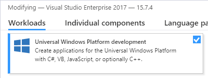
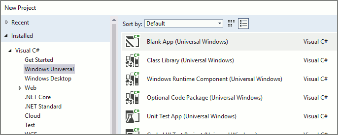
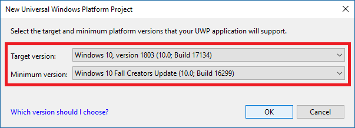
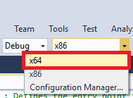
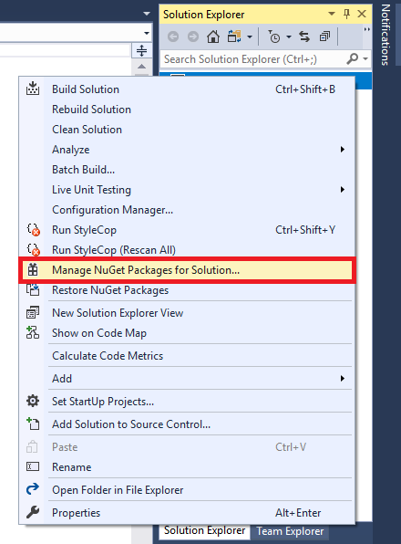
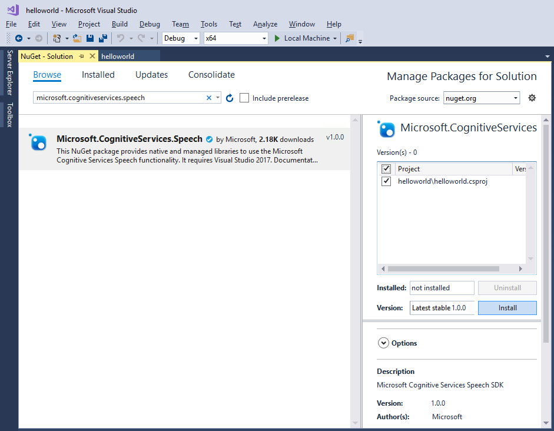
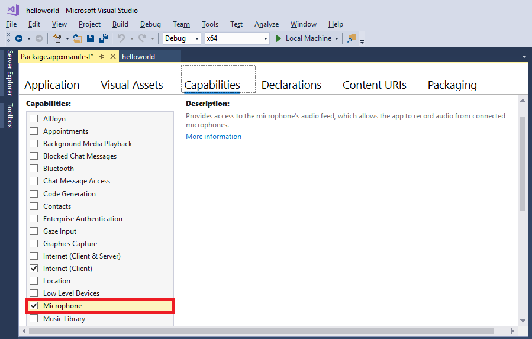

1. Start Visual Studio 2017.

1. Make sure the **Universal Windows Platform development** workload is available. Choose **Tools** > **Get Tools and Features** from the Visual Studio menu bar to open the Visual Studio installer. If this workload is already enabled, close the dialog box.

    

    Otherwise, select the box next to **.NET cross-platform development,** and select **Modify** at the lower right corner of the dialog box. Installation of the new feature takes a moment.

1. Create a blank Visual C# Universal Windows app. First, choose **File** > **New** > **Project** from the menu. In the **New Project** dialog box, expand **Installed** > **Visual C#** > **Windows Universal** in the left pane. Then select **Blank App (Universal Windows)**. For the project name, enter *helloworld*.

    

1. The Speed SDK requires that your application be built for the Windows 10 Fall Creators Update or later. In the **New Universal Windows Platform Project** window that pops up, choose **Windows 10 Fall Creators Update (10.0; Build 16299)** as **Minimum version**. In the **Target version** box, select this or any later version, and then click **OK**.

    

1. If you're running 64-bit Windows, you can switch your build platform to `x64` by using the drop-down menu in the Visual Studio toolbar. (64-bit Windows can run 32-bit applications, so you can leave it set to `x86` if you prefer.)

   

   > [!NOTE]
   > The Speech SDK only supports Intel-compatible processors. ARM is currently not supported.

1. Install and reference the [Speech SDK NuGet package](https://aka.ms/csspeech/nuget). In Solution Explorer, right-click the solution, and select **Manage NuGet Packages for Solution**.

    

1. In the upper-right corner, in the **Package Source** field, select **nuget.org**. Search for the `Microsoft.CognitiveServices.Speech` package, and install it into the **helloworld** project.

    

1. Accept the displayed license to begin installation of the NuGet package.

    

1. The following output line appears in the Package Manager console.

   ```text
   Successfully installed 'Microsoft.CognitiveServices.Speech 1.2.0' to helloworld
   ```

1. Because the application uses the microphone for speech input, add the **Microphone** capability to the project. In Solution Explorer, double-click **Package.appxmanifest** to edit your application manifest. Then switch to the **Capabilities** tab, select the box for the **Microphone** capability, and save your changes.

   
