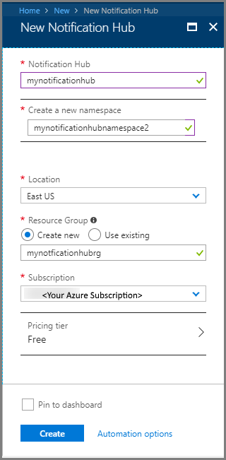
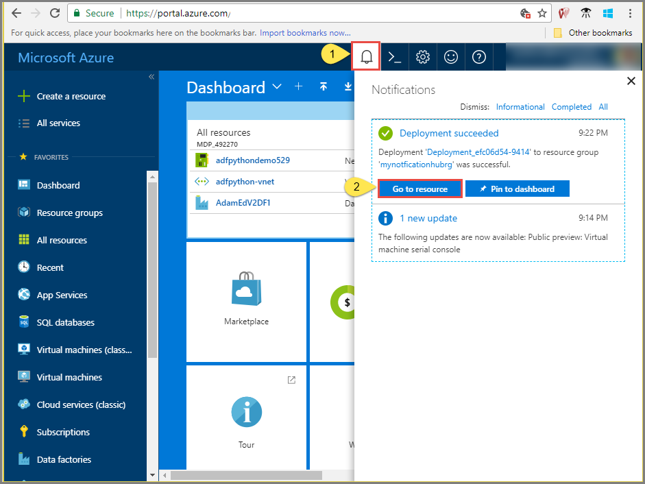
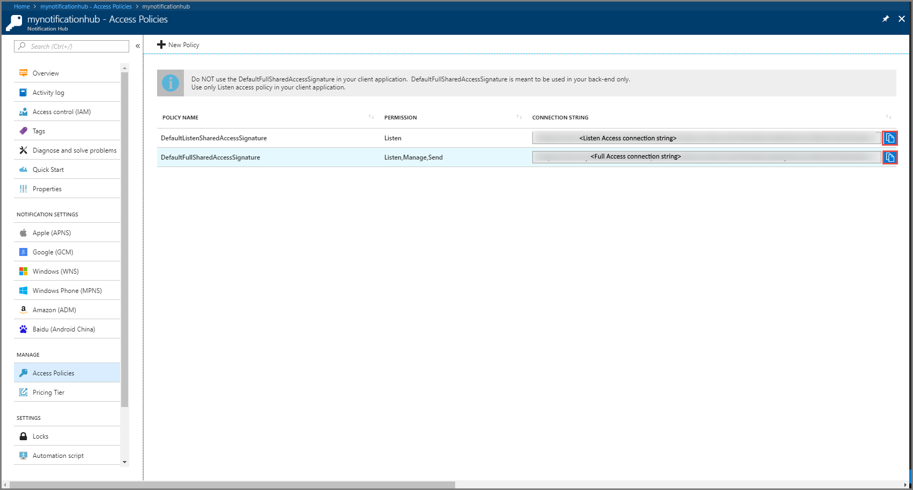

1. Sign in to the [Azure portal](https://portal.azure.com).

2. Select **Create a resource** > **Mobile** > **Notification Hub**.

      

3. In the **Notification Hub** box, type a unique name. Select your **Region**, **Subscription**, and **Resource Group** (if you have one already).

      If you don't already have a service bus namespace, you can use the default name, which is created based on the hub name (if the namespace name is available).

      If you already have a service bus namespace that you want to create the hub in, follow these steps

    a. In the **Namespace** area, select the **Select Existing** link.

    b. Select **Create**.

    

4. Select **Notifications** (Bell icon), and select **Go to resource**.

      
5. Select **Access Policies** from the list. Note the two connection strings that are available to you. You need them to handle push notifications later.

      >[!IMPORTANT]
      >Do **NOT** use the DefaultFullSharedAccessSignature in your application. This is meant to be used in your back-end only.
      >

      
